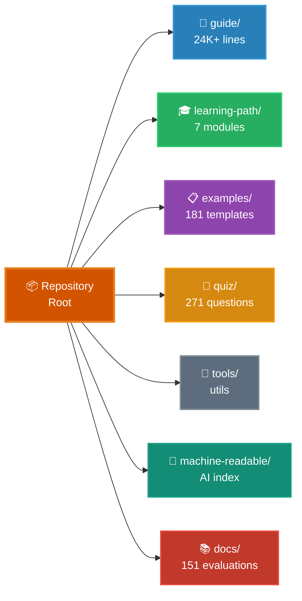

# Claude Code 终极指南

<!-- Website CTA -->
<p align="center">
  <a href="https://florianbruniaux.github.io/claude-code-ultimate-guide-landing/"></a>
</p>

<!-- Stats -->
<p align="center">
  <a href="https://github.com/FlorianBruniaux/claude-code-ultimate-guide/stargazers"></a>
  <a href="./CHANGELOG.md"></a>
  <a href="./quiz/"></a>
  <a href="./examples/"></a>
</p>

<!-- Features -->
<p align="center">
  <a href="./guide/security/security-hardening.md"></a>
  <a href="./mcp-server/"></a>
</p>

<!-- Downloads -->
<p align="center">
  <a href="https://github.com/FlorianBruniaux/claude-code-ultimate-guide/releases/latest/download/guide-export.pdf"></a>
  <a href="https://github.com/FlorianBruniaux/claude-code-ultimate-guide/releases/latest/download/guide-export.epub"></a>
</p>

<!-- Meta -->
<p align="center">
  <a href="https://github.com/hesreallyhim/awesome-claude-code"></a>
  <a href="https://creativecommons.org/licenses/by-sa/4.0/"></a>
  <a href="https://skills.palebluedot.live/owner/FlorianBruniaux"></a>
  <a href="https://zread.ai/FlorianBruniaux/claude-code-ultimate-guide"></a>
</p>

> **6 个月的每日实践**提炼成一份指南——它教你的是"为什么"，而不仅仅是"是什么"。从核心概念到生产环境安全，你将学会设计自己的智能体工作流，而不是复制粘贴配置。

> **如果这份指南对你有帮助，[给它点个 star ⭐](https://github.com/FlorianBruniaux/claude-code-ultimate-guide/stargazers)** —— 这也能帮助更多人发现它。

---

## StarMapper

<a href="https://starmapper.bruniaux.com/FlorianBruniaux/claude-code-ultimate-guide">
  <picture>
    <source media="(prefers-color-scheme: dark)" srcset="https://starmapper.bruniaux.com/api/map-image/FlorianBruniaux/claude-code-ultimate-guide?theme=dark" />
    <source media="(prefers-color-scheme: light)" srcset="https://starmapper.bruniaux.com/api/map-image/FlorianBruniaux/claude-code-ultimate-guide?theme=light" />
    
  </picture>
</a>

---

## 选择你的路径

| 你是谁 | 你的指南 |
|---|---|
| 🏗️ **技术负责人 / 工程经理** | [在团队中部署 Claude Code →](docs/for-tech-leads.md) |
| 📊 **CTO / 决策者** | [投资回报、安全态势、团队采纳 →](docs/for-cto.md) |
| 💼 **CIO / CEO** | [预算、风险、该向技术团队问什么（3 分钟）→](docs/for-cio-ceo.md) |
| 🎨 **产品经理 / 设计师** | [Vibe coding、与 AI 辅助开发团队协作 →](docs/for-product-managers.md) |
| ✍️ **撰稿人 / 运营 / 管理者** | [Claude Cowork 指南（独立仓库）→](https://github.com/FlorianBruniaux/claude-cowork-guide) |
| 👨‍💻 **开发者（各层级）** | 你来对地方了 —— 继续往下读 ↓ |
| 🧭 **职业转型 / AI 新岗位** | [AI 角色与职业路径 →](guide/roles/ai-roles.md) |

---

## 🎯 你将学到什么

**这份指南教你用不同的思维方式看待 AI 辅助开发：**
- ✅ **理解权衡** —— 何时使用 agents、skills 还是 commands（而不仅仅是如何配置它们）
- ✅ **建立心智模型** —— Claude Code 内部如何工作（架构、上下文流转、工具编排）
- ✅ **可视化概念** —— 48 张 Mermaid 图，涵盖模型选择、主循环、记忆层级、多智能体模式、安全威胁、AI 熟练度路径
- ✅ **掌握方法论** —— 在 AI 协作下进行 TDD、SDD、BDD（不只是模板）
- ✅ **安全思维** —— 为 AI 系统进行威胁建模（唯一收录 28 个 CVE + 655 个恶意 skills 数据库的指南）
- ✅ **检验你的知识** —— 271 道测验题验证理解程度（其他资源都没有提供这一点）

**最终成效**：从复制粘贴配置，转变为自信地设计属于你自己的智能体工作流。

---

## 📊 何时用本指南 vs Everything-CC

两份指南服务于不同的需求。请根据你的优先目标来选择。

| 你的目标 | 本指南 | everything-claude-code |
|-----------|------------|------------------------|
| **理解为什么**这些模式有效 | 深入讲解 + 架构 | 以配置为中心 |
| 为项目**快速搭建** | 有，但不是重点 | 经过实战检验的生产配置 |
| **学习权衡**（agents vs skills） | 决策框架 + 对比 | 列出模式，无权衡分析 |
| **安全加固** | 唯一的威胁数据库（28 个 CVE） | 仅基础模式 |
| **检验理解** | 271 道测验题 | 没有 |
| **方法论**（TDD/SDD/BDD） | 完整工作流指南 | 未覆盖 |
| **即拿即用**的模板 | 181 个模板 | 200+ 个模板 |

### 生态定位

```
                    EDUCATIONAL DEPTH
                           ▲
                           │
                           │  ★ This Guide
                           │  Security + Methodologies + 24K+ lines
                           │
                           │  [Everything-You-Need-to-Know]
                           │  SDLC/BMAD beginner
  ─────────────────────────┼─────────────────────────► READY-TO-USE
  [awesome-claude-code]    │            [everything-claude-code]
  (discovery, curation)    │            (plugin, 1-cmd install)
                           │
                           │  [claude-code-studio]
                           │  Context management
                           │
                      SPECIALIZED
```

**5 个没有竞品覆盖的独特空白点：**
1. **安全优先** —— 追踪 28 个 CVE + 655 个恶意 skills（没有竞品有如此深度）
2. **方法论工作流** —— TDD/SDD/BDD 对比 + 分步指南
3. **全面的参考资料** —— 横跨 16 份专题指南、24K+ 行（参考资料量是 everything-cc 的 24 倍）
4. **渐进式教学** —— 271 道测验题 + 7 模块结构化学习路径（初学者 → 进阶）
5. **交互式自测** —— `/self-assessment` skill，提供个性化学习路径建议

**推荐的工作流：**
1. 在这里学习概念（心智模型、权衡、安全）
2. 在那边使用经过实战检验的配置（快速搭建项目）
3. 回到这里深入研究（当某些东西不工作时，或需要设计自定义工作流时）

**两种资源是互补的，而非竞争关系。** 用适合你当前需求的那个。

---

## ⚡ 快速开始

**Claude Code 新手？** → [**7 模块学习路径**](./guide/learning-path/README.md) —— 8-11 小时，从入门到进阶

**最快路径**：[速查表](./guide/cheatsheet.md) —— 1 页可打印的每日必备要点

**交互式上手**（无需任何设置）：
```bash
claude "Fetch and follow the onboarding instructions from: https://raw.githubusercontent.com/FlorianBruniaux/claude-code-ultimate-guide/main/tools/onboarding-prompt.md"
```

**直接浏览**：[完整指南](./guide/ultimate-guide.md) | [学习路径](./guide/learning-path/) | [可视化图表](./guide/diagrams/) | [示例](./examples/) | [测验](./quiz/)

---

## 🔌 MCP Server —— 在任意 Claude Code 会话中使用本指南

无需克隆仓库。添加到 `~/.claude.json`，即可在任意会话中直接提问：

```json
{
  "mcpServers": {
    "claude-code-guide": {
      "type": "stdio",
      "command": "npx",
      "args": ["-y", "claude-code-ultimate-guide-mcp"]
    }
  }
}
```

17 个工具：`search_guide`、`read_section`、`get_cheatsheet`、`get_digest`、`get_example`、`list_examples`、`search_examples`、`get_release`、`get_changelog`、`compare_versions`、`list_topics`、`get_threat`、`list_threats`，外加 `init_official_docs`、`refresh_official_docs`、`diff_official_docs`、`search_official_docs`（v1.1.0 —— 官方 Anthropic 文档追踪器）—— 另有 13 个 slash commands `/ccguide:*` 和一个 Haiku agent。

**上手一行命令**（MCP 配置完成后）：
```bash
claude "Use the claude-code-guide MCP server. Activate the claude-code-expert prompt, then run a personalized onboarding: ask me 3 questions about my goal, experience level, and preferred tone — then build a custom learning path using search_guide and read_section to navigate the guide with live source links."
```

→ [MCP Server README](./mcp-server/README.md)

---

## 📁 仓库结构



<details>
<summary><strong>详细结构（文本视图）</strong></summary>

```
📦 claude-code-ultimate-guide/
│
├─ 📖 guide/              Core Documentation (24K+ lines)
│  ├─ learning-path/      7-Module Learning Path (beginners → advanced)
│  ├─ ultimate-guide.md   Complete reference, 10 sections
│  ├─ cheatsheet.md       1-page printable
│  ├─ architecture.md     How Claude Code works internally
│  ├─ methodologies.md    TDD, SDD, BDD workflows
│  ├─ diagrams/           48 Mermaid diagrams (10 thematic files)
│  ├─ third-party-tools.md  Community tools (RTK, ccusage, Entire CLI)
│  ├─ mcp-servers-ecosystem.md  Official & community MCP servers
│  └─ workflows/          Step-by-step guides
│
├─ 📋 examples/           181 Production Templates
│  ├─ CATALOG.md          Auto-generated index by complexity, time, domain
│  ├─ agents/             23 custom AI personas
│  ├─ commands/           redirect stubs (migrated to skills/ in CC 2.1.3)
│  ├─ hooks/              37 hooks (bash + PowerShell)
│  ├─ skills/             64 skills (9 on SkillHub)
│  └─ scripts/            Utility scripts (audit, search)
│
├─ 🧠 quiz/               271 Questions
│  ├─ 9 categories        Setup, Agents, MCP, Trust, Advanced...
│  ├─ 4 profiles          Junior, Senior, Power User, PM
│  └─ Instant feedback    Doc links + score tracking
│
├─ 🔧 tools/              Interactive Utilities
│  ├─ onboarding-prompt   Personalized guided tour
│  └─ audit-prompt        Setup audit & recommendations
│
├─ 🤖 machine-readable/   AI-Optimized Index
│  ├─ reference.yaml      Structured index (~2K tokens) — powers landing site CMD+K search
│  ├─ claude-code-releases.yaml  Structured releases changelog
│  └─ llms.txt            Standard LLM context file
│
└─ 📚 docs/               151 Resource Evaluations
   └─ resource-evaluations/  5-point scoring, source attribution
```

</details>

---

## 🎯 这份指南的独特之处

### 🎓 深入理解胜过单纯配置

**最终成效**：设计你自己的工作流，而不是盲目复制粘贴。

**我们讲解 Claude Code 如何工作，以及这些模式为什么重要**：
- [工具参考](./guide/core/tools-reference.md)：全部 40 个内置工具、权限规则格式、各工具的行为细节（超时、文件读取限制、有损的 WebFetch），以及 Monitor、Workflow、agent teams、Cron、Tasks API 的使用方法
- [架构](./guide/core/architecture.md) —— 内部机制（上下文流转、工具编排、记忆管理）
- [权衡](./guide/ultimate-guide.md#when-to-use-what) —— agents vs skills vs commands 的决策框架
- [配置决策指南](./guide/ultimate-guide.md#27-configuration-decision-guide) —— 横跨全部 7 个配置层级的统一"什么场景用什么机制？"映射
- [陷阱](./guide/ultimate-guide.md#common-mistakes) —— 常见的失败模式 + 预防策略

**这对你意味着什么**：独立排查问题，针对你的具体用例进行优化，知道何时该偏离既有模式。

---

### 🖼️ 可视化图表系列（48 张 Mermaid 图）

**最终成效**：通过可视化心智模型，即刻理解复杂概念。

**48 张交互式图表**，分布在 10 个专题文件中 —— GitHub 原生 Mermaid 渲染 + 每张图都有 ASCII 备选方案：
- [基础](./guide/diagrams/01-foundations.md) —— 4 层上下文模型、9 步流水线、权限模式
- [架构](./guide/diagrams/04-architecture-internals.md) —— 主循环、工具类别、系统提示词组装
- [多智能体](./guide/diagrams/07-multi-agent-patterns.md) —— 3 种拓扑、worktrees、双实例、横向扩展
- [安全](./guide/diagrams/08-security-and-production.md) —— 3 层防御、MCP rug pull 攻击链、验证悖论
- [成本与模型](./guide/diagrams/09-cost-and-optimization.md) —— 模型选择树、token 缩减流水线

[浏览全部 48 张图 →](./guide/diagrams/)

**这对你意味着什么**：在读 24K+ 行内容之前先理解主循环，一眼看懂多智能体拓扑，把可视化的安全威胁模型分享给你的团队。

---

### 🛡️ 安全威胁情报（唯一的全面数据库）

**最终成效**：保护生产系统免受 AI 特有的攻击。

**唯一进行系统化威胁追踪的指南**：
- **28 个映射到 CVE 的漏洞** —— 提示词注入、数据外泄、代码注入
- **655 个已编目的恶意 skills** —— Unicode 注入、隐藏指令、自动执行模式
- **生产加固工作流** —— MCP 审查、注入防御、审计自动化

[威胁数据库 →](./examples/skills/update-threat-db/threat-db.yaml) | [安全指南 →](./guide/security/security-hardening.md)

**这对你意味着什么**：在信任 MCP servers 之前先审查它们，在配置中检测攻击模式，通过安全审计的合规要求。

---

### 📝 271 道题的知识验证（生态中独一无二）

**最终成效**：验证你的理解程度 + 发现知识盲点。

**唯一可用的全面自测** —— 跨 9 个类别测试：
- 安装与配置、Agents 与 Sub-Agents、MCP Servers、信任与验证、进阶模式

**特性**：4 种技能画像（Junior/Senior/Power User/PM）、带文档链接的即时反馈、薄弱环节识别

[在线试做测验 →](https://florianbruniaux.github.io/claude-code-ultimate-guide-landing/quiz/) | [本地运行](./quiz/)

**这对你意味着什么**：知道自己有哪些不知道的地方，追踪学习进度，为团队采纳讨论做准备。

---

### 🤖 Agent Teams 覆盖（v2.1.32+ 实验性）

**最终成效**：在大型代码库上并行处理工作（Fountain：快 50%，CRED：速度翻倍）。

**唯一全面讲解 Anthropic 多智能体协调的指南**：
- 来自真实公司的生产指标（自主 C 编译器、节省 50 万小时）
- 5 个经过验证的工作流（多层评审、并行调试、大规模重构）
- 决策框架：Teams vs 多实例 vs 双实例 vs Beads

[Agent Teams 工作流 →](./guide/workflows/agent-teams.md) | [第 9.20 节 →](./guide/ultimate-guide.md#920-agent-teams-multi-agent-coordination)

**这对你意味着什么**：把单体任务拆分为可并行的工作，协调跨多文件的重构，评审你自己由 AI 生成的代码。

---

### 🔬 方法论（结构化开发工作流）

**最终成效**：在与 AI 协作的同时保持代码质量。

附带原理与示例的完整指南：
- [TDD](./guide/core/methodologies.md#1-tdd-test-driven-development-with-claude) —— 测试驱动开发（与 AI 协作的 Red-Green-Refactor）
- [SDD](./guide/core/methodologies.md#2-sdd-specification-driven-development) —— 规范驱动开发（先设计后编码）
- [BDD](./guide/core/methodologies.md#3-bdd-behavior-driven-development) —— 行为驱动开发（用户故事 → 测试）
- [GSD](./guide/core/methodologies.md#gsd-get-shit-done) —— Get Shit Done（务实交付）

**这对你意味着什么**：为你的团队文化选择合适的工作流，把 AI 融入既有流程，避免因过度依赖 AI 而产生技术债。

---

### 📚 181 个带注释的模板

**最终成效**：学习的是模式，而不仅仅是配置。

带讲解的教学型模板：
- Agents（23 个）、Skills（74 个）、Hooks（37 个）
- 注释解释每个模式**为什么**有效（而不仅是它做了什么）
- 渐进的复杂度递进（简单 → 进阶）

[浏览目录 →](./examples/)

**这对你意味着什么**：理解模式背后的推理，把模板适配到你的场景，创造你自己的自定义模式。

---

### 🔍 151 份资源评估

**最终成效**：相信我们的推荐都基于证据。

对外部资源的系统化评估（5 分制评分）：
- 文章、视频、工具、框架
- 诚实的评估并标注来源（无营销废话）
- 带权衡分析的集成建议

[查看评估 →](./docs/resource-evaluations/)

**这对你意味着什么**：节省审查资源的时间，在采用工具前了解其局限，做出明智的决策。

---

## 🎯 学习路径

<details>
<summary><strong>初级开发者</strong> —— 基础路径（7 步）</summary>

1. [快速开始](./guide/ultimate-guide.md#1-quick-start-day-1) —— 安装与第一个工作流
2. [核心命令](./guide/ultimate-guide.md#13-essential-commands) —— 7 个命令
3. [上下文管理](./guide/ultimate-guide.md#22-context-management) —— 关键概念
4. [记忆文件](./guide/ultimate-guide.md#31-memory-files-claudemd) —— 你的第一个 CLAUDE.md
5. [与 AI 一起学习](./guide/roles/learning-with-ai.md) —— 在不变得依赖的前提下使用 AI ⭐
6. [TDD 工作流](./guide/workflows/tdd-with-claude.md) —— 测试先行的开发
7. [速查表](./guide/cheatsheet.md) —— 打印出来

</details>

<details>
<summary><strong>高级开发者</strong> —— 进阶路径（6 步）</summary>

1. [核心概念](./guide/ultimate-guide.md#2-core-concepts) —— 心智模型
2. [Plan Mode](./guide/ultimate-guide.md#23-plan-mode) —— 安全的探索
3. [方法论](./guide/core/methodologies.md) —— TDD、SDD、BDD 参考
4. [Agents](./guide/ultimate-guide.md#4-agents) —— 自定义 AI 角色
5. [Hooks](./guide/ultimate-guide.md#7-hooks) —— 事件自动化
6. [CI/CD 集成](./guide/ultimate-guide.md#93-cicd-integration) —— 流水线

</details>

<details>
<summary><strong>高阶用户</strong> —— 全面路径（8 步）</summary>

1. [完整指南](./guide/ultimate-guide.md) —— 从头到尾
2. [架构](./guide/core/architecture.md) —— Claude Code 如何工作
3. [安全加固](./guide/security/security-hardening.md) —— MCP 审查、注入防御
4. [MCP Servers](./guide/ultimate-guide.md#8-mcp-servers) —— 扩展能力
5. [Trinity 模式](./guide/ultimate-guide.md#91-the-trinity) —— 进阶工作流
6. [可观测性](./guide/ops/observability.md) —— 监控成本与会话
7. [Agent Teams](./guide/workflows/agent-teams.md) —— 多智能体协调（Opus 4.7+ 实验性）
8. [示例](./examples/) —— 生产模板

</details>

<details>
<summary><strong>产品经理 / DevOps / 设计师</strong></summary>

**产品经理**（5 步）：
1. [内容概览](#-内含什么) —— 范围总览
2. [黄金法则](#-黄金法则) —— 核心原则
3. [数据隐私](./guide/security/data-privacy.md) —— 留存与合规
4. [采纳方式](./guide/roles/adoption-approaches.md) —— 团队策略
5. [PM 常见问题](./guide/ultimate-guide.md#can-product-managers-use-claude-code) —— 贴近代码的 PM vs 不写代码的 PM

**注意**：不写代码的 PM 应优先考虑 [Claude Cowork 指南](https://github.com/FlorianBruniaux/claude-cowork-guide)。

**DevOps / SRE**（5 步）：
1. [DevOps & SRE 指南](./guide/ops/devops-sre.md) —— FIRE 框架
2. [K8s 故障排查](./guide/ops/devops-sre.md#kubernetes-troubleshooting) —— 基于症状的提示词
3. [事件响应](./guide/ops/devops-sre.md#pattern-incident-response) —— 工作流
4. [IaC 模式](./guide/ops/devops-sre.md#pattern-infrastructure-as-code) —— Terraform、Ansible
5. [护栏](./guide/ops/devops-sre.md#guardrails--adoption) —— 安全边界

**产品设计师**（5 步）：
1. [处理图像](./guide/ultimate-guide.md#24-working-with-images) —— 图像分析
2. [线框图工具](./guide/ultimate-guide.md#wireframing-tools) —— ASCII/Excalidraw
3. [Figma MCP](./guide/ultimate-guide.md#figma-mcp) —— 访问设计文件
4. [设计转代码工作流](./guide/workflows/design-to-code.md) —— Figma → Claude
5. [速查表](./guide/cheatsheet.md) —— 打印出来

</details>

### 渐进式旅程

- **第 1 周**：基础（安装、CLAUDE.md、第一个 agent）
- **第 2 周**：核心特性（skills、hooks、信任校准）
- **第 3 周**：进阶（MCP servers、方法论）
- **第 2 个月起**：生产精通（CI/CD、可观测性）

---

## 🔧 速率限制与成本节省

**cc-copilot-bridge** 通过 GitHub Copilot Pro+ 路由 Claude Code，以固定费率访问（每月 10 美元，而非按 token 计费）。

```bash
# Install
git clone https://github.com/FlorianBruniaux/cc-copilot-bridge.git && cd cc-copilot-bridge && ./install.sh

# Use
ccc   # Copilot mode (flat $10/month)
ccd   # Direct Anthropic mode (per-token)
cco   # Offline mode (Ollama, 100% local)
```

**优势**：多提供商切换、绕过速率限制、在重度使用场景下节省 99%+ 成本。

→ **[cc-copilot-bridge](https://github.com/FlorianBruniaux/cc-copilot-bridge)**

---

## 🔑 黄金法则

### 1. 使用前先验证可信度

Claude Code 产生的逻辑错误可能比人工编写的代码多 1.75 倍（[ACM 2025](https://dl.acm.org/doi/10.1145/3716848)）。每一份输出都必须经过验证。使用 `/insights` 命令，并通过测试来验证模式。

**策略：** 独立开发者（验证逻辑 + 边界情况）。团队（系统化的同行评审）。生产环境（强制性的门禁测试）。

---

### 2. 切勿批准来源未知的 MCP

Claude Code 生态中已识别出 28 个 CVE。供应链中存在 655 个恶意 skills。MCP servers 能读写你的代码库。

**策略：** 系统化审计（5 分钟检查清单）。社区审查过的 MCP 安全名单。指南中记录的审查工作流。

---

### 3. 上下文压力会改变行为

在 70% 上下文时，Claude 开始失去精确度。在 85% 时，幻觉增多。在 90%+ 时，回复变得不稳定。

**策略：** 0-50%（自由工作）。50-70%（注意）。70-90%（`/compact`）。90%+（强制 `/clear`）。

---

### 4. 从简单开始，明智地扩展

从基础的 CLAUDE.md + 少量命令开始。在生产环境中试用 2 周。只有在需求被证实后才添加 agents/skills。

**策略：** 阶段 1（基础）。阶段 2（如需要则加 commands + hooks）。阶段 3（如有多上下文则加 agents）。阶段 4（如确有必要则加 MCP servers）。

---

### 5. 有了 AI，方法论更加重要

在 Claude Code 下，TDD/SDD/BDD 并非可选项。AI 加速糟糕代码的程度不亚于加速优秀代码。

**策略：** TDD（关键逻辑）。SDD（提前做架构）。BDD（PM/开发协作）。GSD（一次性原型）。

---

### 快速参考

| # | 法则 | 关键指标 | 行动 |
|---|------|------------|--------|
| 1 | 验证可信度 | 逻辑错误多 1.75 倍 | 测试一切，同行评审 |
| 2 | 审查 MCP | 28 个 CVE，655 个恶意 skills | 5 分钟审计检查清单 |
| 3 | 管理上下文 | 70% = 精确度下降 | 70% 时 `/compact`，90% 时 `/clear` |
| 4 | 从简单开始 | 2 周试用期 | 阶段 1→4 渐进式采纳 |
| 5 | 运用方法论 | AI 同时放大好与坏 | 按场景选用 TDD/SDD/BDD |

> 上下文管理至关重要。阈值与对应行动请参见[速查表](./guide/cheatsheet.md#context-management-critical)。

---

## 🤖 致 AI 助手

| 资源 | 用途 | Tokens |
|----------|---------|--------|
| **[llms.txt](./machine-readable/llms.txt)** | 标准上下文文件 | ~1K |
| **[reference.yaml](./machine-readable/reference.yaml)** | 带行号的结构化索引 | ~2K |

**快速加载**：`curl -sL https://raw.githubusercontent.com/FlorianBruniaux/claude-code-ultimate-guide/main/machine-readable/reference.yaml`

### reference.yaml —— 结构与落地页搜索

`reference.yaml` 组织为若干顶层小节：

| 小节 | 内容 |
|---------|---------|
| `lines` | `ultimate-guide.md` 中关键小节的行号引用 |
| `deep_dive` | 所有 guides、examples、hooks、agents、commands 的 键 → 文件路径 映射 |
| `decide` | 决策树（什么场景用什么） |
| `stats` | 计数器（模板、题目、CVE…） |

**`deep_dive` 小节驱动了[落地页](https://cc.bruniaux.com)的 CMD+K 搜索。** 构建脚本（`scripts/build-guide-index.mjs`）解析它以生成 160 条搜索条目。

#### 搜索索引的工作原理

落地页上的 CMD+K 搜索是一个**显式索引** —— 并非全文搜索。只有在 `deep_dive` 中列出的条目才会被索引。关键词是从键名和文件路径机械地推导出来的，而非来自文件内容。

**后果**：添加一个新的指南小节，需要显式地往 `deep_dive` 里加一条条目，然后在落地页仓库中运行 `pnpm build:search`。

#### 维护 reference.yaml

**向 `deep_dive` 添加新条目**：
```yaml
deep_dive:
  # existing entries...
  my_new_section: "guide/my-new-file.md"          # local guide file
  my_hook_example: "examples/hooks/bash/foo.sh"   # example file
  my_section_ref: "guide/ultimate-guide.md:1234"  # with line number anchor
```

**关键：避免重复键。** 如果某个键在 `deep_dive` 中出现两次，YAML 解析器会失败，落地页搜索索引会变空（0 条条目）。构建会以警告退出，但不会硬报错：

```
[build-guide-index] ERROR: Failed to parse YAML: duplicated mapping key
[build-guide-index] Generating empty guide-search-entries.ts
```

使用不同的名称 —— 例如，如果你需要为同一概念同时保留行号引用和文件路径，请给行号键加上 `_line` 后缀：
```yaml
security_gate_hook_line: 6907                              # line number ref
security_gate_hook: "examples/hooks/bash/security-gate.sh" # file path ref
```

---

## 📄 白皮书（FR + EN）

11 份聚焦的白皮书，深入讲解 Claude Code —— PDF + EPUB，提供法语和英语版本。总计 472 页。

> **即将推出** —— 目前为私密访问。计划公开发布。

| # | FR | EN | 页数 |
|---|----|----|-------|
| **00** | *De Zéro à Productif* | *From Zero to Productive* | 20 |
| **01** | *Prompts qui Marchent* | *Prompts That Work* | 40 |
| **02** | *Personnaliser Claude* | *Customizing Claude* | 47 |
| **03** | *Sécurité en Production* | *Security in Production* | 48 |
| **04** | *L'Architecture Démystifiée* | *Architecture Demystified* | 40 |
| **05** | *Déployer en Équipe* | *Team Deployment* | 43 |
| **06** | *Privacy & Compliance* | *Privacy & Compliance* | 29 |
| **07** | *Guide de Référence* | *Reference Guide* | 87 |
| **08** | *Agent Teams* | *Agent Teams* | 42 |
| **09** | *Apprendre avec l'IA* | *Learning with AI* — UVAL protocol, comprehension debt | 49 |
| **10** | *Convaincre son Employeur* | *Making the Case for AI* — ROI dossier for CEO/CTO/CFO | 27 |

## 🗂️ Recap Cards（FR，EN 即将推出）

57 张单页 A4 参考卡 —— 可打印，每张一个概念。已提供法语版；英语版正在制作中。

> **在线浏览**：[cc.bruniaux.com/cheatsheets/](https://cc.bruniaux.com/cheatsheets/)

- **Technique（22 张）** —— 命令、权限、配置、MCP、模型、上下文窗口
- **Méthodologie（22 张）** —— 日常工作流、agents、hooks、CI/CD、多智能体、调试
- **Conception（13 张）** —— 心智模型、提示词、设计即安全、成本模式

---

## 🌍 生态

### Claude Cowork（非开发者）

**Claude Cowork** 是面向非技术用户（知识工作者、助理、管理者）的配套指南。

具备与 Claude Code 相同的智能体能力，但通过可视化界面实现，无需编写代码。

→ **[Claude Cowork 指南](https://github.com/FlorianBruniaux/claude-cowork-guide)** —— 文件整理、文档生成、自动化工作流

**状态**：研究预览（Pro 每月 20 美元或 Max 每月 100-200 美元，仅限 macOS，**与 VPN 不兼容**）

### Claude Code 插件（Marketplace）

本指南的全部 181 个模板打包为可安装的 Claude Code 插件 —— hooks 自动接线，无需手动配置：

```bash
# Add the marketplace
claude plugin marketplace add FlorianBruniaux/claude-code-plugins

# Install the plugins you need
claude plugin install security-suite       # OWASP auditing, cyber-defense pipeline, 13 hooks
claude plugin install devops-pipeline      # CI/CD, git worktrees, GitHub Actions
claude plugin install release-automation   # Changelog + release notes + social content
claude plugin install code-quality         # SOLID refactoring, TDD, GoF patterns, 6 agents
claude plugin install pr-workflow          # Planning gates, PR/issue triage, handoffs
claude plugin install session-tools        # ccboard monitoring, voice refinement, 11 hooks
claude plugin install ai-methodology       # Scaffolding, 6-stage talk pipeline, context-engineering
claude plugin install session-summary      # Session analytics dashboard (15 sections)
```

> **[FlorianBruniaux/claude-code-plugins](https://github.com/FlorianBruniaux/claude-code-plugins)** —— 8 个插件，181 个模板，一个 marketplace

### 互补资源

| 项目 | 侧重 | 最适合 |
|---------|-------|----------|
| [everything-claude-code](https://github.com/affaan-m/everything-claude-code) | 生产配置（45k+ stars） | 快速搭建、经过实战检验的模式 |
| [claude-code-templates](https://github.com/davila7/claude-code-templates) | 分发（200+ 模板） | CLI 安装（17k stars） |
| [anthropics/skills](https://github.com/anthropics/skills) | 官方 Anthropic skills（60K+ stars） | 文档、设计、开发模板 |
| [anthropics/claude-plugins-official](https://skills.sh/anthropics/claude-plugins-official) | 插件开发工具（3.1K 安装量） | CLAUDE.md 审计、自动化发现 |
| [skills.sh](https://skills.sh/) | Skills marketplace | 一行命令安装（Vercel Labs） |
| [awesome-claude-code](https://github.com/hesreallyhim/awesome-claude-code) | 精选 | 资源发现 |
| [youtube-skills](https://github.com/ZeroPointRepo/youtube-skills) | 12 个 YouTube skills（搜索、字幕、章节） | Claude Code、Cursor、Windsurf、Cline |
| [awesome-claude-skills](https://github.com/BehiSecc/awesome-claude-skills) | Skills 分类法 | 12 个类别下的 62 个 skills |
| [awesome-claude-md](https://github.com/josix/awesome-claude-md) | CLAUDE.md 示例 | 带评分的带注释配置 |
| [ctop](https://github.com/aakashadesara/ctop) | 会话监控（AI 智能体版 htop） | 实时 CPU、内存、tokens、成本 |
| [AI Coding Agents Matrix](https://coding-agents-matrix.dev) | 技术对比 | 对比 23+ 个替代方案 |

**社区**：🇫🇷 [Dev With AI](https://www.devw.ai/) —— Slack 上 1500+ 名开发者，在巴黎、波尔多、里昂举办线下聚会

→ **[AI 生态指南](./guide/ecosystem/ai-ecosystem.md)** —— 与互补 AI 工具的完整集成模式

---

## 🛡️ 安全

**全面的 MCP 安全覆盖** —— 唯一拥有威胁情报数据库和生产加固工作流的指南。

### 官方安全工具

| 工具 | 用途 | 维护方 |
|------|---------|---------------|
| [claude-code-security-review](https://github.com/anthropics/claude-code-security-review) | 用于自动化安全扫描的 GitHub Action | Anthropic（官方） |
| 本指南的威胁数据库 | 情报层（28 个 CVE，655 个恶意 skills） | 社区 |

**工作流**：用 GitHub Action 做自动化 → 查阅威胁数据库获取威胁情报。

### 威胁数据库

**28 个映射到 CVE 的漏洞**和 **655 个恶意 skills**，追踪于 [`examples/skills/update-threat-db/threat-db.yaml`](./examples/skills/update-threat-db/threat-db.yaml)：

| 威胁类别 | 数量 | 示例 |
|----------------|-------|----------|
| **代码/命令注入** | 5 个 CVE | CLI 绕过（CVE-2025-66032）、child_process exec |
| **路径遍历与访问** | 4 个 CVE | 符号链接逃逸（CVE-2025-53109）、前缀绕过 |
| **RCE 与提示词劫持** | 4 个 CVE | MCP Inspector RCE（CVE-2025-49596）、会话劫持 |
| **SSRF 与 DNS 重绑定** | 4 个 CVE | WebFetch SSRF（CVE-2026-24052）、DNS 重绑定 |
| **数据泄露** | 1 个 CVE | 跨客户端响应泄露（CVE-2026-25536） |
| **恶意 Skills** | 655 种模式 | Unicode 注入、隐藏指令、自动执行 |

**分类体系**：10 个攻击面 × 11 种威胁类型 × 8 个影响等级

### 加固资源

| 资源 | 用途 | 时间 |
|----------|---------|------|
| **[安全加固指南](./guide/security/security-hardening.md)** | MCP 审查、注入防御、审计工作流 | 25 分钟 |
| **[数据隐私指南](./guide/security/data-privacy.md)** | 留存策略（5 年 → 30 天 → 0）、GDPR 合规 | 10 分钟 |
| **[沙箱隔离](./guide/security/sandbox-isolation.md)** | 为不受信任的 MCP servers 准备的 Docker 沙箱 | 10 分钟 |
| **[生产安全](./guide/security/production-safety.md)** | 基础设施锁、端口稳定性、数据库安全 | 20 分钟 |

### 安全命令

```bash
/security-check      # Quick scan config vs known threats (~30s)
/security-audit      # Full 6-phase audit with score /100 (2-5min)
/update-threat-db    # Research & update threat intelligence
/audit-agents-skills # Quality audit with security checks
```

### 安全 Hooks

**37 个生产级 hooks**（bash + PowerShell），位于 [`examples/hooks/`](./examples/hooks/)：

| Hook | 用途 |
|------|---------|
| [dangerous-actions-blocker](./examples/hooks/bash/dangerous-actions-blocker.sh) | 拦截 `rm -rf`、force-push、生产环境操作 |
| [prompt-injection-detector](./examples/hooks/bash/prompt-injection-detector.sh) | 检测 CLAUDE.md/提示词中的注入模式 |
| [unicode-injection-scanner](./examples/hooks/bash/unicode-injection-scanner.sh) | 检测隐藏 Unicode（零宽字符、RTL 覆盖） |
| [output-secrets-scanner](./examples/hooks/bash/output-secrets-scanner.sh) | 防止 API 密钥/令牌出现在 Claude 的回复中 |

**[浏览全部安全 Hooks →](./examples/hooks/)**

### MCP 审查工作流

**在信任 MCP servers 之前的系统化评估：**

1. **来源**：GitHub 已验证、100+ stars、活跃维护
2. **代码审查**：最小权限、无混淆、开源
3. **权限**：仅白名单的文件系统访问、网络限制
4. **测试**：先在隔离的 Docker 沙箱中测试，监控工具调用
5. **监控**：会话日志、错误追踪、定期重新审计

**[完整的 MCP 安全工作流 →](./guide/security/security-hardening.md#vetting-mcp-servers)**

---

## 📖 关于

这份指南是**对 Claude Code 进行 6 个月每日实践**的成果。目标不是做到详尽无遗（工具演进得太快），而是分享在生产环境中真正有效的东西。

**你会找到：**
- 在生产环境中验证过的模式（而非理论）
- 权衡的解释（而不仅仅是"这是怎么做的"）
- 安全优先（追踪 28 个 CVE）
- 对局限性的坦诚（Claude Code 并非魔法）

**你不会找到：**
- 确定性的答案（工具太新了）
- 通用配置（每个项目都不一样）
- 营销承诺（零废话）

请批判性地使用这份指南。多做实验。分享对你有用的东西。

**欢迎反馈：** [GitHub Issues](https://github.com/FlorianBruniaux/claude-code-ultimate-guide/issues)

### 关于作者

**Florian Bruniaux** —— [Méthode Aristote](https://methode-aristote.fr)（EdTech + AI）的创始工程师。12 年技术经验（Dev → Lead → EM → VP Eng → CTO）。当前专注：Rust CLI 工具、MCP servers、AI 开发者工具。

| 项目 | 描述 | 链接 |
|---------|-------------|-------|
| **RTK** | CLI 代理 —— 减少 60-90% 的 LLM token | [GitHub](https://github.com/rtk-ai/rtk) · [Site](https://www.rtk-ai.app/) |
| **ccboard** | Claude Code 的实时 TUI/Web 仪表盘 | [GitHub](https://github.com/FlorianBruniaux/ccboard) · [Demo](https://ccboard.bruniaux.com/) |
| **Claude Cowork Guide** | 面向非程序员的 26 个业务工作流 | [GitHub](https://github.com/FlorianBruniaux/claude-cowork-guide) · [Site](https://cowork.bruniaux.com/) |
| **cc-copilot-bridge** | Claude Code 与 GitHub Copilot 之间的桥接 | [GitHub](https://github.com/FlorianBruniaux/cc-copilot-bridge) · [Site](https://ccbridge.bruniaux.com/) |
| **Agent Academy** | 用于 AI 智能体学习的 MCP server | [GitHub](https://github.com/FlorianBruniaux/agent-academy) |
| **techmapper** | 技术栈映射与可视化 | [GitHub](https://github.com/FlorianBruniaux/techmapper) |

[GitHub](https://github.com/FlorianBruniaux) · [LinkedIn](https://www.linkedin.com/in/florian-bruniaux-43408b83/) · [Portfolio](https://florian.bruniaux.com/)

---

## 📚 内含什么

### 核心文档

| 文件 | 用途 | 时间 |
|------|---------|------|
| **[终极指南](./guide/ultimate-guide.md)** | 完整参考（24K+ 行），10 个章节 | 30-40 小时（全部）• 多数人查阅相关章节 |
| **[速查表](./guide/cheatsheet.md)** | 1 页可打印参考 | 5 分钟 |
| **[可视化参考](./guide/core/visual-reference.md)** | 20 张关键概念的 ASCII 图 | 5 分钟 |
| **[架构](./guide/core/architecture.md)** | Claude Code 内部如何工作 | 25 分钟 |
| **[方法论](./guide/core/methodologies.md)** | TDD、SDD、BDD 参考 | 20 分钟 |
| **[工作流](./guide/workflows/)** | 实用指南（TDD、计划驱动、任务管理） | 30 分钟 |
| **[数据隐私](./guide/security/data-privacy.md)** | 留存与合规 | 10 分钟 |
| **[安全加固](./guide/security/security-hardening.md)** | MCP 审查、注入防御 | 25 分钟 |
| **[沙箱隔离](./guide/security/sandbox-isolation.md)** | Docker 沙箱、云端替代方案、安全自治 | 10 分钟 |
| **[生产安全](./guide/security/production-safety.md)** | 端口稳定性、数据库安全、基础设施锁 | 20 分钟 |
| **[DevOps & SRE](./guide/ops/devops-sre.md)** | FIRE 框架、K8s 故障排查、事件响应 | 30 分钟 |
| **[AI 生态](./guide/ecosystem/ai-ecosystem.md)** | 互补的 AI 工具与集成模式 | 20 分钟 |
| **[AI 可追溯性](./guide/ops/ai-traceability.md)** | 代码归属与来源追踪 | 15 分钟 |
| **[搜索工具速查表](./guide/cheatsheet.md)** | Grep、Serena、ast-grep、grepai 对比 | 5 分钟 |
| **[与 AI 一起学习](./guide/roles/learning-with-ai.md)** | 在不变得依赖的前提下使用 AI | 15 分钟 |
| **[Claude Code 发布记录](./guide/core/claude-code-releases.md)** | 官方发布历史 | 10 分钟 |
| **[致谢](./guide/core/credits.md)** | 开源灵感来源与模式归属 | 2 分钟 |

<details>
<summary><strong>示例库</strong>（181 个模板）</summary>

**Agents**（23 个）：[code-reviewer](./examples/agents/code-reviewer.md)、[test-writer](./examples/agents/test-writer.md)、[security-auditor](./examples/agents/security-auditor.md)、[refactoring-specialist](./examples/agents/refactoring-specialist.md)、[output-evaluator](./examples/agents/output-evaluator.md)、[devops-sre](./examples/agents/devops-sre.md) ⭐

**Skills**（74 个）：[/pr](./examples/skills/pr/SKILL.md)、[/commit](./examples/skills/commit/SKILL.md)、[/release-notes](./examples/skills/release-notes/SKILL.md)、[/diagnose](./examples/skills/diagnose/SKILL.md)、[/security](./examples/skills/security/SKILL.md)、[/security-check](./examples/skills/security-check/SKILL.md) **、[/security-audit](./examples/skills/security-audit/SKILL.md) **、[/update-threat-db](./examples/skills/update-threat-db/SKILL.md) **、[/refactor](./examples/skills/refactor/SKILL.md)、[/explain](./examples/skills/explain/SKILL.md)、[/optimize](./examples/skills/optimize/SKILL.md)、[/ship](./examples/skills/ship/SKILL.md)…

**安全 Hooks**（37 个）：[dangerous-actions-blocker](./examples/hooks/bash/dangerous-actions-blocker.sh)、[prompt-injection-detector](./examples/hooks/bash/prompt-injection-detector.sh)、[unicode-injection-scanner](./examples/hooks/bash/unicode-injection-scanner.sh)、[output-secrets-scanner](./examples/hooks/bash/output-secrets-scanner.sh)…

**Skills**（64 个）：[Claudeception](https://github.com/blader/Claudeception) —— 元 skill，可从会话发现中自动生成 skills ⭐

**Plugins**（1 个）：[SE-CoVe](./examples/plugins/se-cove.md) —— 用于独立代码评审的 Chain-of-Verification（Meta AI，ACL 2024）

**实用脚本**：[session-search.sh](./examples/scripts/session-search.sh)、[audit-scan.sh](./examples/scripts/audit-scan.sh)

**GitHub Actions**：[claude-pr-auto-review.yml](./examples/github-actions/claude-pr-auto-review.yml)、[claude-security-review.yml](./examples/github-actions/claude-security-review.yml)、[claude-issue-triage.yml](./examples/github-actions/claude-issue-triage.yml)

**集成**（1 个）：[Agent Vibes TTS](./examples/integrations/agent-vibes/) - 为 Claude Code 回复提供文本转语音朗读

**[浏览完整目录](./examples/README.md)** | **[交互式目录](./examples/index.html)**

</details>

<details>
<summary><strong>知识测验</strong>（271 道题）</summary>

用一个交互式 CLI 测验检验你的 Claude Code 知识，覆盖指南的所有章节。

```bash
cd quiz && npm install && npm start
```

**特性**：4 种画像（Junior/Senior/Power User/PM）、10 个主题类别、带文档链接的即时反馈、带薄弱环节识别的得分追踪。

**[测验文档](./quiz/README.md)** | **[贡献题目](./quiz/templates/question-template.yaml)**

</details>

<details>
<summary><strong>资源评估</strong>（151 份评估）</summary>

在集成进指南之前，对外部资源（工具、方法论、文章）进行系统化评估。

**方法论**：5 分制评分系统（Critical → Low），配有技术评审与质询阶段以确保客观性。

**评估**：GSD 方法论、Worktrunk、Boris Cowork 视频、AST-grep、ClawdBot 分析，等等。

**[浏览评估](./docs/resource-evaluations/)** | **[评估方法论](./docs/resource-evaluations/README.md)**

</details>

---

## ⭐ Star 历史

[](https://www.star-history.com/#FlorianBruniaux/claude-code-ultimate-guide&Date)

<p align="center">
  <a href="https://starmapper.bruniaux.com/FlorianBruniaux/claude-code-ultimate-guide">
    <picture>
      <source media="(prefers-color-scheme: dark)" srcset="https://starmapper.bruniaux.com/api/map-image/FlorianBruniaux/claude-code-ultimate-guide?theme=dark" />
      <source media="(prefers-color-scheme: light)" srcset="https://starmapper.bruniaux.com/api/map-image/FlorianBruniaux/claude-code-ultimate-guide?theme=light" />
      
    </picture>
  </a>
</p>

---

## 🤝 贡献

我们欢迎：
- ✅ 更正与澄清
- ✅ 新的测验题目
- ✅ 方法论与工作流
- ✅ 资源评估（参见[流程](./docs/resource-evaluations/README.md)）
- ✅ 教学内容改进

指南请参见 [CONTRIBUTING.md](./CONTRIBUTING.md)。

**帮助方式**：给仓库点 star • 报告问题 • 提交 PR • 在 [Discussions](../../discussions) 中分享工作流

---

## 📄 许可与支持

**指南**：[CC BY-SA 4.0](https://creativecommons.org/licenses/by-sa/4.0/) —— 教学内容可在署名的前提下自由复用。

**模板**：[CC0 1.0](https://creativecommons.org/publicdomain/zero/1.0/) —— 随意复制粘贴，无需署名。

**作者**：[Florian BRUNIAUX](https://github.com/FlorianBruniaux) | 创始工程师 [@Méthode Aristote](https://methode-aristote.fr)

**保持更新**：[关注发布](../../releases) | [Discussions](../../discussions) | [在 LinkedIn 上联系](https://www.linkedin.com/in/florian-bruniaux-43408b83/)

---

## 📚 延伸阅读

### 本指南
- **[CHANGELOG](./CHANGELOG.md)** —— 指南版本历史（每个版本有什么新内容）
- [Claude Code 发布记录](./guide/core/claude-code-releases.md) —— 官方 Claude Code 发布追踪

### 官方资源
- [Claude Code CLI](https://code.claude.com) —— 官方网站
- [文档](https://code.claude.com/docs) —— 官方文档
- [Anthropic CHANGELOG](https://github.com/anthropics/claude-code/blob/main/CHANGELOG.md) —— 官方 Claude Code changelog
- [GitHub Issues](https://github.com/anthropics/claude-code/issues) —— Bug 报告与功能请求

### 研究与行业报告

- **[2026 Agentic Coding Trends Report](https://resources.anthropic.com/hubfs/2026%20Agentic%20Coding%20Trends%20Report.pdf)**（Anthropic，2026 年 2 月）
  - 8 个前瞻趋势（foundation/capability/impact）
  - 案例研究：Fountain（快 50%）、Rakuten（7 小时自主运行）、CRED（速度翻倍）、TELUS（节省 50 万小时）
  - 研究数据：60% AI 使用率、0-20% 完全委派、每天合并的 PR 多 67%
  - **评估**：[`docs/resource-evaluations/anthropic-2026-agentic-coding-trends.md`](docs/resource-evaluations/anthropic-2026-agentic-coding-trends.md)（评分 4/5）
  - **集成**：分散于 9.17 节（多实例 ROI）、9.20 节（Agent Teams 采纳）、9.11 节（企业反模式）、第 9 节引言

- **[AI Fluency Index](https://www.anthropic.com/research/AI-fluency-index)**（Anthropic，2026 年 2 月 23 日）
  - 对 9,830 段 Claude.ai 对话的研究：迭代使熟练度行为翻倍（2.67 vs 1.33）
  - **制品悖论**：精致的输出（代码、文件）会降低批判性评估 —— 上下文缺失 −5.2pp、事实核查 −3.7pp、推理质疑 −3.1pp
  - 只有 30% 的用户会显式设定协作条款 —— CLAUDE.md 从结构上解决了这一点
  - **评估**：[`docs/resource-evaluations/2026-02-23-anthropic-ai-fluency-index.md`](docs/resource-evaluations/2026-02-23-anthropic-ai-fluency-index.md)（评分 4/5）
  - **集成**：§2.3（计划评审）、§3.1（CLAUDE.md）、§9.11（制品悖论）中的 3 处提示框 + [图表](./guide/diagrams/06-development-workflows.md#ai-fluency--high-vs-low-fluency-paths)

- **[Outcome Engineering — o16g Manifesto](https://o16g.com/)**（Cory Ondrejka，2026 年 2 月）
  - 16 条原则，主张从"软件工程"转向"成果工程"
  - 作者：Onebrief CTO、Second Life 联合创造者、前 Google/Meta VP
  - 文化定位：数字缩略命名（o16g，类似 i18n、k8s）、Honeycomb 背书
  - **状态**：新兴中 —— 已列入[关注列表](./docs/resource-evaluations/watch-list.md)以追踪社区采纳情况

### 社区资源
- [everything-claude-code](https://github.com/affaan-m/everything-claude-code) —— 生产配置（45k+⭐）
- [awesome-claude-code](https://github.com/hesreallyhim/awesome-claude-code) —— 精选链接
- [SuperClaude Framework](https://github.com/SuperClaude-Org/SuperClaude_Framework) —— 行为模式

### 工具
- [Ask Zread](https://zread.ai/FlorianBruniaux/claude-code-ultimate-guide) —— 就本指南提问
- [交互式测验](./quiz/) —— 271 道题
- [落地页](https://cc.bruniaux.com) —— 可视化导航、速查表、电子书、测验
- [RSS Feed](https://cc.bruniaux.com/rss.xml) —— 订阅指南更新、新内容以及 CC 发布

---

*Version 3.41.1 | 每日更新 · Jun 4, 2026 | Crafted with Claude*

<!-- SEO Keywords -->
<!-- claude code, claude code tutorial, anthropic cli, ai coding assistant, claude code mcp,
claude code agents, claude code hooks, claude code skills, agentic coding, ai pair programming,
tdd ai, test driven development ai, sdd spec driven development, bdd claude, development methodologies,
claude code architecture, data privacy anthropic, claude code workflows, ai coding workflows -->
