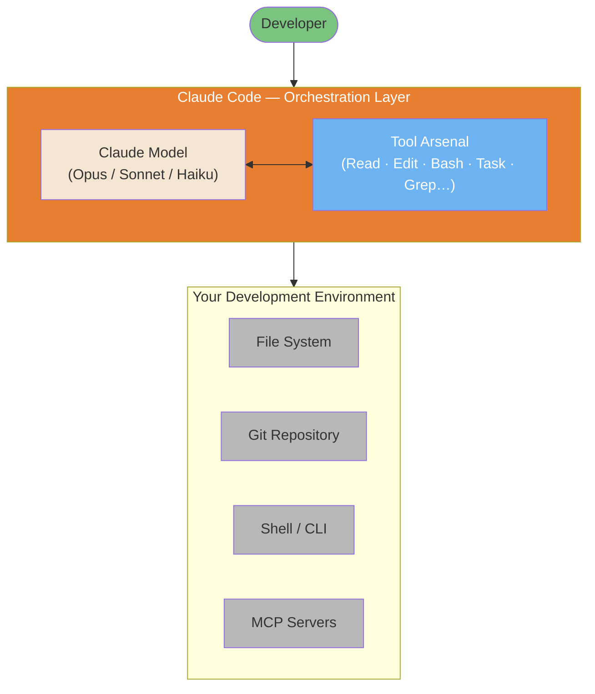

# Claude Code 工作原理：架构与内部机制

> 基于 Anthropic 官方文档和经过验证的社区分析，深入剖析 Claude Code 的内部机制。

**作者**：Florian BRUNIAUX | 由 Claude (Anthropic) 贡献

**阅读时间**：约 25 分钟（完整版）| 约 5 分钟（仅 TL;DR）

**最后核实**：2026 年 2 月（Claude Code v2.1.34）

---

## 来源透明度

本文档整合了三个层级的来源：

| 层级 | 描述 | 可信度 | 示例 |
|------|-------------|------------|---------|
| **第 1 层** | Anthropic 官方文档 | 100% | anthropic.com/engineering/* |
| **第 2 层** | 经过验证的逆向工程 | 70-90% | PromptLayer 分析、code.claude.com 行为 |
| **第 3 层** | 社区推断 | 40-70% | 已观察到但未经官方确认 |

每条论断都标注了其可信度等级。**在有官方文档时，始终优先采用官方文档**。

---

## TL;DR - 5 条要点总结

1. **简单循环**：Claude Code 运行一个 `while(tool_call)` 循环 —— 没有 DAG，没有分类器，没有 RAG。所有决策都由模型做出。

2. **八个核心工具**：Bash（通用适配器）、Read、Edit、Write、Grep、Glob、Task（子代理）、TodoWrite。这就是全部武器库。

   **搜索策略的演进**：早期的 Claude Code 版本曾试验使用 Voyage embeddings 进行 RAG，以实现语义化代码搜索。在内部基准测试显示基于 grep（ripgrep）的代理式搜索在更低运维复杂度下性能更优后，Anthropic 转向了这种方案 —— 无需索引同步，也没有来自外部 embedding 提供商的安全隐患。这种"搜索，而非索引"（Search, Don't Index）的理念以延迟/token 为代价换取了简洁性/安全性。社区插件（用于 AST 模式的 ast-grep）和 MCP 服务器（用于符号的 Serena、用于 RAG 的 grepai）可满足专门化需求。

   *来源*：[Latent Space podcast](https://www.latent.space/p/claude-code)（2025 年 5 月）、ast-grep 文档

3. **200K Token 预算**：上下文窗口在系统提示、历史记录、工具结果和响应缓冲区之间共享。在约 75-92% 容量时自动 compact。

4. **子代理 = 隔离**：`Task` 工具会派生出拥有各自上下文的子代理。它们不能再派生更多子代理（深度 = 1）。只有它们的摘要会返回。

5. **理念**："更少的脚手架，更多的模型"（Less scaffolding, more model）—— 信任 Claude 的推理能力，而不是围绕它构建复杂的编排系统。

---

## 可视化概览

Claude Code 不是一个新的 AI 模型。它是一个编排层，将 Claude（Opus/Sonnet/Haiku）包装起来，赋予其读取文件、运行 shell 命令、浏览代码仓库和派生子代理的能力 —— 所有这些都在一个持续的循环中进行，直到任务完成。



*灵感来自 [Mohamed Ali Ben Salem 的架构图](https://www.linkedin.com/posts/mohamed-ali-ben-salem-2b777b9a_en-ce-moment-je-vois-passer-des-posts-du-activity-7420592149110362112-eY5a) —— 更深入的拆解请参阅[架构内部机制图示](../diagrams/04-architecture-internals.md)。*

---

## 目录

- [可视化概览](#visual-overview)

1. [主循环](#1-the-master-loop)
2. [工具武器库](#2-the-tool-arsenal)
3. [上下文管理内部机制](#3-context-management-internals)
4. [子代理架构](#4-sub-agent-architecture)
5. [权限与安全模型](#5-permission--security-model)
6. [MCP 集成](#6-mcp-integration)
7. [高级工具使用模式（API）](#7-advanced-tool-use-patterns-api)
8. [Edit 工具：它实际如何工作](#8-the-edit-tool-how-it-actually-works)
9. [会话持久化](#9-session-persistence)
10. [理念：更少的脚手架，更多的模型](#10-philosophy-less-scaffolding-more-model)
11. [Claude Code 与替代方案对比](#11-claude-code-vs-alternatives)
12. [来源与参考](#12-sources--references)
13. [附录：我们尚不知道的事](#13-appendix-what-we-dont-know)


---

## 1. 主循环

**可信度**：100%（第 1 层 - 官方）
**来源**：[Anthropic Engineering Blog](https://www.anthropic.com/engineering/claude-code-best-practices)

究其核心，Claude Code 非常简单：

```
┌─────────────────────────────────────────────────────────────┐
│                    CLAUDE CODE MASTER LOOP                  │
├─────────────────────────────────────────────────────────────┤
│                                                             │
│   ┌──────────────┐                                          │
│   │  Your Prompt │                                          │
│   └──────┬───────┘                                          │
│          │                                                  │
│          ▼                                                  │
│   ┌──────────────────────────────────────────────────────┐  │
│   │                                                      │  │
│   │                  CLAUDE REASONS                      │  │
│   │        (No classifier, no routing layer)             │  │
│   │                                                      │  │
│   └────────────────────────┬─────────────────────────────┘  │
│                            │                                │
│                            ▼                                │
│                   ┌────────────────┐                        │
│                   │  Tool Call?    │                        │
│                   └───────┬────────┘                        │
│                           │                                 │
│              YES          │           NO                    │
│         ┌─────────────────┴─────────────────┐               │
│         │                                   │               │
│         ▼                                   ▼               │
│  ┌────────────┐                      ┌────────────┐         │
│  │  Execute   │                      │   Text     │         │
│  │   Tool     │                      │  Response  │         │
│  │            │                      │   (DONE)   │         │
│  └─────┬──────┘                      └────────────┘         │
│        │                                                    │
│        ▼                                                    │
│  ┌─────────────┐                                            │
│  │ Feed Result │                                            │
│  │  to Claude  │──────────────────┐                         │
│  └─────────────┘                  │                         │
│                                   │                         │
│                                   ▼                         │
│                          ┌────────────────┐                 │
│                          │   LOOP BACK    │                 │
│                          │  (Next turn)   │                 │
│                          └────────────────┘                 │
│                                                             │
└─────────────────────────────────────────────────────────────┘
```

### 这意味着什么

整个架构就是一个简单的 `while` 循环：

```
while (claude_response.has_tool_call):
    result = execute_tool(tool_call)
    claude_response = send_to_claude(result)
return claude_response.text
```

**这里不存在：**
- 意图分类器
- 任务路由器
- RAG/embedding 流水线
- DAG 编排器
- 规划器/执行器拆分

模型自身决定何时调用工具、调用哪些工具，以及何时完成。这就是 Anthropic 工程博客中所描述的"代理式循环"（agentic loop）模式。

### 为什么采用这种设计？

1. **简洁性**：组件越少 = 故障模式越少
2. **模型驱动**：Claude 的推理优于手工编写的启发式规则
3. **灵活性**：没有刚性流水线来约束 Claude 能做什么
4. **可调试性**：易于理解发生了什么以及为什么

### 代理式循环的 API 词汇

上面的主循环图从概念上展示了流程，但 Anthropic API 通过具体的 `stop_reason` 值来暴露它。每个 API 响应都包含一个 `stop_reason` 字段 —— 这是 Claude 用来发出下一步应做什么信号的方式。理解这三个值对于在 Anthropic SDK 之上构建自定义代理至关重要。

| `stop_reason` | 含义 | 循环动作 |
|---------------|---------|-------------|
| `tool_use` | Claude 想要调用一个或多个工具 | 执行工具，将结果回传，继续循环 |
| `end_turn` | Claude 判定它已经完成 | 退出循环，返回文本响应 |
| `max_tokens` | 在完成前已达到上下文限制 | 重新思考上下文策略，很可能需要进行摘要 |

有了这些名称，伪代码就变得精确了：

```python
messages = [{"role": "user", "content": user_prompt}]

while True:
    response = client.messages.create(model=model, messages=messages, tools=tools)

    if response.stop_reason == "end_turn":
        return response.content[0].text  # done

    if response.stop_reason == "tool_use":
        # Process every tool_use block in the response
        tool_results = []
        for block in response.content:
            if block.type == "tool_use":
                result = execute_tool(block.name, block.input)
                tool_results.append({
                    "type": "tool_result",
                    "tool_use_id": block.id,
                    "content": result
                })
        messages.append({"role": "assistant", "content": response.content})
        messages.append({"role": "user", "content": tool_results})
        # loop continues
```

`response.content` 中的 `tool_use` 块有三个你需要据以操作的字段：`id`（用于将结果匹配回去）、`name`（要调用哪个函数）以及 `input`（参数字典）。你回传的结果必须引用 `tool_use_id`，这样模型才能将调用与响应关联起来。

**`fork_session`** 是构建在此循环之上的一个更高层概念：它创建当前对话的一个独立分支，共享截至分叉点的相同消息历史。两个分支可以同时探索不同的方法或配置，就像 `git branch` 一样，但针对的是代理会话。每个分叉独立运行自己的代理式循环 —— 这对于在不同工具配置或提示变体下比较响应很有用，而无需从头重新运行整个对话。

#### 使用 max_turns 控制循环深度

`max_turns` 限制了编排器退出前的助手/工具迭代次数。如果没有显式限制，失控的循环可能会以事后难以诊断的方式耗尽预算或上下文窗口。

按任务类型划分的实用范围：

| 任务类型 | 推荐 `max_turns` |
|---|---|
| 简单检索（单次查找） | 5 |
| 研究或多步骤编码 | 20-30 |
| 长时间自主工作流 | 50 |

当达到 `max_turns` 时，循环会以最后写入的任何状态退出。任务可能未完成。始终检查最终的 `stop_reason` 并实现一个回退路径：

```python
result = agent.run(task, max_turns=20)
if result.stop_reason == "max_turns":
    # escalate or summarize partial progress
    handle_incomplete(result)
```

按任务类型而非全局设置 `max_turns`，可以防止单个慢任务在多代理流水线中拖垮其他任务。一个确实需要 50 轮的夜间批处理作业，不应继承与应在 5 轮内解决的快速查找相同的上限。

### 原生能力审查

使用此清单来核实你是否理解 Claude Code 的全部能力范围。每项能力都在本指南其他部分有详细说明。

**11 项原生能力**：

- [ ] **Event Hooks** —— 在工具执行时触发的 Bash/PowerShell 脚本
  - PreToolUse、PostToolUse、UserPromptSubmit、Notification
  - 参见：[第 5 节 Hooks](#5-permission--security-model)

- [ ] **Skill 范围的 Hooks** —— 特定于 skill 执行上下文的事件 hooks
  - 每个 skill 的生命周期管理
  - 参见：[终极指南第 5.11 节](#51-understanding-skills)

- [ ] **后台代理** —— 异步任务执行（测试套件、长时操作）
  - 非阻塞式代理派生
  - 参见：[第 4.2 节 子代理架构](#4-sub-agent-architecture)

- [ ] **Explore 子代理** —— 用于代码库分析的 `/explore`
  - 只读代码库探索
  - 参见：[第 4.2 节 子代理](#4-sub-agent-architecture)

- [ ] **Plan 子代理** —— 用于只读规划模式的 `/plan`
  - 安全的架构探索
  - 参见：[终极指南第 2.3 节](#23-plan-mode)

- [ ] **Task 工具** —— 向专门化代理进行分层任务委派
  - 并行任务执行，深度 = 1 的子代理
  - 参见：[第 4.2 节 子代理架构](#4-sub-agent-architecture)

- [ ] **Agent Teams** —— 多代理并行协调（实验性，v2.1.32+）
  - 基于 Git 的协调，自主任务认领
  - 参见：[终极指南第 9.20 节](#920-agent-teams-multi-agent-coordination)

- [ ] **逐任务模型选择** —— 会话中途动态切换模型
  - 在任务边界使用 `/model opus|sonnet|haiku`
  - 参见：[第 10 节 成本优化](#10-claude-code-vs-alternatives)

- [ ] **MCP 协议集成** —— 用于工具扩展的 Model Context Protocol
  - Context7、Sequential、Serena、Playwright 等
  - 参见：[第 6 节 MCP 集成](#6-mcp-integration)

- [ ] **权限模式** —— 对工具执行的细粒度控制
  - 默认、自动接受、plan mode、自定义规则
  - 参见：[第 5 节 权限与安全模型](#5-permission--security-model)

- [ ] **会话记忆** —— 跨会话的持久化上下文
  - CLAUDE.md、记忆文件、项目状态
  - 参见：[第 8 节 会话持久化](#8-session-persistence)

**入门提示**：如果你尚未探索全部 11 项能力，你很可能错失了提升效率的机会。请关注上面未勾选的项目。

**来源**：综合自 [Gur Sannikov 的分析](https://www.linkedin.com/posts/gursannikov_claudecode-embeddedengineering-aiagents-activity-7423851983331328001-DrFb)

---

## 2. 工具武器库

**置信度**: 100% (Tier 1 - 官方)
**来源**: [code.claude.com/docs](https://code.claude.com/docs/en/setup)

在大约 40 个内置工具中,这 8 个工具覆盖了日常使用的 90%。完整的工具列表(包括 Monitor、LSP、Workflow、Cron*、Task API、agent teams 等)请参阅[完整工具参考](./tools-reference.md)。

| 工具 | 用途 | 关键行为 | Token 成本 |
|------|---------|--------------|------------|
| `Bash` | 执行 shell 命令 | 通用适配器,功能最强大 | 低(命令)+ 可变(输出) |
| `Read` | 读取文件内容 | 最多 2000 行,处理截断 | 大文件时较高 |
| `Edit` | 修改已有文件 | 基于 diff,需要精确匹配 | 中 |
| `Write` | 创建/覆盖文件 | 若文件已存在必须先读取 | 中 |
| `Grep` | 搜索文件内容 | 基于 ripgrep(正则),取代了 RAG/embedding 方案。结构化代码搜索(基于 AST)请参阅 ast-grep 插件。权衡:Grep(快速、简单)vs ast-grep(精确、需配置)vs Serena MCP(语义化、符号感知) | 低 |
| `Glob` | 按模式查找文件 | 路径匹配,按 mtime 排序 | 低 |
| `Agent` | 派生 sub-agent(原 `Task`) | 隔离上下文,depth=1 限制 | 高(新上下文) |
| `TodoWrite` | 跟踪进度(遗留) | 已被 Tasks API 取代(v2.1.16+);自 v2.1.142 起默认禁用 | 低 |

### Bash 通用适配器

**关键洞见**: Bash 是 Claude 的瑞士军刀。它可以:

- 运行任意 CLI 工具(git、npm、docker、curl……)
- 执行脚本
- 用管道串联命令
- 访问系统状态

模型在海量 shell 数据上经过训练,因此当专用工具不够用时,它能极其高效地把 Bash 当作通用适配器使用。

### 工具选择逻辑

Claude 根据任务来决定使用哪个工具。不存在硬编码的路由:

```
┌─────────────────────────────────────────────────────┐
│              TOOL SELECTION (Model-Driven)          │
├─────────────────────────────────────────────────────┤
│                                                     │
│  "Read auth.ts"           → Read tool               │
│  "Find all test files"    → Glob tool               │
│  "Search for TODO"        → Grep tool               │
│  "Run npm test"           → Bash tool               │
│  "Explore the codebase"   → Task tool (sub-agent)   │
│  "Track my progress"      → TodoWrite tool          │
│                                                     │
│  The model learns these patterns during training,   │
│  not from explicit rules.                           │
│                                                     │
└─────────────────────────────────────────────────────┘
```

### 扩展工具生态

除了 8 个核心工具之外,Claude Code 还可以利用:

**MCP Servers** (Model Context Protocol):
- **Serena**: 符号感知的代码导航 + 会话记忆
- **grepai**: 语义搜索 + 调用图分析(基于 Ollama)
- **Context7**: 官方库文档查询
- **Sequential**: 结构化多步推理
- **Playwright**: 浏览器自动化和 E2E 测试
- **claude-code-ultimate-guide**: 12 个工具 —— 指南搜索、发布追踪、`compare_versions`、安全威胁查询(`get_threat`、`list_threats`,含 28 个 CVE + 655 个恶意 skill)、模板搜索(`search_examples`)—— `npx -y claude-code-ultimate-guide-mcp`

**社区插件**:
- **ast-grep**: 基于 AST 的结构化代码搜索(需显式调用)

### 搜索工具选择矩阵

Claude Code 提供多种代码搜索方式,各有特定优势:

| 搜索需求 | 原生工具 | MCP/插件替代方案 | 何时升级 |
|-------------|-------------|----------------------|------------------|
| 精确文本 | `Grep` (ripgrep) | - | 永不(最快) |
| 函数名 | `Grep` | Serena `find_symbol` | 跨文件重构 |
| 按含义 | - | grepai `search` | 不知道确切文本 |
| 调用图 | - | grepai `trace_callers` | 依赖分析 |
| 结构模式 | - | ast-grep | 大型迁移(>50k 行) |
| 文件结构 | - | Serena `get_symbols_overview` | 需要符号上下文 |

**性能对比**:

| 工具 | 速度 | 配置 | 使用场景 |
|------|-------|-------|----------|
| Grep (ripgrep) | ⚡ ~20ms | ✅ 无 | 90% 的搜索 |
| Serena | ⚡ ~100ms | ⚠️ MCP | 重构、符号 |
| grepai | 🐢 ~500ms | ⚠️ Ollama + MCP | 语义、调用图 |
| ast-grep | 🕐 ~200ms | ⚠️ 插件 | AST 模式、迁移 |

**决策原则**: 从 Grep 开始(最快),仅在需要时才升级到专用工具。

> **📖 深入了解**: 整合所有搜索工具的完整工作流,请参阅[搜索工具精通](../workflows/search-tools-mastery.md)。

---

## 3. 上下文管理内部机制

**置信度**: 80% (Tier 2 - 部分官方)
**来源**:
- [platform.claude.com/docs](https://platform.claude.com/docs/en/build-with-claude/context-windows) (Tier 1)
- 观察到的行为 (Tier 2)

Claude Code 在固定的上下文窗口内运行(~200K tokens,因模型而异)。

### 上下文预算分解

```
┌─────────────────────────────────────────────────────────────┐
│                 CONTEXT BUDGET (~200K tokens)               │
├─────────────────────────────────────────────────────────────┤
│                                                             │
│  ┌──────────────────────────────────────────────────────┐   │
│  │ System Prompt                            (~5-15K)    │   │
│  │ • Tool definitions                                   │   │
│  │ • Safety instructions                                │   │
│  │ • Behavioral guidelines                              │   │
│  │ • See detailed breakdown below ↓                     │   │
│  ├──────────────────────────────────────────────────────┤   │
│  │ CLAUDE.md Files                          (~1-10K)    │   │
│  │ • Global ~/.claude/CLAUDE.md                         │   │
│  │ • Project /CLAUDE.md                                 │   │
│  │ • Local /.claude/CLAUDE.md                           │   │
│  ├──────────────────────────────────────────────────────┤   │
│  │ Conversation History                     (variable)  │   │
│  │ • Your prompts                                       │   │
│  │ • Claude's responses                                 │   │
│  │ • Tool call records                                  │   │
│  ├──────────────────────────────────────────────────────┤   │
│  │ Tool Results                             (variable)  │   │
│  │ • File contents from Read                            │   │
│  │ • Command outputs from Bash                          │   │
│  │ • Search results from Grep                           │   │
│  ├──────────────────────────────────────────────────────┤   │
│  │ Reserved for Response                    (~40-45K)   │   │
│  │ • Claude's thinking                                  │   │
│  │ • Generated code/text                                │   │
│  └──────────────────────────────────────────────────────┘   │
│                                                             │
│  USABLE = Total - System - Reserved ≈ 140-150K tokens       │
│                                                             │
└─────────────────────────────────────────────────────────────┘
```

### System Prompt 内容

**置信度**: 100% (Tier 1 - Anthropic 官方文档)
**来源**:
- [Anthropic System Prompts Release Notes](https://platform.claude.com/docs/en/release-notes/system-prompts)
- [Anthropic Engineering: Claude Code Best Practices](https://www.anthropic.com/engineering/claude-code-best-practices)

Claude 的 system prompts(~5-15K tokens)作为透明度承诺的一部分,由 Anthropic **公开发布**。这些提示词定义了:

**核心组成部分**:
- **工具定义**: Bash、Read、Edit、Write、Grep、Glob、Task、TodoWrite
- **安全指令**: 内容政策、拒绝模式(参阅[安全加固](../security/security-hardening.md))
- **行为准则**: 任务优先、MVP 优先、不过度工程化
- **上下文指令**: 如何收集和使用项目上下文

**重要区别**:
- **Claude.ai/移动端**: 已发布的提示词可公开获取
- **Anthropic API**: 不同的默认指令,可由开发者配置
- **Claude Code CLI**: 具有上下文收集行为的智能编码助手

**社区分析**(用于更深入理解):
- **Simon Willison 的 Claude 4 分析**(2025 年 5 月):[深入剖析 thinking 块、搜索规则、安全护栏](https://simonwillison.net/2025/May/25/claude-4-system-prompt/)
- **PromptHub 技术拆解**(2025 年 6 月):[提示工程模式的详细分析](https://www.prompthub.us/blog/an-analysis-of-the-claude-4-system-prompt)

→ **交叉引用**: 关于安全影响,参阅[第 5 节:权限与安全模型](#5-permission--security-model)

**注意**: Claude Code 的 system prompts 可能与 Claude.ai/移动端版本不同。上述来源涵盖的是 Claude 系列;Code 专属的提示词已集成到 CLI 工具的行为中。

---

### 自动压缩(Auto-Compaction)

**置信度**: 75% (Tier 2 - 社区验证并有研究支撑)

当上下文用量超过阈值时,Claude Code 会自动总结较早的对话回合:

| 来源 | 报告的阈值 | 备注 |
|--------|-------------------|-------|
| VS Code 扩展 | ~75% 用量(剩余 25%) | [GitHub #11819](https://github.com/anthropics/claude-code/issues/11819)(2025 年 11 月) |
| CLI 版本 | 剩余 1-5% | 比 VS Code 更保守 |
| PromptLayer 分析 | 92% | 历史观察 |
| Steve Kinney | 95% | [Session Management Guide](https://stevekinney.com/courses/ai-development/claude-code-session-management)(2025 年 7 月) |
| 用户触发的 `/compact` | 任意时刻 | 手动控制 |

**压缩过程中发生了什么:**

1. 较早的对话回合被总结
2. 工具结果被精简
3. 近期上下文被完整保留
4. 模型收到一个"上下文已被压缩"的信号

**性能影响**(有研究支撑):

近期研究和从业者观察证实了**自动压缩会带来质量下降**:

- **随着上下文从 1K 增长到 32K tokens,LLM 在复杂任务上的性能下降 50-70%**([Context Rot Research](https://research.trychroma.com/context-rot),2025 年 7 月)
- **12 个模型中有 11 个在 32K tokens 时降至其短上下文性能的 50% 以下**(NoLiMa 基准)
- **自动压缩在反复的压缩循环中丢失细节并破坏引用关系**([Claude Saves Tokens, Forgets Everything](https://golev.com/post/claude-saves-tokens-forgets-everything/),2026 年 1 月)
- 在高上下文场景下,**注意力机制难以应对检索负担**

**社区共识**: 在逻辑断点处手动执行 `/compact` 优于等待自动压缩触发。

**推荐策略**([Lorenz, 2026](https://www.linkedin.com/posts/robin-lorenz-54055412a_claudecode-contextengineering-aiengineering-activity-7425136701515251713)):

| 上下文 % | 操作 | 理由 |
|-----------|--------|-----------|
| **70%** | 警告 - 规划清理 | 提前预警 |
| **85%** | 建议手动交接 | 防止自动压缩导致的质量下降 |
| **95%** | 强制交接 | 严重的质量下降 |

**用户控制**: 在逻辑断点处手动使用 `/compact` 触发总结,或使用 **session handoffs**(参阅[会话交接](#session-handoffs))在被压缩的历史之上保留意图。

### 上下文保留策略

| 策略 | 何时使用 | 如何使用 |
|----------|-------------|-----|
| Sub-agents | 探索性任务 | 用 `Task` 工具进行隔离搜索 |
| 手动压缩 | 主动清理 | `/compact` 命令 |
| 清除会话 | 需要重新开始时 | `/clear` 命令 |
| 精确读取 | 明确知道需要什么 | 读取确切的文件,而非目录 |
| CLAUDE.md | 持久化上下文 | 在记忆文件中存储约定 |

### 会话退化极限

**置信度**: 70% (Tier 2 - 从业者研究、arXiv 研究)

Claude Code 的有效性在特定条件下会以可预测的方式退化:

| 条件 | 观察到的阈值 | 症状 |
|-----------|-------------------|---------|
| 对话回合数 | **15-25 回合** | 丢失对早先约束的记忆 |
| Token 累积 | **80-100K tokens** | 忽略会话早期陈述的需求 |
| 问题范围 | **同时 >5 个文件** | 修改不一致、遗漏文件 |

**按范围划分的成功率**(来自从业者研究):

| 范围 | 成功率 | 示例 |
|-------|--------------|---------|
| 1-3 个文件 | ~85% | 修复单个模块中的 bug |
| 4-7 个文件 | ~60% | 跨组件重构功能 |
| 8+ 个文件 | ~40% | 全代码库范围的改动 |

**缓解策略**:

1. **检查点提示**: "在继续之前,复述当前的需求和约束。"
2. **会话重置**: 为新任务重新开始(`/clear`)
3. **收紧范围**: 把大任务拆分为聚焦的子任务
4. **使用 sub-agents**: 把探索工作委派给 `Task` 工具,以保留主上下文

### 失败触发的上下文漂移

这是一种不依赖于上下文大小的独立退化模式:反复的工具失败。当一次工具调用失败、Claude 重试时,错误输出会在上下文窗口中累积。堆栈跟踪、重试噪声和错误消息稀释了原本的意图 —— 后续尝试会跟随错误叙事而非任务目标。此时上下文窗口并未满,但信噪比已经退化。

这与压缩漂移不同。压缩处理的是上下文*大小*;失败重注入处理的是有界窗口内的上下文*质量*。

**模式**: 在每次命令失败时重新注入核心任务指令,而不仅是在 `/compact` 之后。一个 `PostToolUse` hook 可以在重试的提示词前面加上原始任务及约束的精简版本:

```bash
# PostToolUse hook: re-inject intent after failures
if [[ "$CLAUDE_TOOL_EXIT_CODE" != "0" ]]; then
  echo "REMINDER: The current task is: $ORIGINAL_TASK_SUMMARY. Ignore the above error if non-blocking and continue toward that goal."
fi
```

来源: [Nick Tune — Workflow DSL: Domain-Driven Claude Code Workflows](https://nick-tune.me/blog/2026-03-01-workflow-dsl-domain-driven-claude-code-workflows/)(2026-03-01)

---

## 4. Sub-Agent 架构

**置信度**：100%（Tier 1 - 已记录的行为）
**来源**：[code.claude.com/docs](https://code.claude.com/docs/en/setup) + 系统提示词（在工具定义中可见）

`Task` 工具会生成 sub-agent 用于并行或隔离的工作。

### 隔离模型

```
┌─────────────────────────────────────────────────────────────┐
│                        MAIN AGENT                           │
│                                                             │
│  ┌───────────────────────────────────────────────────────┐  │
│  │ Context: Full conversation + all file reads           │  │
│  │                                                       │  │
│  │         Task("Explore authentication patterns")       │  │
│  │                        │                              │  │
│  │                        ▼                              │  │
│  │  ┌─────────────────────────────────────────────────┐  │  │
│  │  │             SUB-AGENT (Spawned)                 │  │  │
│  │  │                                                 │  │  │
│  │  │  • Own fresh context window                     │  │  │
│  │  │  • Receives: task description only              │  │  │
│  │  │  • Has access to: same tools (except Task)      │  │  │
│  │  │  • CANNOT spawn sub-sub-agents (depth = 1)      │  │  │
│  │  │  • Returns: summary text only                   │  │  │
│  │  │                                                 │  │  │
│  │  └─────────────────────────────────────────────────┘  │  │
│  │                        │                              │  │
│  │                        ▼                              │  │
│  │         Result: "Found 3 auth patterns: JWT in..."    │  │
│  │         (Only this text enters main context)          │  │
│  │                                                       │  │
│  └───────────────────────────────────────────────────────┘  │
│                                                             │
└─────────────────────────────────────────────────────────────┘
```

### 为什么深度 = 1？

将 sub-agent 限制为一层可以防止：

1. **递归爆炸**：Agent 套娃会消耗无限的资源
2. **上下文污染**：每一层都会累积上下文
3. **调试噩梦**：追踪多层 agent 链非常困难
4. **不可预测的成本**：嵌套 agent = 不可预测的 token 用量

### Sub-Agent 类型

Claude Code 通过 `subagent_type` 参数提供专门的 sub-agent 类型：

| 类型 | 用途 | 可用工具 |
|------|---------|-----------------|
| `Explore` | 代码库探索 | 所有只读工具 |
| `Plan` | 架构规划 | 除 Edit/Write 外的所有工具 |
| `Bash` | 命令执行 | 仅 Bash |
| `general-purpose` | 复杂的多步骤任务 | 所有工具 |

### 何时使用 Sub-Agent

| 使用场景 | Sub-Agent 的帮助 |
|----------|---------------------|
| 搜索大型代码库 | 保持主上下文干净 |
| 并行探索 | 同时进行多个搜索 |
| 高风险探索 | 错误不会污染主上下文 |
| 专项分析 | 为不同任务采用不同的"思维方式" |

### Hub-and-Spoke 编排

生产环境中占主导地位的多 agent 模式是 **hub-and-spoke**（中心辐射）：一个协调者 agent 位于中心，管理 N 个 worker sub-agent，并且是唯一掌握全局视图的实体。

```
                    ┌─────────────────────┐
                    │    COORDINATOR      │
                    │  (Hub / Orchestrator)│
                    │                     │
                    │  • Decomposes goal  │
                    │  • Passes context   │
                    │  • Aggregates results│
                    │  • Resolves conflicts│
                    └──┬──────┬──────┬───┘
                       │      │      │
            ┌──────────┘      │      └──────────┐
            │                 │                 │
     ┌──────▼──────┐  ┌───────▼─────┐  ┌───────▼─────┐
     │  WORKER A   │  │  WORKER B   │  │  WORKER C   │
     │             │  │             │  │             │
     │  Specific   │  │  Specific   │  │  Specific   │
     │  task only  │  │  task only  │  │  task only  │
     └─────────────┘  └─────────────┘  └─────────────┘
           │                 │                 │
           └────────────────►│◄────────────────┘
                     (results flow back to coordinator only)
```

**关键规则：上下文绝不会自动继承。** 当协调者生成 Worker A 来分析文件 X 时，除非协调者在任务描述中显式传递，否则 Worker B 对该分析一无所知。Worker 在设计上就是隔离的——它们只接收任务字符串，别无其他。

这是多 agent 设计中最常见的错误：假设 sub-agent 共享上下文。它们并不共享。

**显式上下文传递模式：**

```python
# Wrong — Worker B won't know about Worker A's findings
task_a = Task("Analyze auth.py and find the session token logic")
task_b = Task("Find all callers of the session token logic")  # doesn't know where it is

# Correct — coordinator passes findings explicitly
result_a = run_task("Analyze auth.py and return the exact function name(s) handling session tokens")
task_b = Task(f"Find all callers of {result_a} across the codebase")  # explicit context
```

**协调者的职责：**

1. **分解**：将目标拆分为边界清晰的独立子任务
2. **显式传递上下文**：每个 worker 的任务描述都必须是自包含的
3. **聚合**：收集所有 worker 的文本结果，整合为连贯的输出
4. **裁决横切性问题**：只有协调者才能做出跨 worker 的决策

Worker 之间永远不应需要相互通信。如果需要，那就说明分解方式有误，该任务应归属于协调者。

---

## 5. 权限与安全模型

**置信度**：100%（Tier 1 - 官方）
**来源**：
- [code.claude.com/docs/en/hooks](https://code.claude.com/docs/en/hooks)
- [code.claude.com/docs/en/sandboxing](https://code.claude.com/docs/en/sandboxing)

Claude Code 采用分层的安全模型：

```
┌─────────────────────────────────────────────────────────────┐
│                    PERMISSION LAYERS                        │
├─────────────────────────────────────────────────────────────┤
│                                                             │
│  Layer 1: INTERACTIVE PROMPTS                               │
│  ┌────────────────────────────────────────────────────────┐ │
│  │ Claude wants to run: rm -rf node_modules               │ │
│  │ [Allow once] [Allow always] [Deny] [Edit command]      │ │
│  └────────────────────────────────────────────────────────┘ │
│                          │                                  │
│                          ▼                                  │
│  Layer 2: ALLOW/DENY RULES (settings.json)                  │
│  ┌────────────────────────────────────────────────────────┐ │
│  │ {                                                      │ │
│  │   "permissions": {                                     │ │
│  │     "allow": ["Bash(npm *)", "Read"],              │ │
│  │     "deny": ["Bash(rm -rf *)"]                         │ │
│  │   }                                                    │ │
│  │ }                                                      │ │
│  └────────────────────────────────────────────────────────┘ │
│                          │                                  │
│                          ▼                                  │
│  Layer 3: HOOKS (Pre/Post execution)                        │
│  ┌────────────────────────────────────────────────────────┐ │
│  │ PreToolUse: Validate before execution                  │ │
│  │ PostToolUse: Audit after execution                     │ │
│  │ PermissionRequest: Override permission prompts         │ │
│  └────────────────────────────────────────────────────────┘ │
│                          │                                  │
│                          ▼                                  │
│  Layer 4: SANDBOX MODE (Optional isolation)                 │
│  ┌────────────────────────────────────────────────────────┐ │
│  │ Filesystem isolation + Network restrictions            │ │
│  └────────────────────────────────────────────────────────┘ │
│                                                             │
└─────────────────────────────────────────────────────────────┘
```

### 危险模式检测

**置信度**：80%（Tier 2 - 已观察到但不详尽）

Claude Code 似乎会标记某些模式以进行额外审查：

| 模式 | 风险 | 行为 |
|---------|------|----------|
| `rm -rf` | 破坏性删除 | 始终提示 |
| `sudo` | 权限提升 | 始终提示 |
| `curl \| sh` | 远程代码执行 | 始终提示 |
| `chmod 777` | 不安全的权限 | 始终提示 |
| `git push --force` | 历史记录销毁 | 始终提示 |
| `DROP TABLE` | 数据销毁 | 始终提示 |

这并非完整的屏蔽列表——这些模式很可能是通过模型训练而非显式规则检测出来的。

### 原生沙箱（v2.1.0+）

**置信度**：100%（Tier 1 - 官方）
**来源**：[code.claude.com/docs/en/sandboxing](https://code.claude.com/docs/en/sandboxing)

Claude Code 内置了**原生沙箱**，使用操作系统级别的原语实现进程级隔离：

```
┌──────────────────────────────────────────────────────┐
│               Native Sandbox Architecture            │
├──────────────────────────────────────────────────────┤
│                                                      │
│  Bash Command Request                                │
│       │                                              │
│       ▼                                              │
│  Sandbox Wrapper (Seatbelt/bubblewrap)               │
│       │                                              │
│       ├─ Filesystem: read all, write CWD only        │
│       ├─ Network: SOCKS5 proxy + domain filtering    │
│       ├─ Process: isolated environment               │
│       │                                              │
│       ▼                                              │
│  OS Kernel Enforcement                               │
│       │                                              │
│       ├─ Allowed: operations within boundaries       │
│       ├─ Blocked: violations at system call level    │
│       └─ Notify: user receives alert on violation    │
│                                                      │
└──────────────────────────────────────────────────────┘
```

**操作系统原语**：

| 平台 | 机制 | 备注 |
|----------|-----------|-------|
| **macOS** | Seatbelt (TrustedBSD MAC) | 内置，内核级系统调用过滤 |
| **Linux/WSL2** | bubblewrap (namespaces + seccomp) | 需要：`sudo apt-get install bubblewrap socat` |
| **WSL1** | ❌ 不支持 | bubblewrap 需要不可用的内核特性 |
| **Windows** | ⏳ 计划中 | 尚未推出 |

**隔离模型**：

1. **文件系统**：
   - **读取**：整台计算机（被拒绝的路径除外）
   - **写入**：仅当前工作目录（可配置）
   - **被阻止**：CWD 之外的修改、凭据目录（`~/.ssh`、`~/.aws`）

2. **网络**：
   - **代理**：所有连接都通过 SOCKS5 代理路由
   - **域名过滤**：允许列表/拒绝列表模式
   - **默认阻止**：私有 CIDR、localhost 范围

3. **进程**：
   - **共享内核**：易受内核漏洞攻击（与 Docker microVM 不同）
   - **子进程**：继承相同的沙箱限制
   - **逃生通道**：为不兼容的工具提供 `dangerouslyDisableSandbox` 参数

**沙箱模式**：

- **自动允许模式**：如果在沙箱内运行，Bash 命令将自动批准（推荐用于日常开发）
- **常规权限模式**：所有命令都需要显式批准（高安全性）

**安全权衡**：

| 方面 | 原生沙箱 | Docker 沙箱（microVM） |
|--------|---------------|---------------------------|
| **内核隔离** | ❌ 共享内核 | ✅ 每个 VM 独立内核 |
| **配置** | 0 依赖（macOS），2 个包（Linux） | Docker Desktop 4.58+ |
| **开销** | 极小（~1-3% CPU） | 中等（~5-10% CPU） |
| **使用场景** | 日常开发、可信代码 | 不可信代码、最高安全性 |

**安全局限**：

⚠️ **域前置（Domain fronting）**：CDN（Cloudflare、Akamai）可绕过域名过滤
⚠️ **Unix 套接字**：错误配置的 `allowUnixSockets` 会导致权限提升
⚠️ **文件系统**：过于宽泛的写入权限会使针对 `$PATH` 目录的攻击成为可能

**何时使用**：

- ✅ **原生沙箱**：日常开发、可信团队、轻量级配置
- ✅ **Docker 沙箱**：不可信代码、内核漏洞防护、需要 Docker-in-Docker

**深入了解**：完整的技术参考、配置示例和故障排查请参阅 [原生沙箱指南](../security/sandbox-native.md)。

### Hooks 系统

Hooks 允许以编程方式控制 Claude 的操作：

```json
{
  "hooks": {
    "PreToolUse": [
      {
        "matcher": "Bash",
        "hooks": [{
          "type": "command",
          "command": "/path/to/validate-command.sh"
        }]
      }
    ],
    "PostToolUse": [
      {
        "matcher": "*",
        "hooks": [{
          "type": "command",
          "command": "/path/to/audit-log.sh"
        }]
      }
    ]
  }
}
```

**Hook 能力：**

| 能力 | 是否支持 | 实现方式 |
|------------|-----------|-----|
| 阻止执行 | 是 | 退出码 2 |
| 修改参数 | 是 | 返回修改后的 JSON |
| 记录操作 | 是 | 在 hook 中写入文件 |
| 异步处理 | 是 | 在 hook 配置中设置 `async: true`（v2.1.0+） |

**Hook JSON 载荷**（通过 stdin 传入）：

```json
{
  "session_id": "abc123",
  "transcript_path": "/home/user/.claude/projects/.../transcript.jsonl",
  "cwd": "/path/to/project",
  "permission_mode": "default",
  "hook_event_name": "PreToolUse",
  "tool_name": "Bash",
  "tool_input": {
    "command": "npm install lodash"
  }
}
```

发送给所有事件的通用字段：`session_id`、`transcript_path`、`cwd`、`permission_mode`、`hook_event_name`。事件特定字段（例如 PreToolUse 的 `tool_name`/`tool_input`）会在此基础上追加。

→ **交叉引用**：完整示例请参阅主指南中的 [Section 7 - Hooks](#7-hooks)。

---

## 6. MCP 集成

**可信度**：100%（Tier 1 - 官方）
**来源**：[code.claude.com/docs/en/mcp](https://code.claude.com/docs/en/mcp)

MCP（Model Context Protocol）服务器为 Claude Code 扩展额外的工具。

### MCP 架构概览

> **💡 可视化指南**：下图展示了 MCP 如何在 LLM 与真实系统之间创建一个安全的控制层。LLM 层**没有直接的数据访问权限**——在工具能够与数据库、API 或文件交互之前，MCP Server 会强制执行安全策略。


*图 1：MCP 架构，展示思考层（LLM）、控制层（MCP Server）与执行层（Tools）之间的分离。设计灵感来自 [Dinesh Kumar 的 LinkedIn 可视化](https://www.linkedin.com/posts/dinesh-kumar-6b0528b4_model-context-protocol-mcp-why-it-came-activity-7419969525795782656-VoFh)，在 Apache-2.0 许可下重新绘制。*

**关键安全边界**：
- **黄色层（LLM）**：仅负责推理——**无数据访问**
- **橙色层（MCP Server）**：安全控制点（策略、校验、日志）
- **灰色层（真实系统）**：受保护的数据——**对 AI 隐藏**

### MCP 的工作原理（技术细节）

```
┌─────────────────────────────────────────────────────────────┐
│                    MCP INTEGRATION                          │
├─────────────────────────────────────────────────────────────┤
│                                                             │
│  ┌─────────────────────────────────────────────────────┐    │
│  │                  CLAUDE CODE                        │    │
│  │                                                     │    │
│  │   Native Tools        MCP Tools                     │    │
│  │   ┌─────────┐        ┌─────────────────────────┐    │    │
│  │   │ Bash    │        │ mcp__serena__*          │    │    │
│  │   │ Read    │        │ mcp__context7__*        │    │    │
│  │   │ Edit    │        │ mcp__playwright__*      │    │    │
│  │   │ ...     │        │ mcp__custom__*          │    │    │
│  │   └─────────┘        └───────────┬─────────────┘    │    │
│  │                                  │                  │    │
│  └──────────────────────────────────┼──────────────────┘    │
│                                     │                       │
│                           JSON-RPC 2.0                      │
│                                     │                       │
│                                     ▼                       │
│  ┌─────────────────────────────────────────────────────┐    │
│  │                  MCP SERVER                         │    │
│  │                                                     │    │
│  │   stdio/HTTP transport                              │    │
│  │   Tool definitions (JSON Schema)                    │    │
│  │   Tool implementations                              │    │
│  │                                                     │    │
│  └─────────────────────────────────────────────────────┘    │
│                                                             │
└─────────────────────────────────────────────────────────────┘
```

### MCP 关键事实

| 方面 | 行为 |
|--------|----------|
| 协议 | 基于 stdio 或 HTTP 的 JSON-RPC 2.0 |
| 工具命名 | `mcp__<server>__<tool>` 约定 |
| 上下文共享 | 仅通过工具参数和返回值 |
| 生命周期 | 服务器在首次使用时启动，并在会话期间保持运行 |
| 权限 | 与原生工具采用相同的系统 |

### MCP 无法做到的事

| 限制 | 说明 |
|------------|-------------|
| 访问对话历史 | 只能看到工具参数，看不到完整上下文 |
| 在多次调用间维持状态 | 每次调用都是独立的（除非服务器自行实现缓存） |
| 修改 Claude 的系统提示 | 仅限工具，无法进行提示注入 |
| 绕过权限 | 与原生工具处于同一安全层 |

→ **交叉引用**：关于安全方面的考量，参见 [Section 8.6 - MCP Security](#86-mcp-security)。

### MCP 扩展：Apps（SEP-1865）

**状态**：稳定版（2026 年 1 月 26 日）
**规范**：[SEP-1865 on GitHub](https://github.com/modelcontextprotocol/ext-apps)
**联合作者**：OpenAI、Anthropic、MCP-UI 创建者

#### 什么是 MCP Apps？

MCP Apps 是 Model Context Protocol 的**第一个官方扩展**，使 MCP 服务器能够在传统工具响应之外提供**交互式用户界面**。

**它解决的问题**：传统的纯文本响应给需要探索的工作流带来了摩擦。每一次交互（排序、筛选、下钻）都需要一个新的提示周期。MCP Apps 通过直接在对话中渲染交互式 UI，消除了这种"上下文鸿沟"。

#### 技术架构

**两个核心原语**：

1. **带有 UI 元数据的工具**：
   ```json
   {
     "name": "query_database",
     "description": "Query customer database",
     "_meta": {
       "ui": {
         "resourceUri": "ui://dashboard/customers"
       }
     }
   }
   ```

2. **UI 资源**（`ui://` scheme）：
   - 服务器端的 HTML/JavaScript 包
   - 由宿主在沙箱化的 iframe 中渲染
   - 通过 `postMessage` 进行双向 JSON-RPC 通信

**通信流程**：

```
┌─────────────────────────────────────────────────────────┐
│                  MCP APPS ARCHITECTURE                  │
├─────────────────────────────────────────────────────────┤
│                                                         │
│  ┌──────────────┐         ┌──────────────┐             │
│  │  MCP Client  │◄───────►│  MCP Server  │             │
│  │ (Claude/IDE) │ JSON-RPC│  (Your App)  │             │
│  └──────┬───────┘         └──────────────┘             │
│         │                                               │
│         │ Fetches ui:// resource                       │
│         ▼                                               │
│  ┌─────────────────────────────────────────┐            │
│  │     Sandboxed Iframe (UI Render)        │            │
│  │  ┌───────────────────────────────────┐  │            │
│  │  │  HTML/JS Bundle from Server       │  │            │
│  │  │  - Interactive dashboard           │  │            │
│  │  │  - Forms with validation           │  │            │
│  │  │  - Real-time data visualization    │  │            │
│  │  └───────────────────────────────────┘  │            │
│  │                                          │            │
│  │  postMessage ◄─────► JSON-RPC           │            │
│  └─────────────────────────────────────────┘            │
│                                                         │
└─────────────────────────────────────────────────────────┘
```

#### 安全模型

**多层防护**：

| 层级 | 防护 |
|-------|------------|
| **Iframe 沙箱** | 受限权限（无直接系统访问） |
| **预声明模板** | 宿主在渲染前审查 HTML/JS |
| **可审计的消息传递** | 所有 UI 到宿主的通信均通过 JSON-RPC 日志 |
| **用户同意** | 对 UI 发起的工具调用可选要求 |
| **内容拦截** | 宿主可在渲染前拒绝可疑资源 |

→ **交叉引用**：关于更广泛的 MCP 安全考量，参见 [Section 8.6 - MCP Security](#86-mcp-security)。

#### SDK：@modelcontextprotocol/ext-apps

**安装**：
```bash
npm install @modelcontextprotocol/ext-apps
```

**核心 API**（与框架无关）：

```typescript
import { App } from '@modelcontextprotocol/ext-apps';

const app = new App();

// 1. Establish communication with host
await app.connect();

// 2. Receive tool results from host
app.ontoolresult = (result) => {
  // Update UI with tool execution results
  updateDashboard(result.data);
};

// 3. Call server tools from UI
await app.callServerTool('fetch_analytics', {
  timeRange: '7d',
  metrics: ['users', 'revenue']
});

// 4. Update model context asynchronously
await app.updateModelContext({
  selectedFilters: ['region:EU', 'status:active']
});

// Additional capabilities:
app.logDebug('User action', { filter: 'applied' });
app.openBrowserLink('https://docs.example.com');
app.sendFollowUpMessage('Applied filters: EU, Active');
```

**标准通信**：所有功能均基于 `postMessage` 运行（无框架锁定）。

#### 平台支持

| 平台 | MCP Apps 支持 | 备注 |
|----------|------------------|-------|
| **Claude Desktop** | ✅ 现已可用 | claude.ai/directory（Pro/Max/Team/Enterprise） |
| **Claude Cowork** | 🔄 即将推出 | 计划集成 Agentic 工作流 |
| **VS Code** | ✅ Insiders 构建版 | [官方博客文章](https://code.visualstudio.com/blogs/2026/01/26/mcp-apps-support) |
| **ChatGPT** | 🔄 逐步推出中 | 2026 年 1 月 26 日当周 |
| **Goose** | ✅ 现已可用 | 支持 UI 的开源 CLI |
| **Claude Code CLI** | ❌ 不适用 | 终端仅支持文本（无 iframe 渲染） |

#### 对 Claude Code 用户的相关性

**直接使用**：无（CLI 仅支持文本，无法渲染 iframe）

**间接收益**：

1. **生态系统理解**：MCP Apps 代表了 Agentic 工作流的未来
2. **MCP 服务器开发**：如果你在构建自定义 MCP 服务器，Apps 现已成为一个设计选项
3. **混合工作流**：
   - 使用 Claude Desktop 配合 Apps 探索数据（仪表盘、可视化）
   - 切换到 Claude Code CLI 进行实现（脚本编写、自动化）
4. **配置的上下文**：MCP 服务器可能会在元数据中声明 UI 能力

#### 示例实现

**官方示例服务器**（位于 [`ext-apps` 仓库](https://github.com/modelcontextprotocol/ext-apps)）：

- **threejs-server**：3D 可视化与操作
- **map-server**：交互式地理数据探索
- **pdf-server**：带内联高亮的文档查看
- **system-monitor-server**：实时指标仪表盘
- **sheet-music-server**：乐谱渲染

**生产环境采用情况**（2026 年 1 月）：

| 工具 | 提供方 | 能力 |
|------|----------|--------------|
| Asana | Asana | 项目时间线、任务看板 |
| Slack | Salesforce | 带格式预览的消息草拟 |
| Figma | Figma | 在 FigJam 中绘制流程图、甘特图 |
| Amplitude | Amplitude | 带交互式筛选的分析图表 |
| Box | Box | 文件搜索、文档预览 |
| Canva | Canva | 带实时定制的演示文稿设计 |
| Clay | Clay | 公司调研、联系人发现 |
| Hex | Hex | 带交互式查询的数据分析 |
| monday.com | monday.com | 工作管理看板 |

**即将推出**：Salesforce（Agentforce 360）

#### 与既有工作的关系

MCP Apps 将以下项目首创的模式标准化：
- **MCP-UI**：MCP 早期的 UI 扩展（社区项目）
- **OpenAI Apps SDK**：交互式工具的并行尝试

两个框架仍将继续受到支持。MCP Apps 提供了一份**统一规范**（SEP-1865），由两个生态系统的维护者以及 Anthropic 和 OpenAI 共同撰写。

**迁移路径**：对于现有的 MCP-UI 和 Apps SDK 实现来说非常直接。

#### 何时使用 MCP Apps

**面向 MCP 服务器开发者的决策树**：

```
Building a custom MCP server?
├─ Users need to SELECT from 50+ options? → MCP Apps (dropdown, multi-select UI)
├─ Users need to VISUALIZE data patterns? → MCP Apps (charts, maps, graphs)
├─ Users need MULTI-STEP workflows with conditional logic? → MCP Apps (wizard forms)
├─ Users need REAL-TIME updates? → MCP Apps (live dashboards)
└─ Simple data retrieval or actions only? → Traditional MCP tools (sufficient)
```

**权衡**：UI 复杂度和实现成本 vs. 用户体验提升。

#### 资源

- **规范**：[SEP-1865 on GitHub](https://github.com/modelcontextprotocol/ext-apps)
- **SDK**：[`@modelcontextprotocol/ext-apps` (npm)](https://www.npmjs.com/package/@modelcontextprotocol/ext-apps)
- **示例服务器**：[modelcontextprotocol/ext-apps repository](https://github.com/modelcontextprotocol/ext-apps)
- **博客文章（MCP）**：[MCP Apps announcement](https://blog.modelcontextprotocol.io/posts/2026-01-26-mcp-apps/)
- **博客文章（Claude）**：[Interactive tools in Claude](https://claude.com/blog/interactive-tools-in-claude)
- **VS Code**：[MCP Apps support announcement](https://code.visualstudio.com/blogs/2026/01/26/mcp-apps-support)

---

### MCP 工具搜索（惰性加载）

**可信度**：100%（Tier 1 - 官方）
**来源**：[anthropic.com/engineering/advanced-tool-use](https://www.anthropic.com/engineering/advanced-tool-use)

自 v2.1.7（2026 年 1 月）起，Claude Code 对 MCP 工具定义采用**惰性加载**，而不再将所有工具预加载到上下文中。该机制由 Anthropic 的 [Advanced Tool Use](https://www.anthropic.com/engineering/advanced-tool-use) API 特性驱动。

**它解决的问题：**
- MCP 工具定义会消耗大量上下文（例如，仅 GitHub MCP 一项：93 个工具就占用约 46K tokens）
- 开发者 Scott Spence 记录到在输入第一个提示之前就已消耗 66,000+ tokens
- 这种"上下文污染"限制了 MCP 的实际采用

**工具搜索的工作原理：**

```
┌─────────────────────────────────────────────────────────────┐
│                   MCP TOOL SEARCH FLOW                       │
├─────────────────────────────────────────────────────────────┤
│                                                             │
│  WITHOUT Tool Search (eager loading):                       │
│  ┌──────────────────────────────────────────────────────┐   │
│  │All 100+ tool definitions loaded upfront (~55K tokens)│   │
│  └──────────────────────────────────────────────────────┘   │
│                                                             │
│  WITH Tool Search (lazy loading):                           │
│  ┌──────────────────────────────────────────────────────┐   │
│  │ Step 1: Only search tool loaded (~500 tokens)        │   │
│  │ Step 2: Claude determines needed capability          │   │
│  │ Step 3: Tool Search finds matching tools (regex/BM25)│   │
│  │ Step 4: Only matched tools loaded (~600 tokens each) │   │
│  │ Step 5: Tool invoked normally                        │   │
│  └──────────────────────────────────────────────────────┘   │
│                                                             │
│  Result: 55K tokens → ~8.7K tokens (85% reduction)          │
│                                                             │
└─────────────────────────────────────────────────────────────┘
```

**实测改进**（Anthropic 基准测试）：

| 指标 | 之前 | 之后 | 改进 |
|--------|--------|-------|-------------|
| Token 开销（5 服务器配置） | ~55K | ~8.7K | **降低 85%** |
| Opus 4 工具选择准确率 | 49% | 74% | +25 个百分点 |
| Opus 4.5 工具选择准确率 | 79.5% | 88.1% | +8.6 个百分点 |
| Opus 4.6 自适应思考 | 不适用 | 自动校准 | 动态深度 |

**配置**（v2.1.9+）：

```bash
# Environment variable
ENABLE_TOOL_SEARCH=auto      # Default (10% context threshold)
ENABLE_TOOL_SEARCH=auto:5    # Aggressive (5% threshold)
ENABLE_TOOL_SEARCH=auto:20   # Conservative (20% threshold)
ENABLE_TOOL_SEARCH=true      # Always enabled
ENABLE_TOOL_SEARCH=false     # Disabled (eager loading)
```

| 阈值 | 推荐用于 |
|-----------|-----------------|
| `auto:20` | 轻量级配置（5-10 个工具） |
| `auto:10` | 均衡默认值（20-50 个工具） |
| `auto:5` | 重度用户（100+ 个工具） |

→ 正如 Simon Willison 所言："上下文污染正是我很少使用 MCP 的原因。如今这个问题已经解决，没有理由不把数十个甚至数百个 MCP 接入 Claude Code。" — [X/Twitter，2026 年 1 月 14 日](https://twitter.com/simonw)

---

## 7. 高级工具使用模式（API）

**置信度**：90%（Tier 1 - Anthropic 官方工程团队）
**来源**：[Anthropic Engineering: Advanced Tool Use](https://www.anthropic.com/engineering/advanced-tool-use) | [Programmatic Tool Calling Docs](https://platform.claude.com/docs/en/agents-and-tools/tool-use/programmatic-tool-calling)

四项 API 层面的特性已于 2026 年 2 月 18 日正式发布（随 Opus/Sonnet 4.6 一同推出）。这些特性面向在 Anthropic API 或 Agent SDK 上构建 agent 的开发者——并不能直接在 Claude Code CLI 中使用。

| 特性 | 解决的问题 | 可用范围 |
|---------|---------------|--------------|
| Programmatic Tool Calling (PTC) | agent 循环在往返调用上消耗 token | API + Foundry |
| Dynamic Filtering | 网络搜索用噪声塞满上下文 | API + Foundry |
| Tool Search Tool | 工具定义过多导致上下文膨胀 | API + Foundry |
| Tool Use Examples | 仅靠 schema 无法表达使用模式 | API + Foundry |

**分层策略**——优先解决你最大的瓶颈：
- 上下文被工具定义撑大 → Tool Search Tool
- 中间结果过大 → Programmatic Tool Calling
- 网络研究返回大量噪声 → Dynamic Filtering
- schema 正确但参数仍然出错 → Tool Use Examples

### Programmatic Tool Calling (PTC)

**范式转变**：与其每次只调用一个工具并经历一整轮完整的模型往返，Claude 转而编写 Python 代码在内部编排所有工具调用。只有最终的 `stdout` 才会进入上下文窗口。

```
Traditional: prompt → Claude → tool 1 → response 1 → Claude → tool 2 → response 2 → Claude → answer
             (3 tools = 3 inference passes, 3× intermediate results in context)

PTC:         prompt → Claude → writes Python → code calls tool 1, 2, 3 → stdout → Claude → answer
             (3 tools = 1 inference pass, only final output in context)
```

**配置**——用 `allowed_callers` 标记可从代码执行沙箱中调用的工具：

```json
{
  "tools": [
    { "type": "code_execution_20250825", "name": "code_execution" },
    {
      "name": "query_database",
      "description": "Execute SQL. Returns rows as JSON: id (str), name (str), revenue (float).",
      "input_schema": {
        "type": "object",
        "properties": { "sql": { "type": "string" } },
        "required": ["sql"]
      },
      "allowed_callers": ["code_execution_20250825"]
    }
  ]
}
```

| `allowed_callers` 取值 | 行为 |
|-------------------------|----------|
| 省略 / `["direct"]` | 仅支持传统调用方式 |
| `["code_execution_20250825"]` | 仅可从 Python 沙箱中调用 |
| `["direct", "code_execution_20250825"]` | 两种模式皆可——不推荐（会让 Claude 混淆） |

**使用模式**（全部在 1 次推理中完成）：
- 批处理：循环遍历 N 个项目，聚合，打印汇总
- 提前终止：一旦满足成功条件即跳出
- 条件式工具选择：根据中间结果选用轻量工具还是重量工具
- 数据过滤：减少 Claude 所看到的内容（`errors = [l for l in logs if "ERROR" in l]`）

**Token 效率**：来自程序化调用的工具结果永远不会进入 Claude 的上下文——只有最终的 `stdout` 会。10 次程序化工具调用所占的上下文 token ≈ 10 次直接调用的十分之一。整体约 37% 的 token 缩减这一说法来自社区报告（Shayan Tabe 的分析），并未得到 Anthropic 的官方确认。

**限制条件**：仅限 API 和 Foundry（不支持 Bedrock/Vertex）。不支持 MCP 工具、不支持网络搜索/抓取、不支持 `strict: true` 工具。容器存活时间约 4.5 分钟。不在 Zero Data Retention 覆盖范围内。

### 网络搜索/抓取的 Dynamic Filtering

网络搜索和抓取工具会把完整的 HTML 倾倒进上下文——包括导航栏、广告、模板样板内容。Dynamic Filtering 让 Claude 能编写 Python 在结果进入上下文窗口之前先进行预处理和过滤。

**配置**——使用更新后的工具类型版本，并附带 beta header：

```json
{
  "tools": [
    { "type": "web_search_20260209", "name": "web_search" },
    { "type": "web_fetch_20260209", "name": "web_fetch" }
  ]
}
```

需要的 header：`anthropic-beta: code-execution-web-tools-2026-02-09`。在 Sonnet 4.6 或 Opus 4.6 上使用这些工具类型版本时，过滤功能默认启用。

**官方基准测试结果**（Anthropic，BrowseComp 数据集）：

| 模型 | 不使用过滤 | 使用过滤 | 提升 |
|-------|-------------------|----------------|-------------|
| Sonnet 4.6 | 33.3% | 46.6% | +13.3 pp |
| Opus 4.6 | 45.3% | 61.6% | +16.3 pp |

平均输入 token 缩减：约 24%。最适合用于多步研究、引用核实，以及从大型页面中提取特定数据点。

### Tool Use Examples

JSON schema 定义了结构，但无法表达何时应包含可选参数、哪些参数组合有意义，或格式约定。在工具定义中加入 `input_examples` 来展示具体的使用模式：

```json
{
  "name": "create_ticket",
  "input_schema": { ... },
  "input_examples": [
    { "title": "Login page 500 error", "priority": "critical", "assignee": "oncall-team", "labels": ["bug", "auth"] },
    { "title": "Add dark mode", "priority": "low", "labels": ["feature-request"] },
    { "title": "Update API docs for v2" }
  ]
}
```

复杂参数处理的准确率：在 Anthropic 的基准测试中从 72% 提升到 90%。每个工具使用 1-5 个真实示例，覆盖最简、部分和完整的参数说明。

### 与 Claude Code 的相关性

| 特性 | Claude Code CLI | CLI 用户的应对方式 |
|---------|----------------|---------------------|
| Tool Search（MCP 惰性加载） | 自 v2.1.7 起内置为 MCPSearch auto 模式 | 调优 `ENABLE_TOOL_SEARCH=auto:N`——已在上文 §6 中记录 |
| Tool Use Examples | 无法从 CLI 配置 | 与自定义 MCP server 作者相关——向工具 schema 添加 `input_examples` |
| Programmatic Tool Calling | CLI 中不可用 | 与构建自定义 agent 的 Agent SDK 开发者相关 |
| Dynamic Filtering | CLI 中不可用 | 与做网络研究流水线的 Agent SDK 用户相关 |

---

## 8. Edit 工具：它实际是如何工作的

**置信度**：90%（Tier 2 - 经行为验证）
**来源**：
- 观察到的行为
- [github.com/cline/cline/issues/2909](https://github.com/cline/cline/issues/2909)（类似实现）

Edit 工具比它表面看起来更为精巧。

### Edit 算法

```
┌─────────────────────────────────────────────────────────────┐
│                     EDIT TOOL FLOW                          │
├─────────────────────────────────────────────────────────────┤
│                                                             │
│  Input: old_string, new_string, file_path                   │
│                                                             │
│         ┌──────────────────────────────────────┐            │
│         │ Step 1: EXACT MATCH                  │            │
│         │ Search for literal old_string        │            │
│         └────────────────┬─────────────────────┘            │
│                          │                                  │
│              Found?  ────┴────  Not found?                  │
│                │                     │                      │
│                ▼                     ▼                      │
│         ┌──────────┐         ┌──────────────────┐           │
│         │ REPLACE  │         │ Step 2: FUZZY    │           │
│         │  (done)  │         │ MATCH            │           │
│         └──────────┘         └────────┬─────────┘           │
│                                       │                     │
│                           Found?  ────┴────  Not found?     │
│                             │                     │         │
│                             ▼                     ▼         │
│                      ┌──────────┐         ┌──────────────┐  │
│                      │ REPLACE  │         │    ERROR     │  │
│                      │ + WARN   │         │  (mismatch)  │  │
│                      └──────────┘         └──────────────┘  │
│                                                             │
└─────────────────────────────────────────────────────────────┘
```

### 模糊匹配细节

当精确匹配失败时，Edit 工具会尝试：

1. **空白字符归一化**：忽略行尾空格，规范化缩进
2. **行尾归一化**：处理 CRLF 与 LF 的差异
3. **上下文扩展**：利用周围的行来定位正确位置

如果模糊匹配也失败，工具会返回一个错误，要求 Claude 核实 old_string。

### Edit 校验

在应用更改之前，Edit 工具会：

| 检查项 | 目的 |
|-------|---------|
| 文件存在 | 防止通过 Edit 创建文件 |
| 找到 old_string | 确保我们编辑的是正确的位置 |
| 唯一匹配 | old_string 必须唯一（或使用 `replace_all`） |
| 新内容有差异 | 防止无效（no-op）的编辑 |

### Edit 失败时

| 错误 | 原因 | Claude 的应对 |
|-------|-------|-------------------|
| "old_string not found" | 自上次读取后内容已变更 | 重新读取文件，再次尝试 |
| "Multiple matches" | old_string 不唯一 | 使用更多的上下文行 |
| "File not found" | 路径错误 | 搜索正确的路径 |

---

## 9. 会话持久化

**置信度**：100%（Tier 1 - 官方）
**来源**：[code.claude.com/docs](https://code.claude.com/docs/en/setup)

会话可以跨终端会话恢复。

### 恢复机制

| 命令 | 行为 |
|---------|----------|
| `claude --continue` / `claude -c` | 恢复最近一次会话 |
| `claude --resume <id>` / `claude -r <id>` | 按 ID 恢复指定会话 |

### 哪些内容会被持久化

| 会被持久化 | 不会被持久化 |
|-----------|---------------|
| 对话历史 | 实时工具状态 |
| 工具调用结果 | 待执行的操作 |
| 会话 ID | 文件锁 |
| 工作目录上下文 | 环境变量 |

### 存储格式

**置信度**：50%（Tier 3 - 推断）

会话似乎以 JSON/JSONL 文件的形式存储在 `~/.claude/` 中，但：

- 格式未公开记录
- 并非作为稳定的 API 提供
- 可能在不同版本间发生变化

**请勿依赖会话文件格式**来构建外部工具。

---

## 10. 理念：更少脚手架，更多模型

**置信度**：100%（Tier 1 - 官方）
**来源**：Daniela Amodei（Anthropic 联合创始人兼总裁）- 公开声明

Claude Code 背后的核心理念：

> "以少胜多。明智的架构选择、更高的训练效率以及聚焦的问题解决，足以与纯粹的规模相抗衡。"

### 实践中的含义

| 传统方法 | Claude Code 方法 |
|---------------------|---------------------|
| 意图分类器 → 路由器 → 专家模型 | 单一模型决定一切 |
| 基于 embeddings 的 RAG | Grep + Glob（正则搜索） |
| DAG 任务编排 | 简单的 while 循环 |
| 工具专用规划器 | 模型驱动的工具选择 |
| 复杂状态机 | 以对话为状态 |
| 提示工程框架 | 信任模型 |

### 为何有效

1. **模型能力**：Claude 4+ 已经足够强大，能够处理路由决策
2. **延迟降低**：组件更少 = 响应更快
3. **调试更简单**：当出现故障时，只有一个地方需要排查
4. **泛化更好**：没有手写规则会在边缘情况下失效

### 权衡取舍

| 优势 | 劣势 |
|-----------|--------------|
| 简单性 | 细粒度控制更少 |
| 灵活性 | 更难强制执行严格的行为 |
| Bug 更少 | 模型错误会影响一切 |
| 快速迭代 | 需要高质量的模型 |

### 社区验证

"原生能力优先"的方法正越来越多地得到外部实践者的验证。嵌入式工程团队（包括前 Cursor 重度用户）正趋同于采用 Agent Skills 标准，而非外部编排框架，这证明了信任 Claude 原生推理能力、而非堆叠脚手架层的可行性。

**示例**：[Gur Sannikov](https://www.linkedin.com/posts/gursannikov_claudecode-embeddedengineering-aiagents-activity-7423851983331328001-DrFb)（嵌入式工程领域）仅使用 Claude Code 的原生能力（hooks、skills、Task Tool）采用了 ADR 驱动的工作流，无需任何外部框架——这验证了本指南所记录的架构理念。

这种趋同表明，"更少脚手架，更多模型"的方法的可扩展性超出了最初的预期，即便是面对嵌入式系统开发这样复杂的工程领域也是如此。

---

## 11. Claude Code 与替代方案对比

**置信度**：80%（Tier 2 - 基于 2026 年 3 月经事实核查的数据）
**来源**：官方文档、2026 年 3 月 Perplexity 调研、厂商更新日志

| 维度 | Claude Code | GitHub Copilot | Cursor | Amazon Q Developer |
|-----------|-------------|----------------|--------|-------------------|
| **架构** | while(tool) 循环 | IDE agent + 云端编码 agent | 事件驱动 + 云端 | AWS 集成的 agents |
| **执行** | 本地终端 | 本地（agent 模式）+ 云端虚拟机 | 本地 + 云端 | 云/本地混合 |
| **模型** | Claude（单一供应商） | GPT、Claude、Codex（可选） | 多模型（自适应） | Amazon Titan + 其他 |
| **上下文** | ~200K tokens | 完整代码库（agent 模式） | 代码库感知（Composer） | 视情况而定（AWS 范围内） |
| **透明度** | 高（推理过程可见） | 中 | 中 | 低 |
| **可定制性** | CLAUDE.md + hooks + MCP | AGENTS.md、MCP（GA）、自定义 agents | MCP Apps、.cursorrules | MCP（原生）、AWS 集成 |
| **MCP 支持** | 原生 | 有（GA，自动批准） | 有（MCP Apps v2.6） | 有（原生） |
| **定价** | Pro $20 / Max $100-200 | 免费 / Pro $10 / Pro+ $39 / Biz $19/席位 | 免费 / Pro $20 / Biz $40/席位 | 免费 / Pro $19/席位 / 企业版 |

### 何时选择 Claude Code

| 场景 | Claude Code | 替代方案 |
|----------|-------------|-------------|
| 深度代码库探索 | 优秀 | 良好 |
| 终端原生工作流 | 优秀 | 受限 |
| 自定义自动化（hooks） | 优秀 | 受限 |
| 团队标准化 | 良好（CLAUDE.md） | 视情况而定 |
| IDE 集成 | 受限（VS Code 扩展） | Cursor/Copilot 更好 |
| 企业合规 | 通过 Anthropic 企业版 | 视情况而定 |

---

## 12. 来源与参考资料

### Tier 1 - Anthropic 官方

| 来源 | URL | 主题 |
|--------|-----|--------|
| 工程博客 | anthropic.com/engineering/claude-code-best-practices | 主循环、理念 |
| 安装文档 | code.claude.com/docs/en/setup | 工具、命令 |
| 上下文窗口 | platform.claude.com/docs/en/build-with-claude/context-windows | Token 限制 |
| Hooks 参考 | code.claude.com/docs/en/hooks | Hook 系统 |
| Hooks 指南 | code.claude.com/docs/en/hooks-guide | Hook 示例 |
| MCP 文档 | code.claude.com/docs/en/mcp | MCP 集成 |
| 沙箱化 | code.claude.com/docs/en/sandboxing | 安全模型 |
| llms.txt（索引） | code.claude.com/docs/llms.txt | LLM 优化的文档索引，~65 页 |
| llms-full.txt | code.claude.com/docs/llms-full.txt | 完整文档（~98 KB 文本） |

### Tier 2 - 已验证的分析

| 来源 | URL | 主题 |
|--------|-----|--------|
| PromptLayer 分析 | blog.promptlayer.com/claude-code-behind-the-scenes-of-the-master-agent-loop/ | 内部架构 |
| Steve Kinney 课程 | stevekinney.com/courses/ai-development/claude-code-* | 权限、会话 |

### Tier 3 - 社区资源

| 来源 | 主题 |
|--------|--------|
| GitHub Issues（anthropics/claude-code） | 边缘情况、bug、功能讨论 |
| Reddit r/ClaudeAI | 用户体验、变通方法 |
| YouTube 教程 | 可视化演示 |

---

## 13. 附录：我们尚不知道的内容

坦诚说明我们理解上的空白：

### 未知或未经证实

| 主题 | 我们尚不知道的内容 | 对当前理解的置信度 |
|-------|-------------------|-------------------------------------|
| **精确的压缩阈值** | 是 75%？85%？92%？是否因模型而异？ | 40% |
| **系统提示词内容** | 完整文本未公开，因模型版本而异 | 30% |
| **Token 计数方法** | 确切的分词器、工具 schema 的开销 | 50% |
| **模型回退** | 当某个模型失败时 Claude Code 是否会回退？ | 20% |
| **内部缓存** | 会话之间是否存在结果缓存？ | 20% |
| **限流逻辑** | 限流如何按工具维度施加 | 40% |

### 明确未记录的内容

以下内容 Anthropic 有意不予记录：

- 会话文件格式（内部实现细节）
- 模型之间的系统提示词差异
- 内部组件名称/架构
- 各组件的 token 用量明细
- 精确的权限评估顺序

### 如何保持更新

1. **官方更新日志**：关注 anthropic.com/changelog
2. **GitHub 发布**：github.com/anthropics/claude-code/releases
3. **社区 Discord**：各类聚焦 Claude 的服务器
4. **本指南**：基于已验证信息定期更新

---

## 贡献指南

发现了错误？掌握了经过验证的新信息？欢迎贡献：

1. **对于官方事实**：引用 Anthropic 来源
2. **对于观察结果**：描述你是如何验证该行为的
3. **对于更正**：说明哪里有误以及为什么

---

**最后更新**：2026 年 2 月
**Claude Code 版本**：v2.1.34
**文档版本**：1.1.0

---

## 面向架构师的 Anthropic API 模式

架构师在构建生产系统时必须理解的三项 API 层级特性：用于成本优化批量处理的 Message Batches API、用于保证结构化输出的 `tool_choice`，以及严格模式（strict-mode）的 JSON schema 强制约束。

---

### Message Batches API

Batches API 可在单个 HTTP 请求中提交多达 100 条消息，并在 24 小时窗口内异步处理。其成本为同步速率的 50%——质量相同，价格减半，代价是延迟。

**何时使用：**

| 用例 | 同步 API | 流式 | Batch API |
|---|---|---|---|
| 交互式聊天 | 是 | 是 | 否 |
| 实时分析 | 是 | 是 | 否 |
| 批量文档处理 | 否 | 否 | 是（便宜 50%） |
| 多轮工具循环 | 是 | 是 | 否（不支持） |
| 夜间分类流水线 | 否 | 否 | 是 |
| 大规模数据提取 | 否 | 否 | 是 |

Batches API 不支持多轮对话，也不支持跨轮次的 `tool_use` 续接。批次中的每个请求都是单次无状态调用。

**提交、轮询、获取：**

```python
import anthropic
import time

client = anthropic.Anthropic()

batch = client.messages.batches.create(
    requests=[
        {
            "custom_id": f"doc-{i}",
            "params": {
                "model": "claude-opus-4-5",
                "max_tokens": 1024,
                "messages": [
                    {"role": "user", "content": f"Classify this document: {doc}"}
                ]
            }
        }
        for i, doc in enumerate(documents)
    ]
)

# Poll until done (processing_status: "in_progress" | "ended")
while batch.processing_status == "in_progress":
    time.sleep(60)
    batch = client.messages.batches.retrieve(batch.id)

# Stream results — each entry has a custom_id and a result
for result in client.messages.batches.results(batch.id):
    match result.type:
        case "succeeded":
            output = result.message.content[0].text
            process(result.custom_id, output)
        case "errored":
            log_error(result.custom_id, result.error.error.message)
        case "expired":
            requeue(result.custom_id)
```

结果在批次结束后保留 29 天，之后会被自动删除。

**大规模下的错误处理：**

单个请求的错误不会导致整个批次失败。一个包含 100 个请求、其中 3 个失败的批次仍会返回 97 个成功结果。构建弹性流水线的模式如下：

1. 立即处理所有 `succeeded` 结果。
2. 收集 `errored` 的 custom_id，以指数退避方式重试。
3. 将 `expired` 视为软失败——该请求从未运行，因此重新排队即可。

**重试的经济性：**

同步重试单个失败项的成本是批次速率的 2 倍。如果你的错误率低于 5%，同步重试在净成本上仍比进一步拆分批次更划算。如果错误率高于 10%，那么在重试之前应先排查提示词。

---

### tool_choice：控制工具何时触发

`tool_choice` 决定模型是否以及可以调用哪些工具。共有四种模式：

| 取值 | 行为 |
|---|---|
| `{"type": "auto"}` | 模型自行决定；可能调用也可能不调用工具（默认） |
| `{"type": "any"}` | 模型必须从提供的列表中至少调用一个工具 |
| `{"type": "tool", "name": "X"}` | 模型必须专门调用工具 `X` |
| `{"type": "none"}` | 不允许调用任何工具；模型以散文形式回复 |

`any` 和指定工具的模式会将 `stop_reason` 从 `"end_turn"` 改为 `"tool_use"`。这一点足够可靠，可作为一道防护：如果 `stop_reason != "tool_use"`，说明模型违反了约束，你可以重试。

**通过工具强制结构化输出：**

将输出 schema 定义为某个工具的 `input_schema`，然后强制使用该工具。模型无法以散文形式回复——它必须填充你的 schema。

```python
response = client.messages.create(
    model="claude-opus-4-5",
    max_tokens=1024,
    tools=[{
        "name": "extract_invoice",
        "description": "Extract structured fields from an invoice document",
        "input_schema": {
            "type": "object",
            "properties": {
                "vendor_name": {"type": ["string", "null"]},
                "invoice_date": {
                    "type": ["string", "null"],
                    "description": "ISO 8601 date"
                },
                "total_amount": {"type": ["number", "null"]},
                "line_items": {
                    "type": "array",
                    "items": {
                        "type": "object",
                        "properties": {
                            "description": {"type": "string"},
                            "amount": {"type": "number"}
                        },
                        "required": ["description", "amount"]
                    }
                }
            },
            "required": ["vendor_name", "invoice_date", "total_amount", "line_items"]
        }
    }],
    tool_choice={"type": "tool", "name": "extract_invoice"},
    messages=[{"role": "user", "content": f"Extract fields from:\n\n{invoice_text}"}]
)

# result is always tool_use, never prose
fields = response.content[0].input
```

该模式适用于任何需要机器可读输出的提取、分类或分析任务。它无需 beta header。

---

### 结构化输出：strict 模式

`output-schema-2025-02-19` beta 启用了受约束的解码（constrained decoding）。模型生成的 token 在构造上就不可能违反 JSON schema。它永远不会产生无效 JSON，永远不会遗漏必填字段，也永远不会使用错误的类型。

**启用 strict 模式：**

```python
client = anthropic.Anthropic()

response = client.beta.messages.create(
    model="claude-opus-4-5",
    max_tokens=1024,
    betas=["output-schema-2025-02-19"],
    tools=[{
        "name": "classify_document",
        "description": "Classify a document into a category",
        "input_schema": {
            "type": "object",
            "strict": True,
            "properties": {
                "category": {
                    "type": "string",
                    "enum": ["invoice", "contract", "report", "memo", "other"]
                },
                "category_detail": {
                    "type": ["string", "null"],
                    "description": "Free-text clarification required when category is 'other'"
                },
                "confidence": {"type": "number"},
                "summary": {"type": "string"}
            },
            "required": ["category", "category_detail", "confidence", "summary"]
        }
    }],
    tool_choice={"type": "tool", "name": "classify_document"},
    messages=[{"role": "user", "content": doc_text}]
)
```

**`strict: true` 保证什么：**
- 语法上有效的 JSON
- 所有 `required` 字段都存在
- 字段类型与 schema 完全匹配
- 不会有任何超出声明范围的额外属性

**`strict: true` 不保证什么：**
- 语义准确性（即便分类错误，`confidence` 字段仍可能是 0.99）
- 取值真实可靠（`vendor_name` 字段一定会被填充，但若文档含糊不清，其值可能是错的）

为确保语义准确性，应将 strict 模式与验证重试循环搭配使用。

**可空字段防止模型臆造默认值：**

如果不设为可空，模型就必须填满每个必填字段，并且会编造一个值而不是留空。可空字段为模型提供了一个明确的退路：

```json
"vendor_name": {"type": ["string", "null"]}
```

当字段无法找到时，模型会返回 `null`，而不是凭空猜测。

**带配套字段的可扩展枚举：**

当输入不符合任何类别时，封闭枚举就会失效。解决方案是：将 `"other"` 作为最后一个枚举值，并增加一个配套的详情字段：

```json
{
    "document_type": {
        "type": "string",
        "enum": ["invoice", "purchase_order", "receipt", "credit_note", "other"]
    },
    "document_type_detail": {
        "type": ["string", "null"],
        "description": "Populate when document_type is 'other'; describe the actual document type"
    }
}
```

这在 95% 的情况下保留了枚举的类型安全性，同时优雅地捕获了那 5% 的例外。

**用于误报分析的 `detected_pattern`：**

在分类流水线中，`detected_pattern` 字段会暴露模型所依据的证据。这把不透明的分类转化为可调试的决策：

```json
{
    "is_complaint": {"type": "boolean"},
    "detected_pattern": {
        "type": ["string", "null"],
        "description": "Quote the specific phrase or pattern that triggered the classification"
    },
    "confidence": {"type": "number"}
}
```

当 `is_complaint: true` 且 `detected_pattern: "your service is terrible"` 时，人工审核者可以在几秒内验证该分类。而当 `detected_pattern: null` 且 `confidence: 0.6` 时，这是一个应当升级为人工审核、而非自动处理的信号。
