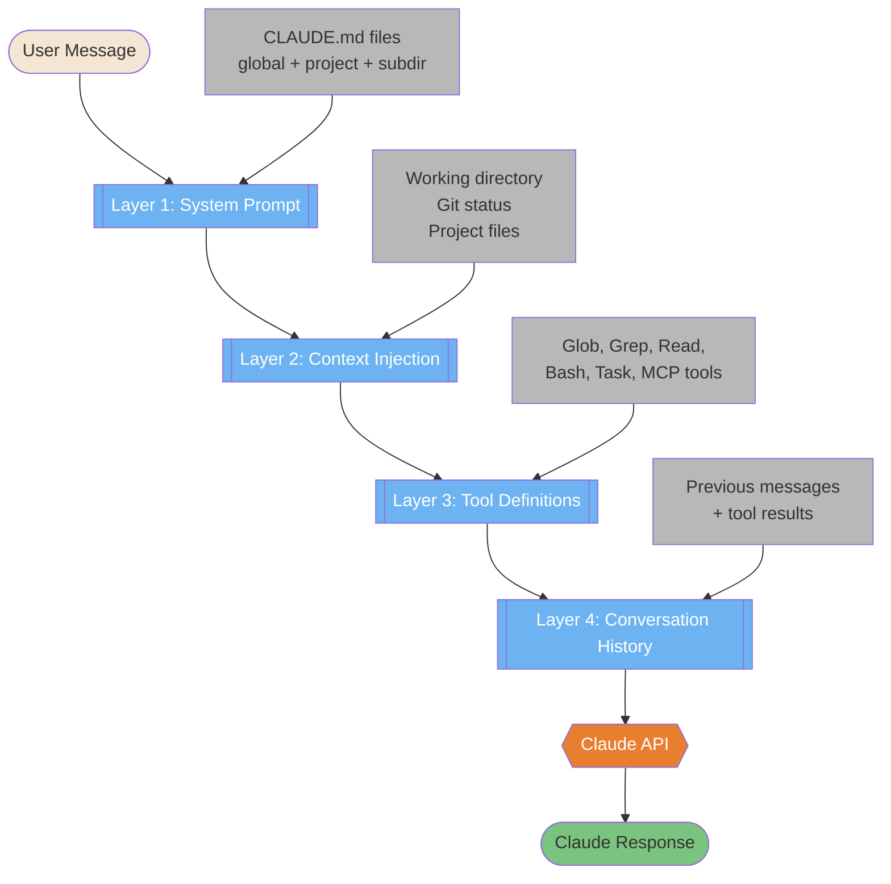
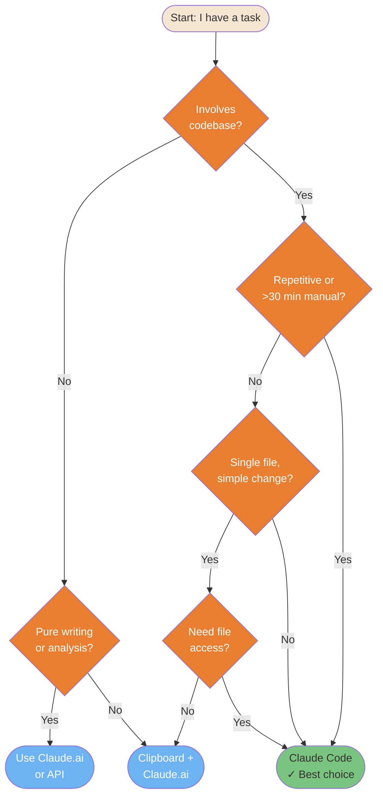

# 基础

解释 Claude Code 是什么以及它从根本上如何运作的核心概念。

---

### "从聊天机器人到上下文系统" — 4 层模型

Claude Code 不是聊天机器人 — 它是一个上下文系统，在调用 API 之前会把你的消息转化为一个丰富的多层 prompt。这张图展示了每次请求时无形发生的 4 层增强。



<details>
<summary>ASCII version</summary>

```
User Message
     │
     ▼
┌─────────────────────────────────┐
│ Layer 1: System Prompt          │ ← CLAUDE.md files
│ Layer 2: Context Injection      │ ← Working dir, git status
│ Layer 3: Tool Definitions       │ ← All available tools
│ Layer 4: Conversation History   │ ← Previous messages
└─────────────────┬───────────────┘
                  │
                  ▼
           Claude API Call
                  │
                  ▼
           Claude Response
```

</details>

> **来源**: [How Claude Code Works](../ultimate-guide.md#how-claude-code-works) — 约第 2360 行

---

### 9 步工作流流水线

每个发往 Claude Code 的请求都会经过这条流水线 — 从解析你的意图到展示最终响应。理解这个循环有助于你写出更好的指令，并更快地诊断问题。

```mermaid
flowchart LR
    A([User Message]) --> B(Parse Intent)
    B --> C(Load Context)
    C --> D(Plan Actions)
    D --> E(Execute Tools)
    E --> F{More tools<br/>needed?}
    F -->|Yes| G(Collect Results)
    G --> E
    F -->|No| H(Update Context)
    H --> I(Generate Response)
    I --> J([Display to User])

    style A fill:#F5E6D3,color:#333
    style B fill:#6DB3F2,color:#fff
    style C fill:#6DB3F2,color:#fff
    style D fill:#E87E2F,color:#fff
    style E fill:#E87E2F,color:#fff
    style F fill:#E87E2F,color:#fff
    style G fill:#B8B8B8,color:#333
    style H fill:#B8B8B8,color:#333
    style I fill:#6DB3F2,color:#fff
    style J fill:#7BC47F,color:#333

    click A href "https://github.com/FlorianBruniaux/claude-code-ultimate-guide/blob/main/guide/ultimate-guide.md#12-first-workflow" "First Workflow"
    click B href "https://github.com/FlorianBruniaux/claude-code-ultimate-guide/blob/main/guide/core/architecture.md#1-the-master-loop" "Parse Intent — Master Loop"
    click C href "https://github.com/FlorianBruniaux/claude-code-ultimate-guide/blob/main/guide/ultimate-guide.md#22-context-management" "Load Context"
    click D href "https://github.com/FlorianBruniaux/claude-code-ultimate-guide/blob/main/guide/ultimate-guide.md#23-plan-mode" "Plan Actions — Plan Mode"
    click E href "https://github.com/FlorianBruniaux/claude-code-ultimate-guide/blob/main/guide/core/architecture.md#2-the-tool-arsenal" "Execute Tools"
    click F href "https://github.com/FlorianBruniaux/claude-code-ultimate-guide/blob/main/guide/core/architecture.md#1-the-master-loop" "More Tools? — Master Loop"
    click G href "https://github.com/FlorianBruniaux/claude-code-ultimate-guide/blob/main/guide/core/architecture.md#1-the-master-loop" "Collect Results"
    click H href "https://github.com/FlorianBruniaux/claude-code-ultimate-guide/blob/main/guide/ultimate-guide.md#22-context-management" "Update Context"
    click I href "https://github.com/FlorianBruniaux/claude-code-ultimate-guide/blob/main/guide/core/architecture.md#1-the-master-loop" "Generate Response"
    click J href "https://github.com/FlorianBruniaux/claude-code-ultimate-guide/blob/main/guide/ultimate-guide.md#12-first-workflow" "Display to User"
```



<details>
<summary>ASCII version</summary>

```
User Message → Parse Intent → Load Context → Plan Actions
                                                   │
                          ┌────────────────────────┘
                          ▼
                    Execute Tools ◄─────────────────┐
                          │                          │
                    More tools?  ──── Yes ─── Collect Results
                          │ No
                          ▼
                   Update Context → Generate Response → Display
```

</details>

> **来源**: [Getting Started](../ultimate-guide.md#getting-started) — 约第 277 行

---

### 快速决策树 — "我应该用 Claude Code 吗？"

并非每项任务都需要 Claude Code。这棵决策树帮助你把合适的任务分流到合适的工具 — Claude Code CLI、Claude.ai 还是基于剪贴板的方式。



<details>
<summary>ASCII version</summary>

```
Task involves codebase?
├── No → Pure writing/analysis? → Yes → Claude.ai
│                              → No  → Clipboard + Claude.ai
└── Yes → Repetitive or >30min?
          ├── Yes → ✓ Claude Code
          └── No  → Single file, simple?
                    ├── Yes → Need file access? → No → Clipboard
                    │                            → Yes → Claude Code
                    └── No  → ✓ Claude Code
```

</details>

> **来源**: [Quick Start Decision](../ultimate-guide.md#quick-start) — 另见 `machine-readable/reference.yaml`（decide 部分）

---

### 权限模式对比

Claude Code 有 5 种权限模式，控制哪些操作可以自动执行、哪些需要你的批准。选错模式是头号安全失误。

```mermaid
flowchart TD
    subgraph DEFAULT["🔒 Default Mode (Recommended)"]
        D1(File reads) --> D2([Auto-approved])
        D3(File writes) --> D4([Prompt required])
        D5(Shell commands) --> D6([Prompt required])
        D7(Risky ops) --> D8([Prompt required])
    end

    subgraph ACCEPT["✏️ acceptEdits Mode"]
        A1(File reads) --> A2([Auto-approved])
        A3(File writes) --> A4([Auto-approved])
        A5(Shell commands) --> A6([Prompt required])
        A7(Risky ops) --> A8([Prompt required])
    end

    subgraph BYPASS["⚠️ bypassPermissions Mode"]
        B1(ALL operations) --> B2([Auto-approved])
        B3["Use only in:<br/>CI/CD, sandboxed<br/>environments"] --> B2
    end

    subgraph PLAN["🔍 Plan Mode (Read-Only)"]
        PL1(File reads) --> PL2([Auto-approved])
        PL3(File writes) --> PL4([Blocked])
        PL5(Shell commands) --> PL6([Blocked])
        PL7["Exit with /execute<br/>or Shift+Tab"] --> PL2
    end

    subgraph DONTASK["🚫 dontAsk Mode"]
        DA1(ALL operations) --> DA2([Auto-denied])
        DA3["Unless pre-approved<br/>via /permissions add"] --> DA2
    end

    style D2 fill:#7BC47F,color:#333
    style D4 fill:#E87E2F,color:#fff
    style D6 fill:#E87E2F,color:#fff
    style D8 fill:#E87E2F,color:#fff
    style A2 fill:#7BC47F,color:#333
    style A4 fill:#7BC47F,color:#333
    style A6 fill:#E87E2F,color:#fff
    style A8 fill:#E87E2F,color:#fff
    style B2 fill:#E85D5D,color:#fff
    style B3 fill:#F5E6D3,color:#333
    style PL2 fill:#7BC47F,color:#333
    style PL4 fill:#E85D5D,color:#fff
    style PL6 fill:#E85D5D,color:#fff
    style DA2 fill:#E85D5D,color:#fff
    style DA3 fill:#F5E6D3,color:#333

    click D1 href "https://github.com/FlorianBruniaux/claude-code-ultimate-guide/blob/main/guide/ultimate-guide.md#14-permission-modes" "Default Mode — Permission Modes"
    click D2 href "https://github.com/FlorianBruniaux/claude-code-ultimate-guide/blob/main/guide/ultimate-guide.md#14-permission-modes" "Auto-approved"
    click D3 href "https://github.com/FlorianBruniaux/claude-code-ultimate-guide/blob/main/guide/ultimate-guide.md#14-permission-modes" "File writes"
    click D4 href "https://github.com/FlorianBruniaux/claude-code-ultimate-guide/blob/main/guide/ultimate-guide.md#14-permission-modes" "Prompt required"
    click D5 href "https://github.com/FlorianBruniaux/claude-code-ultimate-guide/blob/main/guide/ultimate-guide.md#14-permission-modes" "Shell commands"
    click D6 href "https://github.com/FlorianBruniaux/claude-code-ultimate-guide/blob/main/guide/ultimate-guide.md#14-permission-modes" "Prompt required"
    click D7 href "https://github.com/FlorianBruniaux/claude-code-ultimate-guide/blob/main/guide/ultimate-guide.md#14-permission-modes" "Risky ops"
    click D8 href "https://github.com/FlorianBruniaux/claude-code-ultimate-guide/blob/main/guide/ultimate-guide.md#14-permission-modes" "Prompt required"
    click A1 href "https://github.com/FlorianBruniaux/claude-code-ultimate-guide/blob/main/guide/ultimate-guide.md#14-permission-modes" "acceptEdits Mode"
    click A2 href "https://github.com/FlorianBruniaux/claude-code-ultimate-guide/blob/main/guide/ultimate-guide.md#14-permission-modes" "Auto-approved"
    click A3 href "https://github.com/FlorianBruniaux/claude-code-ultimate-guide/blob/main/guide/ultimate-guide.md#14-permission-modes" "File writes — auto"
    click A4 href "https://github.com/FlorianBruniaux/claude-code-ultimate-guide/blob/main/guide/ultimate-guide.md#14-permission-modes" "Auto-approved"
    click A5 href "https://github.com/FlorianBruniaux/claude-code-ultimate-guide/blob/main/guide/ultimate-guide.md#14-permission-modes" "Shell commands"
    click A6 href "https://github.com/FlorianBruniaux/claude-code-ultimate-guide/blob/main/guide/ultimate-guide.md#14-permission-modes" "Prompt required"
    click A7 href "https://github.com/FlorianBruniaux/claude-code-ultimate-guide/blob/main/guide/ultimate-guide.md#14-permission-modes" "Risky ops"
    click A8 href "https://github.com/FlorianBruniaux/claude-code-ultimate-guide/blob/main/guide/ultimate-guide.md#14-permission-modes" "Prompt required"
    click B1 href "https://github.com/FlorianBruniaux/claude-code-ultimate-guide/blob/main/guide/ultimate-guide.md#14-permission-modes" "bypassPermissions Mode"
    click B2 href "https://github.com/FlorianBruniaux/claude-code-ultimate-guide/blob/main/guide/ultimate-guide.md#14-permission-modes" "Auto-approved (all)"
    click B3 href "https://github.com/FlorianBruniaux/claude-code-ultimate-guide/blob/main/guide/ultimate-guide.md#14-permission-modes" "CI/CD, sandboxed only"
    click PL1 href "https://github.com/FlorianBruniaux/claude-code-ultimate-guide/blob/main/guide/ultimate-guide.md#14-permission-modes" "Plan Mode — File reads"
    click PL2 href "https://github.com/FlorianBruniaux/claude-code-ultimate-guide/blob/main/guide/ultimate-guide.md#14-permission-modes" "Auto-approved"
    click PL3 href "https://github.com/FlorianBruniaux/claude-code-ultimate-guide/blob/main/guide/ultimate-guide.md#14-permission-modes" "Plan Mode — File writes blocked"
    click PL4 href "https://github.com/FlorianBruniaux/claude-code-ultimate-guide/blob/main/guide/ultimate-guide.md#14-permission-modes" "Blocked"
    click PL5 href "https://github.com/FlorianBruniaux/claude-code-ultimate-guide/blob/main/guide/ultimate-guide.md#14-permission-modes" "Plan Mode — Shell commands blocked"
    click PL6 href "https://github.com/FlorianBruniaux/claude-code-ultimate-guide/blob/main/guide/ultimate-guide.md#14-permission-modes" "Blocked"
    click PL7 href "https://github.com/FlorianBruniaux/claude-code-ultimate-guide/blob/main/guide/ultimate-guide.md#14-permission-modes" "Exit Plan Mode"
    click DA1 href "https://github.com/FlorianBruniaux/claude-code-ultimate-guide/blob/main/guide/ultimate-guide.md#14-permission-modes" "dontAsk Mode — All operations"
    click DA2 href "https://github.com/FlorianBruniaux/claude-code-ultimate-guide/blob/main/guide/ultimate-guide.md#14-permission-modes" "Auto-denied"
    click DA3 href "https://github.com/FlorianBruniaux/claude-code-ultimate-guide/blob/main/guide/ultimate-guide.md#14-permission-modes" "Pre-approve via /permissions add"
```



<details>
<summary>ASCII version</summary>

```
DEFAULT (Recommended)        acceptEdits               bypassPermissions
─────────────────────        ───────────               ─────────────────
File reads    → AUTO ✓       File reads    → AUTO ✓    ALL ops → AUTO ⚠️
File writes   → PROMPT       File writes   → AUTO ✓
Shell cmds    → PROMPT       Shell cmds    → PROMPT    Use: CI/CD only,
Risky ops     → PROMPT       Risky ops     → PROMPT    sandboxed env

Plan Mode (Read-Only)        dontAsk Mode
─────────────────────        ────────────
File reads    → AUTO ✓       ALL ops → AUTO DENIED ✗
File writes   → BLOCKED ✗    Unless pre-approved via
Shell cmds    → BLOCKED ✗    /permissions add
Exit: /execute or Shift+Tab
```

</details>

> **来源**: [Permission System](../ultimate-guide.md#permission-system) — 约第 760 行
