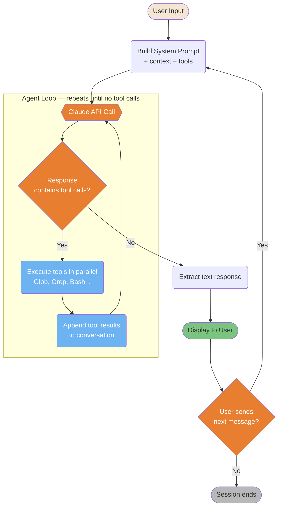
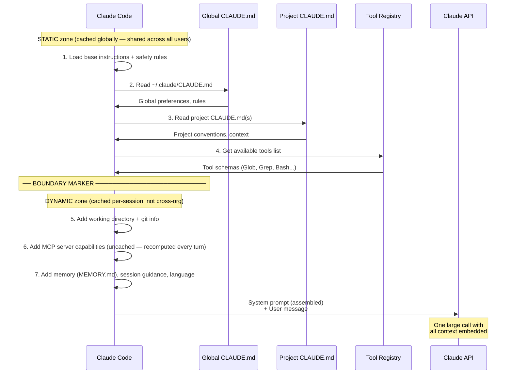
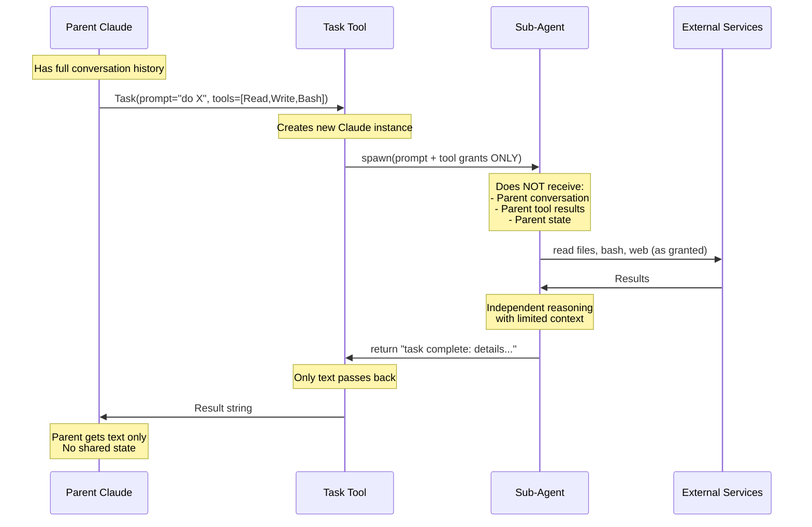

# 架构内部原理

Claude Code 运行时底层发生了什么。

---

### 主循环

Claude Code 的核心执行由两个嵌套循环构成：一个**内层代理循环**，只要 API 返回工具调用就持续调用 API；以及一个**外层对话循环**，在用户响应时开启新一轮。



<details>
<summary>ASCII 版本</summary>

```
User Input
     │
Build prompt (system + context + tools)
     │
 ┌── Agent Loop ──────────────────────┐
 │ Claude API ◄────────────────────┐  │
 │      │                          │  │
 │ Tool calls?                     │  │
 │  ├─ Yes → Execute tools ────────┘  │
 │  └─ No  → exit loop               │
 └────────────────────────────────────┘
               │
         Display response
               │
         User next msg? ──► Yes → rebuild prompt → loop
               └─ No → Session ends
```

</details>

> **来源**：[架构：主循环](../core/architecture.md#master-loop) — 第 ~72 行
>
> *源码确认（2026-03-31）：内层循环是 `queryLoop()` 异步生成器。工具通过 `StreamingToolExecutor` 执行（最多 10 个并发）。循环通过 10 种终止原因之一退出（`completed`、`max_turns`、`aborted_tools` 等）。*

---

### 工具类别与选择

Claude Code 拥有 6 个工具类别，每个都针对不同操作进行了优化。理解 Claude 选择哪个工具（以及为什么）有助于你编写能引导更优工具选择的指令。

```mermaid
flowchart TD
    ROOT["Claude Code Tools"] --> READ
    ROOT --> WRITE
    ROOT --> EXECUTE
    ROOT --> WEB
    ROOT --> WORKFLOW
    ROOT --> CONTROL

    subgraph READ["📖 Read Tools"]
        R1[Glob<br/>Find files by pattern]
        R2[Grep<br/>Search file content]
        R3[Read<br/>Read file content]
        R4[LS<br/>List directory]
    end

    subgraph WRITE["✏️ Write Tools"]
        W1[Write<br/>Create new file]
        W2[Edit<br/>Modify existing file]
        W3[MultiEdit<br/>Batch modifications]
    end

    subgraph EXECUTE["⚙️ Execute Tools"]
        E1[Bash<br/>Shell commands]
        E2[Task<br/>Spawn sub-agent]
    end

    subgraph WEB["🌐 Web Tools"]
        WB1[WebSearch<br/>Search the web]
        WB2[WebFetch<br/>Fetch URL content]
    end

    subgraph WORKFLOW["📋 Workflow Tools"]
        WF1[TodoWrite<br/>Manage task list]
        WF2[NotebookEdit<br/>Jupyter notebooks]
    end

    subgraph CONTROL["🎛️ Control Flow Tools"]
        CF1[EnterPlanMode / ExitPlanMode<br/>Toggle plan mode]
        CF2[EnterWorktree / ExitWorktree<br/>Worktree navigation]
        CF3[AskUserQuestion<br/>Request human input]
    end

    style ROOT fill:#E87E2F,color:#fff
    style R1 fill:#6DB3F2,color:#fff
    style R2 fill:#6DB3F2,color:#fff
    style R3 fill:#6DB3F2,color:#fff
    style R4 fill:#6DB3F2,color:#fff
    style W1 fill:#F5E6D3,color:#333
    style W2 fill:#F5E6D3,color:#333
    style W3 fill:#F5E6D3,color:#333
    style E1 fill:#E85D5D,color:#fff
    style E2 fill:#E87E2F,color:#fff
    style WB1 fill:#7BC47F,color:#333
    style WB2 fill:#7BC47F,color:#333
    style WF1 fill:#B8B8B8,color:#333
    style WF2 fill:#B8B8B8,color:#333
    style CF1 fill:#B8B8B8,color:#333
    style CF2 fill:#B8B8B8,color:#333
    style CF3 fill:#B8B8B8,color:#333

    click ROOT href "https://github.com/FlorianBruniaux/claude-code-ultimate-guide/blob/main/guide/core/architecture.md#2-the-tool-arsenal" "Claude Code Tools"
    click R1 href "https://github.com/FlorianBruniaux/claude-code-ultimate-guide/blob/main/guide/core/architecture.md#2-the-tool-arsenal" "Glob — Find files by pattern"
    click R2 href "https://github.com/FlorianBruniaux/claude-code-ultimate-guide/blob/main/guide/core/architecture.md#2-the-tool-arsenal" "Grep — Search file content"
    click R3 href "https://github.com/FlorianBruniaux/claude-code-ultimate-guide/blob/main/guide/core/architecture.md#2-the-tool-arsenal" "Read — Read file content"
    click R4 href "https://github.com/FlorianBruniaux/claude-code-ultimate-guide/blob/main/guide/core/architecture.md#2-the-tool-arsenal" "LS — List directory"
    click W1 href "https://github.com/FlorianBruniaux/claude-code-ultimate-guide/blob/main/guide/core/architecture.md#2-the-tool-arsenal" "Write — Create new file"
    click W2 href "https://github.com/FlorianBruniaux/claude-code-ultimate-guide/blob/main/guide/core/architecture.md#2-the-tool-arsenal" "Edit — Modify existing file"
    click W3 href "https://github.com/FlorianBruniaux/claude-code-ultimate-guide/blob/main/guide/core/architecture.md#2-the-tool-arsenal" "MultiEdit — Batch modifications"
    click E1 href "https://github.com/FlorianBruniaux/claude-code-ultimate-guide/blob/main/guide/core/architecture.md#2-the-tool-arsenal" "Bash — Shell commands"
    click E2 href "https://github.com/FlorianBruniaux/claude-code-ultimate-guide/blob/main/guide/ultimate-guide.md#41-what-are-agents" "Task — Spawn sub-agent"
    click WB1 href "https://github.com/FlorianBruniaux/claude-code-ultimate-guide/blob/main/guide/core/architecture.md#2-the-tool-arsenal" "WebSearch"
    click WB2 href "https://github.com/FlorianBruniaux/claude-code-ultimate-guide/blob/main/guide/core/architecture.md#2-the-tool-arsenal" "WebFetch"
    click WF1 href "https://github.com/FlorianBruniaux/claude-code-ultimate-guide/blob/main/guide/core/architecture.md#2-the-tool-arsenal" "TodoWrite — Task list"
    click WF2 href "https://github.com/FlorianBruniaux/claude-code-ultimate-guide/blob/main/guide/core/architecture.md#2-the-tool-arsenal" "NotebookEdit — Jupyter"
    click CONTROL href "https://github.com/FlorianBruniaux/claude-code-ultimate-guide/blob/main/guide/core/architecture.md#2-the-tool-arsenal" "Control Flow Tools"
    click CF1 href "https://github.com/FlorianBruniaux/claude-code-ultimate-guide/blob/main/guide/core/architecture.md#2-the-tool-arsenal" "EnterPlanMode / ExitPlanMode"
    click CF2 href "https://github.com/FlorianBruniaux/claude-code-ultimate-guide/blob/main/guide/core/architecture.md#2-the-tool-arsenal" "EnterWorktree / ExitWorktree"
    click CF3 href "https://github.com/FlorianBruniaux/claude-code-ultimate-guide/blob/main/guide/core/architecture.md#2-the-tool-arsenal" "AskUserQuestion"
```



<details>
<summary>ASCII 版本</summary>

```
READ:     Glob (find), Grep (search), Read (content), LS (list)
WRITE:    Write (create), Edit (modify), MultiEdit (batch)
EXECUTE:  Bash (shell), Task (sub-agent)  ← most powerful/risky
WEB:      WebSearch, WebFetch
WORKFLOW: TodoWrite, NotebookEdit
CONTROL:  EnterPlanMode/ExitPlanMode, EnterWorktree/ExitWorktree, AskUserQuestion
```

</details>

> **来源**：[架构：工具](../core/architecture.md#tools) — 第 ~213 行

> *已简化——还有更多可用工具。完整列表见 [架构：工具库](../core/architecture.md#tools)。*

---

### 系统提示词组装

在每次 API 调用之前，Claude Code 都会按特定顺序从多个来源组装系统提示词。提示词被一个边界标记分割为两个缓存区。



<details>
<summary>ASCII 版本</summary>

```
STATIC zone (globally cacheable, cross-org):
1. Base instructions (hardcoded)
2. ~/.claude/CLAUDE.md
3. /project/CLAUDE.md + subdirs
4. Tool definitions list
────── BOUNDARY MARKER ──────────
DYNAMIC zone (per-session cache):
5. Working directory + git status
6. MCP server capabilities (always recomputed)
7. Memory, session guidance, language
──────────────────────────────────
→ All combined → Claude API call
```

</details>

> **来源**：[架构：系统提示词](../core/architecture.md#system-prompt) — 第 ~354 行
>
> *源码确认（2026-03-31）：通过 `SYSTEM_PROMPT_DYNAMIC_BOUNDARY` 标记实现的双区架构。静态区具有 `cacheScope: 'global'`（所有用户共享）。MCP 指令明确不缓存——源码中的注释："servers connect/disconnect between turns"。*

---

### 子代理上下文隔离

子代理与父级完全隔离——它们无法读取父级的对话或修改父级状态。这种隔离既是一个特性（安全），也是一个约束（有意的设计）。



<details>
<summary>ASCII 版本</summary>

```
Parent (full context)
    │
    Task(prompt, tools=[...])
    │
    ▼
Sub-Agent (ISOLATED)
  Input: prompt + tool grants only
  Can: use granted tools independently
  Cannot: see parent conversation, modify parent state
  Output: text result ONLY
    │
    ▼
Parent receives: text string
```

</details>

> **来源**：[架构：子代理](../core/architecture.md#sub-agents) — 第 ~444 行
