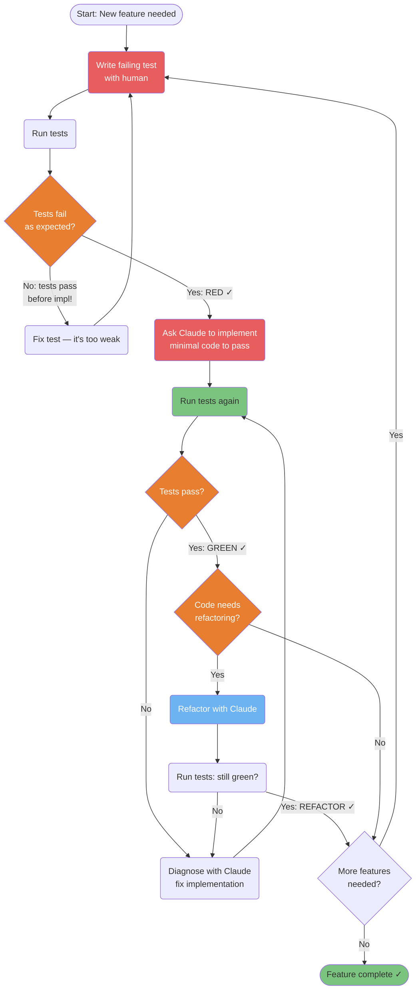
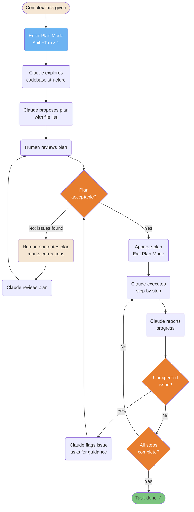
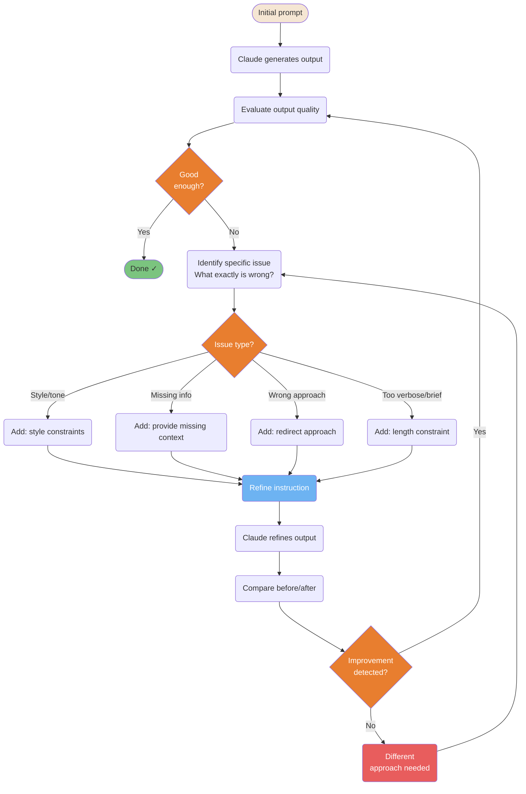
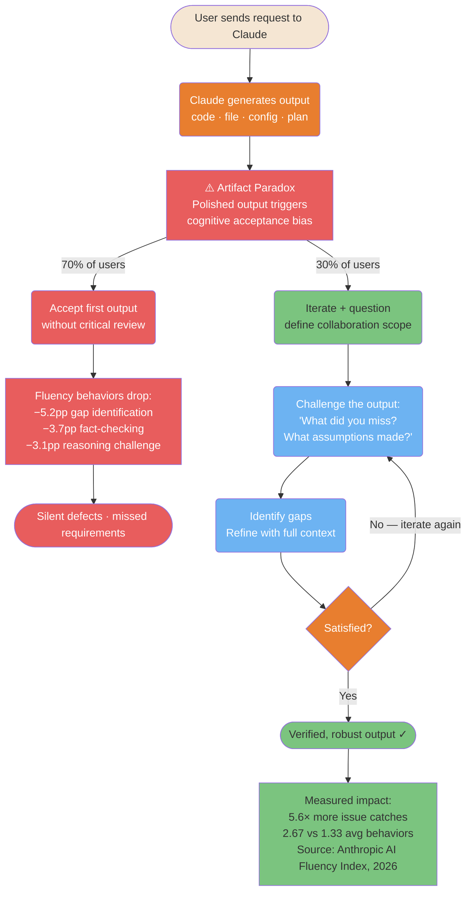

# 开发工作流

用于组织 AI 辅助开发会话的成熟模式。

---

### 与 Claude 配合的 TDD 红-绿-重构

为 Claude Code 调整后的测试驱动开发：先写一个会失败的测试，然后让 Claude 只实现刚好能让它通过所需的代码。这可以防止过度工程化，并确保测试真正验证了行为。



<details>
<summary>ASCII 版本</summary>

```
Write failing test (RED)
        │
    Run tests
        │
  Fail as expected?
  ├─ No  → Fix test (too weak)
  └─ Yes → Ask Claude: implement minimal code
                │
           Run tests
                │
           Pass? (GREEN)
           ├─ No  → Diagnose + fix
           └─ Yes → Refactor?
                    ├─ Yes → Refactor (REFACTOR) → re-run tests
                    └─ No  → Next feature
```

</details>

> **来源**：[TDD with Claude](../workflows/tdd-with-claude.md)

---

### 规范优先（Spec-First）开发流水线

在编码之前先写规范。Claude 把规范当作唯一可信来源——避免计划内容与实际构建内容之间出现偏移。

```mermaid
flowchart LR
    A([Idea / Requirement]) --> B(Write spec.md<br/>in natural language)
    B --> C(Claude reviews spec<br/>for clarity + completeness)
    C --> D{Spec approved<br/> by human?}
    D -->|No: gaps found| E(Refine spec<br/>address gaps)
    E --> C
    D -->|Yes| F(Generate tests<br/>from spec)
    F --> G(Generate implementation<br/>from spec + tests)
    G --> H(Run test suite)
    H --> I{All tests<br/>pass?}
    I -->|No| J(Claude fixes<br/>implementation)
    J --> H
    I -->|Yes| K(Human review<br/>spec vs output)
    K --> L{Matches<br/>spec?}
    L -->|No| M(Update spec<br/>or implementation)
    M --> K
    L -->|Yes| N([Merge ✓])

    style A fill:#F5E6D3,color:#333
    style B fill:#6DB3F2,color:#fff
    style D fill:#E87E2F,color:#fff
    style I fill:#E87E2F,color:#fff
    style L fill:#E87E2F,color:#fff
    style N fill:#7BC47F,color:#333

    click A href "https://github.com/FlorianBruniaux/claude-code-ultimate-guide/blob/main/guide/workflows/spec-first.md" "Idea / Requirement"
    click B href "https://github.com/FlorianBruniaux/claude-code-ultimate-guide/blob/main/guide/workflows/spec-first.md" "Write spec.md"
    click C href "https://github.com/FlorianBruniaux/claude-code-ultimate-guide/blob/main/guide/workflows/spec-first.md" "Claude reviews spec"
    click D href "https://github.com/FlorianBruniaux/claude-code-ultimate-guide/blob/main/guide/workflows/spec-first.md" "Spec approved by human?"
    click E href "https://github.com/FlorianBruniaux/claude-code-ultimate-guide/blob/main/guide/workflows/spec-first.md" "Refine spec"
    click F href "https://github.com/FlorianBruniaux/claude-code-ultimate-guide/blob/main/guide/workflows/spec-first.md" "Generate tests from spec"
    click G href "https://github.com/FlorianBruniaux/claude-code-ultimate-guide/blob/main/guide/workflows/spec-first.md" "Generate implementation"
    click H href "https://github.com/FlorianBruniaux/claude-code-ultimate-guide/blob/main/guide/workflows/spec-first.md" "Run test suite"
    click I href "https://github.com/FlorianBruniaux/claude-code-ultimate-guide/blob/main/guide/workflows/spec-first.md" "All tests pass?"
    click J href "https://github.com/FlorianBruniaux/claude-code-ultimate-guide/blob/main/guide/workflows/spec-first.md" "Claude fixes implementation"
    click K href "https://github.com/FlorianBruniaux/claude-code-ultimate-guide/blob/main/guide/workflows/spec-first.md" "Human review"
    click L href "https://github.com/FlorianBruniaux/claude-code-ultimate-guide/blob/main/guide/workflows/spec-first.md" "Matches spec?"
    click M href "https://github.com/FlorianBruniaux/claude-code-ultimate-guide/blob/main/guide/workflows/spec-first.md" "Update spec or implementation"
    click N href "https://github.com/FlorianBruniaux/claude-code-ultimate-guide/blob/main/guide/workflows/spec-first.md" "Merge ✓"
```



<details>
<summary>ASCII 版本</summary>

```
Idea → Write spec.md → Claude reviews
                             │
                       Approved? ─No→ Refine spec
                             │ Yes
                       Generate tests from spec
                             │
                       Generate implementation
                             │
                       Run tests → Pass? ─No→ Claude fixes
                             │ Yes
                       Human review → Matches spec? ─No→ Fix
                             │ Yes
                           Merge ✓
```

</details>

> **来源**：[Spec-First Development](../workflows/spec-first.md)

---

### 计划驱动（Plan-Driven）工作流与批注

复杂任务能从 Plan Mode 中获益：Claude 探索代码库、提出计划，你对其进行批注，然后 Claude 只执行已获批准的内容。可避免大型重构中出现意外。



<details>
<summary>ASCII 版本</summary>

```
Complex task
     │
Plan Mode (Shift+Tab×2)
     │
Claude explores codebase
     │
Claude proposes plan
     │
Human reviews ──No──► Annotate + Claude revises ──► re-review
     │ Yes
Approve + exit plan mode
     │
Claude executes step by step
     │
Unexpected? ──Yes──► Flag + ask guidance
     │ No
Done? ──No──► continue
     │ Yes
Complete ✓
```

</details>

> **来源**：[Plan-Driven Workflow](../workflows/plan-driven.md)

---

### 迭代精炼循环

输出很少能在第一次就命中目标。这个循环给你一个系统化的方法，通过有针对性的反馈来改进结果，而不是用「把它做得更好」这类模糊指令。



<details>
<summary>ASCII 版本</summary>

```
Prompt → Output → Evaluate → Good? ──Yes──► Done
                                 │ No
                          Identify specific issue
                                 │
                          ┌──────┴──────────────┐
                         Style  Missing  Wrong  Length
                          └──────┬──────────────┘
                          Refine instruction
                                 │
                          Claude refines
                                 │
                          Better? ──Yes──► Evaluate again
                                 │ No
                          Different approach
```

</details>

> **来源**：[Iterative Refinement](../workflows/iterative-refinement.md) — 约第 347 行

---

### AI 流畅度 —— 高流畅度 vs 低流畅度路径

当 Claude 产出一个看起来很精致的输出时，一种认知偏差就会启动：输出看起来越完整，大多数用户对它的批判性评估就越少。这就是「制品悖论」（Artifact Paradox），由 Anthropic 在 9,830 次对话中记录在案。下图展示了是什么把 30% 的高流畅度用户与那 70% 接受首次输出的用户区分开来——以及结果质量上可衡量的差异。



<details>
<summary>ASCII 版本</summary>

```
User request → Claude output (code · file · config · plan)
                        ↓
              ⚠️ Artifact Paradox
          Polished output → cognitive bias
                        ↓
    ┌───────────────────┴──────────────────────┐
70% of users                            30% of users
Accept without review               Iterate + question
        ↓                                     ↓
Fluency behaviors drop:         Challenge: "What did you miss?
−5.2pp gap identification                What assumptions made?"
−3.7pp fact-checking                          ↓
−3.1pp reasoning challenge      Identify gaps → refine
        ↓                                     ↓
Silent defects                  Satisfied? ──No──► iterate
                                            ↓ Yes
                                Verified output ✓
                                            ↓
                               5.6× more issue catches
                               2.67 vs 1.33 avg behaviors
```

</details>

> **来源**：[Anthropic AI Fluency Index](https://www.anthropic.com/research/AI-fluency-index)（Swanson et al., 2026-02-23）— [指南章节：常见陷阱](../ultimate-guide.md#common-pitfalls--best-practices)
