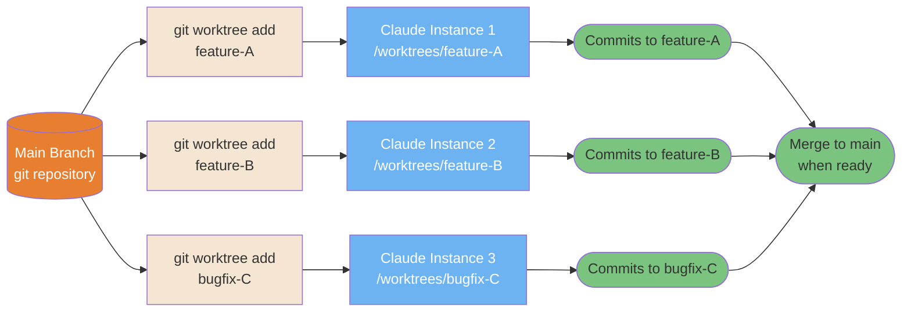
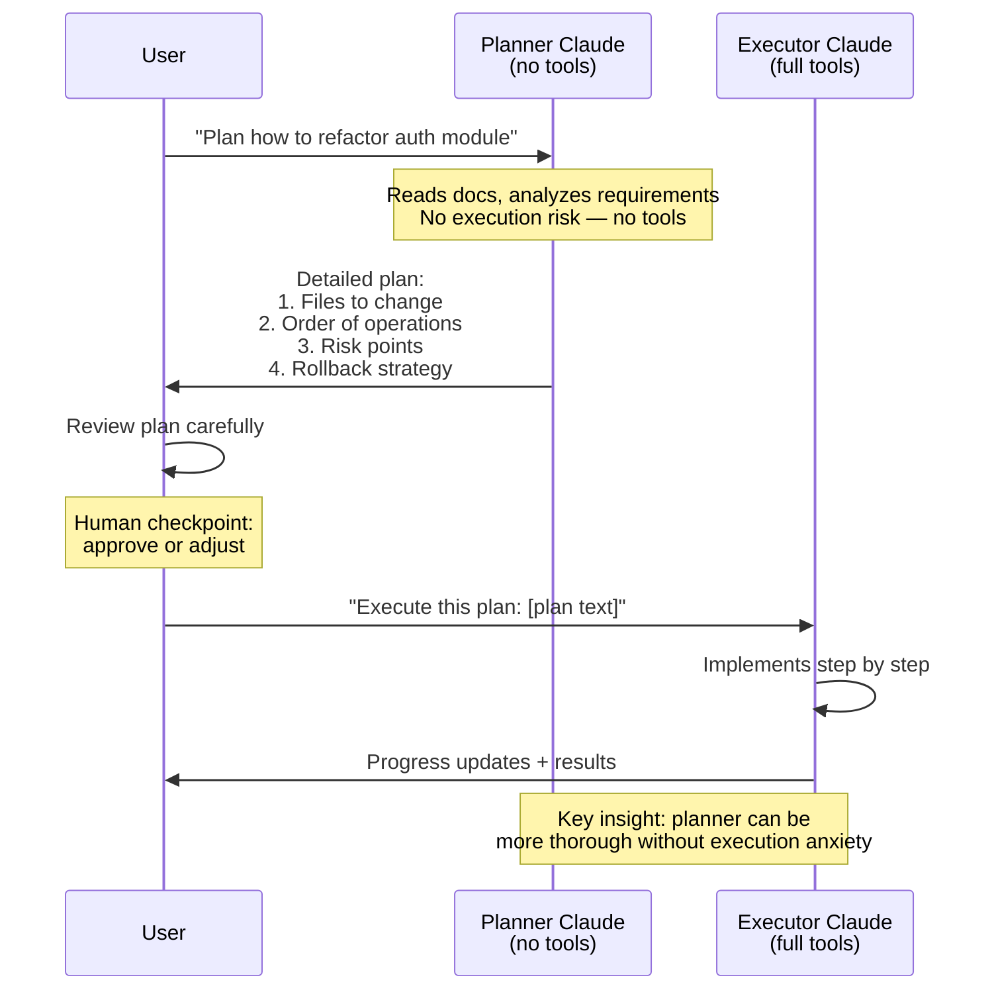
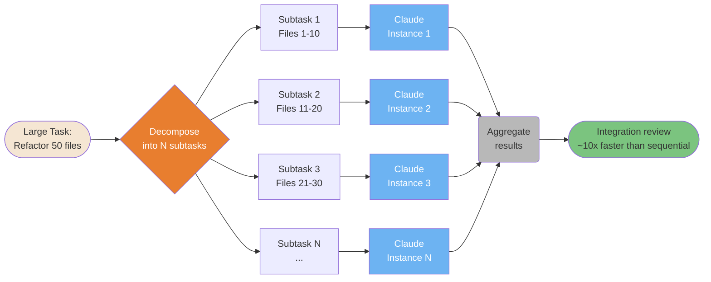
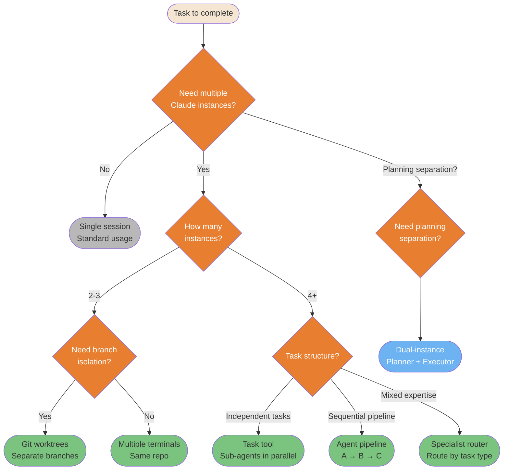

# 多智能体模式

用于协调多个 Claude 实例完成并行与复杂工作的模式。

---

### 智能体团队 — 3 种编排拓扑

三种经过验证的多智能体协调拓扑。根据任务的独立性、排序要求以及专业化需求来选择。

```mermaid
flowchart TD
    subgraph ORCH["Pattern 1: Orchestrator + Workers"]
        OL[Lead Orchestrator] --> OW1[Worker 1<br/>Frontend]
        OL --> OW2[Worker 2<br/>Backend]
        OL --> OW3[Worker 3<br/>Tests]
        OW1 & OW2 & OW3 --> OR([Results aggregated])
    end

    subgraph PIPE["Pattern 2: Pipeline"]
        PA[Agent A<br/>Requirements] --> PB[Agent B<br/>Implementation]
        PB --> PC[Agent C<br/>Review]
        PC --> PD([Final output])
    end

    subgraph ROUTE["Pattern 3: Specialist Router"]
        RR{Router Agent<br/>analyzes task} --> RC[Code Agent]
        RR --> RT[Test Agent]
        RR --> RD[Docs Agent]
        RC & RT & RD --> RO([Specialized result])
    end

    style OL fill:#E87E2F,color:#fff
    style OW1 fill:#6DB3F2,color:#fff
    style OW2 fill:#6DB3F2,color:#fff
    style OW3 fill:#6DB3F2,color:#fff
    style OR fill:#7BC47F,color:#333
    style PA fill:#F5E6D3,color:#333
    style PB fill:#F5E6D3,color:#333
    style PC fill:#F5E6D3,color:#333
    style PD fill:#7BC47F,color:#333
    style RR fill:#E87E2F,color:#fff
    style RC fill:#6DB3F2,color:#fff
    style RT fill:#6DB3F2,color:#fff
    style RD fill:#6DB3F2,color:#fff
    style RO fill:#7BC47F,color:#333

    click OL href "https://github.com/FlorianBruniaux/claude-code-ultimate-guide/blob/main/guide/workflows/agent-teams.md" "Lead Orchestrator"
    click OW1 href "https://github.com/FlorianBruniaux/claude-code-ultimate-guide/blob/main/guide/workflows/agent-teams.md" "Worker: Frontend"
    click OW2 href "https://github.com/FlorianBruniaux/claude-code-ultimate-guide/blob/main/guide/workflows/agent-teams.md" "Worker: Backend"
    click OW3 href "https://github.com/FlorianBruniaux/claude-code-ultimate-guide/blob/main/guide/workflows/agent-teams.md" "Worker: Tests"
    click OR href "https://github.com/FlorianBruniaux/claude-code-ultimate-guide/blob/main/guide/workflows/agent-teams.md" "Results aggregated"
    click PA href "https://github.com/FlorianBruniaux/claude-code-ultimate-guide/blob/main/guide/workflows/agent-teams.md" "Agent A: Requirements"
    click PB href "https://github.com/FlorianBruniaux/claude-code-ultimate-guide/blob/main/guide/workflows/agent-teams.md" "Agent B: Implementation"
    click PC href "https://github.com/FlorianBruniaux/claude-code-ultimate-guide/blob/main/guide/workflows/agent-teams.md" "Agent C: Review"
    click PD href "https://github.com/FlorianBruniaux/claude-code-ultimate-guide/blob/main/guide/workflows/agent-teams.md" "Final output"
    click RR href "https://github.com/FlorianBruniaux/claude-code-ultimate-guide/blob/main/guide/workflows/agent-teams.md" "Router Agent"
    click RC href "https://github.com/FlorianBruniaux/claude-code-ultimate-guide/blob/main/guide/workflows/agent-teams.md" "Code Agent"
    click RT href "https://github.com/FlorianBruniaux/claude-code-ultimate-guide/blob/main/guide/workflows/agent-teams.md" "Test Agent"
    click RD href "https://github.com/FlorianBruniaux/claude-code-ultimate-guide/blob/main/guide/workflows/agent-teams.md" "Docs Agent"
    click RO href "https://github.com/FlorianBruniaux/claude-code-ultimate-guide/blob/main/guide/workflows/agent-teams.md" "Specialized result"
```



<details>
<summary>ASCII 版本</summary>

```
ORCHESTRATOR + WORKERS:      PIPELINE:               ROUTER:

   Lead Agent                Agent A (requirements)   Router
  /    |     \                    │                  /  |  \
W1    W2     W3              Agent B (implement)   Code Test Docs
  \   |     /                    │                  \  |  /
   Aggregate                Agent C (review)        Result
                                 │
                             Final output
```

</details>

> **来源**: [Agent Teams](../workflows/agent-teams.md) — 第 ~59 行

---

### Git Worktree 多实例模式

Git worktree 实现了真正的并行开发: 每个 Claude 实例都在一个隔离的分支中工作, 拥有自己独立的工作树。没有冲突, 没有上下文混淆。



<details>
<summary>ASCII 版本</summary>

```
Main repo
├── git worktree add feature-A → Claude 1 → commits to feature-A
├── git worktree add feature-B → Claude 2 → commits to feature-B
└── git worktree add bugfix-C  → Claude 3 → commits to bugfix-C

No conflicts: separate working trees, separate branches
All merge back to main when done
```

</details>

> **来源**: [Git Worktrees](../ultimate-guide.md#git-worktrees) — 第 ~10634 行

---

### 双实例规划模式 (Jon Williams)

使用两个 Claude 实例将规划与执行分离, 可以避免代价高昂的错误: 规划者 Claude 没有任何工具, 因此在分析过程中不会意外执行任何操作。



<details>
<summary>ASCII 版本</summary>

```
User → Planner (no tools): "Plan X"
         │
    [safe analysis, no execution risk]
         │
Planner → User: detailed plan
         │
User reviews + approves
         │
User → Executor (full tools): "Execute: [plan]"
         │
    [implements with full context]
         │
Executor → User: results
```

</details>

> **来源**: [Dual-Instance Planning](../workflows/dual-instance-planning.md)

---

### Boris Cherny 横向扩展模式

当任务可以并行化时, 同时启动 N 个 Claude 实例, 而不是顺序运行它们。加速比与任务的独立性成正比。



<details>
<summary>ASCII 版本</summary>

```
Large task
     │
Decompose into N independent subtasks
     │
┌────┼────┐
│    │    │
I1  I2  I3... (parallel)
│    │    │
└────┼────┘
     │
Aggregate → Integration review
(~10x faster than sequential)
```

</details>

> **来源**: [Horizontal Scaling](../ultimate-guide.md#horizontal-scaling) — 第 ~9617 行

---

### 多实例决策矩阵

并非每个任务都需要多个实例。这个决策树会根据任务特征引导你选择正确的模式。



<details>
<summary>ASCII 版本</summary>

```
Need multiple instances?
├─ No → Single session
├─ Yes → How many?
│        ├─ 2-3 → Need branch isolation?
│        │        ├─ Yes → Git worktrees
│        │        └─ No  → Multiple terminals
│        └─ 4+  → Task structure?
│                 ├─ Independent → Task tool (parallel sub-agents)
│                 ├─ Sequential  → Agent pipeline A→B→C
│                 └─ Mixed       → Specialist router
└─ Planning separation? → Dual-instance (Planner + Executor)
```

</details>

> **来源**: [Multi-Instance Patterns](../ultimate-guide.md#multi-instance-patterns) — 第 ~11176 行
