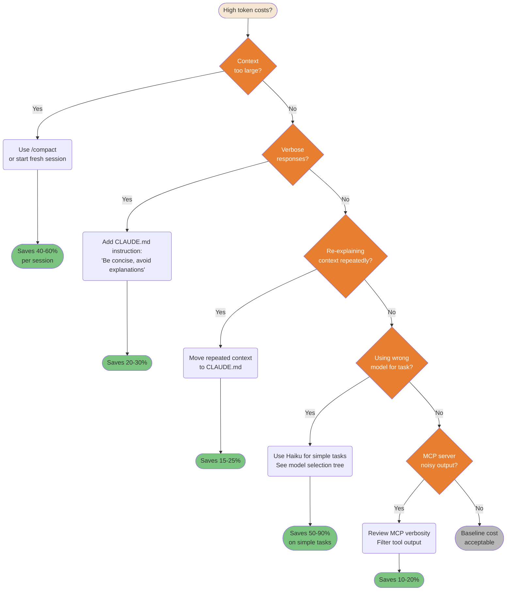
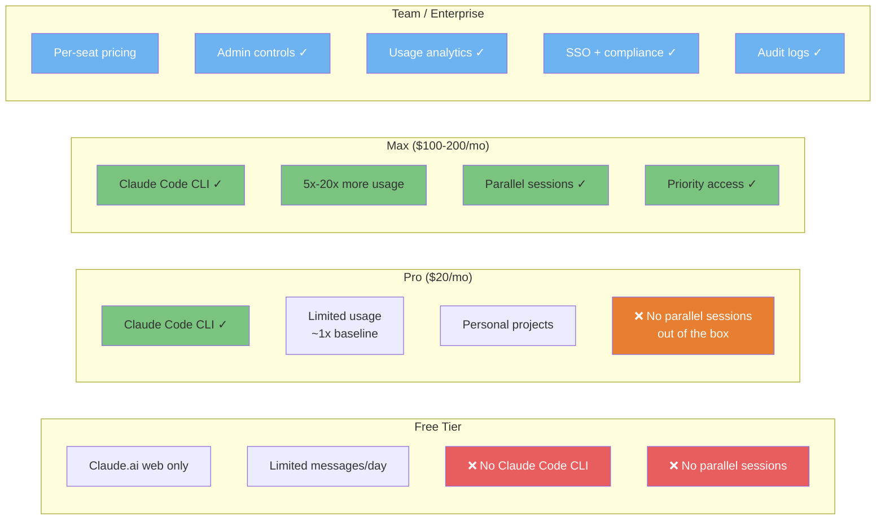

# 成本与优化

如何在控制 token 消耗与成本的同时，从 Claude Code 中获得最大价值。

---

### 模型选择决策流程

并非所有任务都需要最强的模型。为合适的任务选用合适的模型，可在不牺牲质量的前提下将成本降低 5-10 倍。

> **本图假设预算不受限制（Max/API）。** 在更紧张的套餐（Pro、Teams Standard）下，请应用下方的预算调整规则。

```mermaid
flowchart TD
    A([Task to complete]) --> B{Task complexity?}

    B -->|Simple| C["Simple tasks:<br/>typo fixes, renames,<br/>formatting, translations"]
    C --> D([Haiku 4.5<br/>💰 Cheapest, fastest<br/>~5x cheaper than Sonnet])

    B -->|Standard| E["Standard tasks:<br/>feature implementation,<br/>bug fixes, refactoring"]
    E --> F([Sonnet 4.5/4.6<br/>💰💰 Balanced<br/>Best price/quality ratio])

    B -->|Complex| G{Needs deep<br/>reasoning?}
    G -->|Yes| H["Complex tasks:<br/>architecture decisions,<br/>security review,<br/>multi-file analysis"]
    H --> I([Opus 4.8: Maximum capability xhigh<br/>Opus 4.7: Deep analysis (prev. gen)<br/>💰💰💰 Most capable<br/>~5x more than Sonnet])

    G -->|No: just large| J["Large but clear tasks:<br/>big refactors,<br/>doc generation"]
    J --> F

    style A fill:#F5E6D3,color:#333
    style B fill:#E87E2F,color:#fff
    style G fill:#E87E2F,color:#fff
    style D fill:#7BC47F,color:#333
    style F fill:#6DB3F2,color:#fff
    style I fill:#E87E2F,color:#fff
    style C fill:#B8B8B8,color:#333
    style E fill:#B8B8B8,color:#333
    style H fill:#B8B8B8,color:#333
    style J fill:#B8B8B8,color:#333

    click A href "https://github.com/FlorianBruniaux/claude-code-ultimate-guide/blob/main/guide/ultimate-guide.md#25-model-selection--thinking-guide" "Task to complete"
    click B href "https://github.com/FlorianBruniaux/claude-code-ultimate-guide/blob/main/guide/ultimate-guide.md#25-model-selection--thinking-guide" "Task complexity?"
    click C href "https://github.com/FlorianBruniaux/claude-code-ultimate-guide/blob/main/guide/ultimate-guide.md#25-model-selection--thinking-guide" "Simple tasks"
    click D href "https://github.com/FlorianBruniaux/claude-code-ultimate-guide/blob/main/guide/ultimate-guide.md#25-model-selection--thinking-guide" "Haiku 4.5"
    click E href "https://github.com/FlorianBruniaux/claude-code-ultimate-guide/blob/main/guide/ultimate-guide.md#25-model-selection--thinking-guide" "Standard tasks"
    click F href "https://github.com/FlorianBruniaux/claude-code-ultimate-guide/blob/main/guide/ultimate-guide.md#25-model-selection--thinking-guide" "Sonnet 4.5/4.6"
    click G href "https://github.com/FlorianBruniaux/claude-code-ultimate-guide/blob/main/guide/ultimate-guide.md#25-model-selection--thinking-guide" "Needs deep reasoning?"
    click H href "https://github.com/FlorianBruniaux/claude-code-ultimate-guide/blob/main/guide/ultimate-guide.md#25-model-selection--thinking-guide" "Complex tasks"
    click I href "https://github.com/FlorianBruniaux/claude-code-ultimate-guide/blob/main/guide/ultimate-guide.md#25-model-selection--thinking-guide" "Opus 4.8 / Sonnet + --think-hard"
    click J href "https://github.com/FlorianBruniaux/claude-code-ultimate-guide/blob/main/guide/ultimate-guide.md#25-model-selection--thinking-guide" "Large but clear tasks"
```

> **定价**：图中显示的是相对成本。请在 [anthropic.com/pricing](https://www.anthropic.com/pricing) 查看当前费率。

**预算调整规则**（在受限套餐下，每个阶段降一档）：

| 套餐 | 规划阶段 | 实现阶段 |
|------|---------------|---------------------|
| **Max / API 不受限制（xhigh）** | Opus 4.8 | Sonnet |
| **Max / API 不受限制** | Opus 4.8 | Sonnet |
| **Pro / Teams Standard** | Sonnet | Haiku（机械性任务） |
| **API 预算紧张** | Sonnet | Haiku |

> *社区做法（Teams Standard $25/月）：规划用 Sonnet → 实现用 Haiku。在机械性任务上以极低成本获得同等质量的输出。*

<details>
<summary>ASCII version</summary>

```
Task complexity?
├─ Simple (typos, format, rename) → Haiku 4.5       ($  ~5x cheaper than Sonnet)
├─ Standard (features, bugs)      → Sonnet 4.5/4.6  ($$ best price/quality ratio)
└─ Complex (architecture, sec.)
   ├─ Needs deep reasoning?        → Opus 4.8 (xhigh)  ($$$ ~5x more than Sonnet)
   └─ Just large/clear?            → Sonnet 4.6         ($$ handles it)

Budget modifier (downgrade one tier on constrained plans):
  Max/API (xhigh)  → Opus 4.8 plan, Sonnet impl
  Max/API          → Opus 4.8 plan, Sonnet impl
  Pro/Teams        → Sonnet plan, Haiku impl (mechanical tasks)
```

</details>

> **来源**：[Model Selection](../ultimate-guide.md#model-selection)（约第 2634 行）

---

### 成本优化决策树

高昂的 token 成本通常是可以解决的。这棵系统化的决策树能够找出根本原因，并针对每种浪费模式指向正确的修复方案。



<details>
<summary>ASCII version</summary>

```
High costs?
├─ Context too large?      → /compact or new session    (40-60% saving)
├─ Verbose responses?      → CLAUDE.md: be concise      (20-30% saving)
├─ Repeating context?      → Move to CLAUDE.md          (15-25% saving)
├─ Wrong model?            → Use Haiku for simple tasks (50-90% saving)
├─ Noisy MCP output?       → Filter tool output         (10-20% saving)
└─ None of the above?      → Baseline cost, acceptable
```

</details>

> **Effort 滑块**：`/effort xlow/low/default/high/xhigh`（v2.1.111）让你能够按任务调节思考深度。effort 越低 = 思考所消耗的 token 越少。结合模型选择，可实现精细化的成本控制。

> **来源**：[Cost Optimization](../ultimate-guide.md#cost-optimization)（约第 8878 行）

---

### 订阅档位：各档解锁了什么

不同档位解锁不同的 Claude Code 能力。了解这些限制有助于你规划用量并为升级提供依据。



<details>
<summary>ASCII version</summary>

```
FREE         PRO ($20)        MAX ($100-200)   TEAM/Enterprise
────         ─────────        ──────────────   ───────────────
Web only     CLI ✓            CLI ✓            Per-seat
Limited msgs Limited usage    5-20x usage      Admin controls
No CLI       Personal use     Parallel ✓       Analytics
             No parallel      Priority ✓       SSO + compliance
```

</details>

> **来源**：[Subscription Tiers](../ultimate-guide.md#subscription-tiers)（约第 1933 行）

---

### Token 削减策略流水线

多种策略可以叠加，实现累积的 token 节省。请按从影响最大到投入最小的顺序依次应用。

```mermaid
flowchart LR
    BASE([Baseline:<br/>100% tokens]) --> RTK

    subgraph RTK["Strategy 1: RTK Proxy"]
        R1[Raw CLI output<br/>→ filtered output]
        R2["git status, cargo test,<br/>pnpm list → compressed"]
        R3[Saves 60-90%<br/>on CLI commands]
    end

    RTK --> COMP

    subgraph COMP["Strategy 2: /compact"]
        C1[Long conversation<br/>→ summarized]
        C2[Keep decisions,<br/>drop verbose reasoning]
        C3[Saves 40-60%<br/>at checkpoint]
    end

    COMP --> CLAUDE_MD

    subgraph CLAUDE_MD["Strategy 3: CLAUDE.md"]
        CM1[Repeated context<br/>→ persistent instructions]
        CM2[No re-explaining<br/>project conventions]
        CM3[Saves 15-25%<br/>per session]
    end

    CLAUDE_MD --> MODEL

    subgraph MODEL["Strategy 4: Model Selection"]
        MO1[Haiku for simple tasks<br/>instead of Sonnet]
        MO2[Same quality output<br/>at fraction of cost]
        MO3[Saves 50-90%<br/>on simple tasks]
    end

    MODEL --> RESULT([Optimized:<br/>10-20% of baseline<br/>for typical usage])

    style BASE fill:#E85D5D,color:#fff
    style R3 fill:#7BC47F,color:#333
    style C3 fill:#7BC47F,color:#333
    style CM3 fill:#7BC47F,color:#333
    style MO3 fill:#7BC47F,color:#333
    style RESULT fill:#7BC47F,color:#333

    click BASE href "https://github.com/FlorianBruniaux/claude-code-ultimate-guide/blob/main/guide/ultimate-guide.md#913-cost-optimization-strategies" "Baseline: 100% tokens"
    click R1 href "https://github.com/FlorianBruniaux/claude-code-ultimate-guide/blob/main/guide/ultimate-guide.md#913-cost-optimization-strategies" "Raw CLI output filtered"
    click R2 href "https://github.com/FlorianBruniaux/claude-code-ultimate-guide/blob/main/guide/ultimate-guide.md#913-cost-optimization-strategies" "RTK commands"
    click R3 href "https://github.com/FlorianBruniaux/claude-code-ultimate-guide/blob/main/guide/ultimate-guide.md#913-cost-optimization-strategies" "Saves 60-90% on CLI"
    click C1 href "https://github.com/FlorianBruniaux/claude-code-ultimate-guide/blob/main/guide/ultimate-guide.md#913-cost-optimization-strategies" "Long conversation summarized"
    click C2 href "https://github.com/FlorianBruniaux/claude-code-ultimate-guide/blob/main/guide/ultimate-guide.md#913-cost-optimization-strategies" "Keep decisions"
    click C3 href "https://github.com/FlorianBruniaux/claude-code-ultimate-guide/blob/main/guide/ultimate-guide.md#913-cost-optimization-strategies" "Saves 40-60% at checkpoint"
    click CM1 href "https://github.com/FlorianBruniaux/claude-code-ultimate-guide/blob/main/guide/ultimate-guide.md#31-memory-files-claudemd" "Repeated context persistent"
    click CM2 href "https://github.com/FlorianBruniaux/claude-code-ultimate-guide/blob/main/guide/ultimate-guide.md#31-memory-files-claudemd" "No re-explaining conventions"
    click CM3 href "https://github.com/FlorianBruniaux/claude-code-ultimate-guide/blob/main/guide/ultimate-guide.md#913-cost-optimization-strategies" "Saves 15-25% per session"
    click MO1 href "https://github.com/FlorianBruniaux/claude-code-ultimate-guide/blob/main/guide/ultimate-guide.md#25-model-selection--thinking-guide" "Haiku for simple tasks"
    click MO2 href "https://github.com/FlorianBruniaux/claude-code-ultimate-guide/blob/main/guide/ultimate-guide.md#25-model-selection--thinking-guide" "Same quality at lower cost"
    click MO3 href "https://github.com/FlorianBruniaux/claude-code-ultimate-guide/blob/main/guide/ultimate-guide.md#25-model-selection--thinking-guide" "Saves 50-90% on simple"
    click RESULT href "https://github.com/FlorianBruniaux/claude-code-ultimate-guide/blob/main/guide/ultimate-guide.md#913-cost-optimization-strategies" "Optimized: 10-20% of baseline"
```



<details>
<summary>ASCII version</summary>

```
100% baseline
    │
RTK proxy (CLI output compression)  → -60-90% on CLI ops
    │
/compact (conversation summarization) → -40-60% at checkpoint
    │
CLAUDE.md (avoid repeated context)    → -15-25% per session
    │
Model selection (Haiku for simple)    → -50-90% on simple tasks
    │
~10-20% of baseline for typical usage
```

</details>

> **追踪用量**：使用 `/usage` 来监控 token 消耗与成本（自 v2.1.118 起取代 `/cost`；`/cost` 仍为有效别名）。

> **来源**：[Token Optimization](../ultimate-guide.md#token-optimization)（约第 13355 行）
