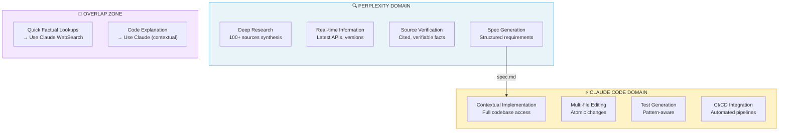
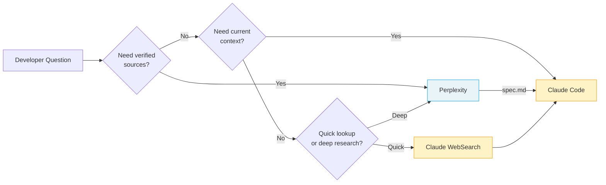
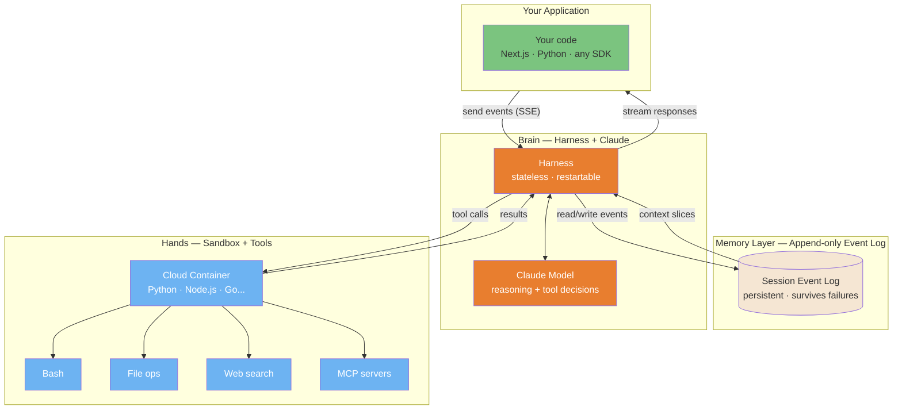
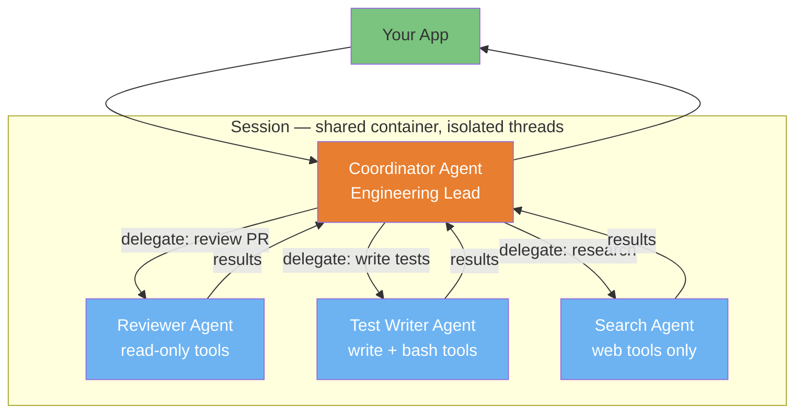

# AI 生态系统：用互补工具最大化发挥 Claude Code

> **阅读时间**：约 25 分钟
>
> **目的**：本指南帮助你理解何时使用 Claude Code 而非互补 AI 工具，以及如何将它们串联以实现最优工作流。

---

## 目录

- [引言](#introduction)
- [1. Perplexity AI（研究与溯源）](#1-perplexity-ai-research--sourcing)
- [2. Google Gemini（视觉理解）](#2-google-gemini-visual-understanding)
- [3. Kimi（PPTX 与长文档生成）](#3-kimi-pptx--long-document-generation)
- [4. NotebookLM（综合与音频）](#4-notebooklm-synthesis--audio)
- [5. 语音转文本工具（Wispr Flow、Superwhisper）](#5-voice-to-text-tools-wispr-flow-superwhisper)
- [6. 基于 IDE 的工具（Cursor、Windsurf、Cline）](#6-ide-based-tools-cursor-windsurf-cline)
- [6.1 Google Antigravity（Agent 优先的 IDE）](#61-google-antigravity-agent-first-ide)
- [7. UI 原型工具（v0、Bolt、Lovable）](#7-ui-prototypers-v0-bolt-lovable)
- [8. 工作流编排](#8-workflow-orchestration)
- [9. 成本与订阅策略](#9-cost--subscription-strategy)
- [10. Claude Cowork（Research Preview）](#10-claude-cowork-research-preview)
- [11. AI 编码 Agent 矩阵](#11-ai-coding-agents-matrix)
- [11.1 Goose：开源替代方案（Block）](#111-goose-open-source-alternative-block)
- [11.2 实践者洞见](#112-practitioner-insights)
- [11.3 何时自建 vs 直接使用](#113-when-to-build-vs-use)
- [11.4 Skills 分发平台](#114-skills-distribution-platforms)
- [12. 上下文打包工具](#12-context-packing-tools)
- [14. Claude Managed Agents（云托管平台）](#14-claude-managed-agents-cloud-hosted-platform)
- [15. Project Glasswing 与 Claude Mythos 预览（防御性安全）](#15-project-glasswing--claude-mythos-preview-defensive-security)
- [16. Step by Token：LLM 如何工作（交互式指南）](#16-step-by-token-how-llms-work-interactive-guide)
- [附录：开箱即用的 Prompt](#appendix-ready-to-use-prompts)
- [替代供应商（社区变通方案）](#alternative-providers-community-workarounds)

---

## 引言

### 理念：增强，而非替代

Claude Code 擅长：
- 跨整个代码库的**上下文推理**
- 结合测试集成的**多文件实现**
- 通过 CLAUDE.md 文件实现的**持久记忆**
- 用于 CI/CD 流水线的 **CLI 自动化**
- 在最少监督下的**自主任务完成**

Claude Code（按设计）不擅长的：
- **带来源验证的实时网络搜索**（WebSearch 存在但有限）
- **图像生成**（无原生能力）
- **PowerPoint/幻灯片生成**（无 PPTX 输出）
- **音频合成**（无 TTS）
- **基于浏览器的原型设计**（无可视化预览）

目标不是寻找"更好"的工具，而是为每个步骤串联起**最合适的工具**。

### 互补性矩阵

| 任务 | Claude Code | 更优替代方案 | 原因 |
|------|-------------|-------------------|-----|
| **代码实现** | ✅ 最佳 | - | 上下文推理 + 文件编辑 |
| **带来源的深度研究** | ⚠️ 有限 | Perplexity Pro | 100+ 个经验证的来源 |
| **图像 → 代码** | ⚠️ 有限 | Gemini 2.5+ | 更强的视觉理解 |
| **幻灯片生成** | ❌ 无 | Kimi.com | 原生 PPTX 导出 |
| **音频概览** | ❌ 无 | NotebookLM | 播客风格的综合 |
| **浏览器原型设计** | ❌ 无 | v0.dev、Bolt | 实时预览 |
| **IDE 自动补全** | ❌ 无 | Copilot、Cursor | 行内建议 |

---

## 1. Perplexity AI（研究与溯源）

### 互补性示意图

下图说明了 Perplexity 和 Claude Code 如何在开发工作流中互补：



**关键洞见**：Perplexity 回答"我们应该构建什么？" → Claude Code 回答"我们在这里如何构建？"

### 决策流程



### 何时使用 Perplexity 而非 Claude

| 场景 | 使用 Perplexity | 使用 Claude |
|----------|---------------|------------|
| "X 的最新 API 是什么？" | ✅ | ⚠️ 知识截止 |
| "对比 5 个认证库" | ✅ 有来源 | ⚠️ 可能产生幻觉 |
| "解释这条错误信息" | ⚠️ 泛泛而谈 | ✅ 结合上下文 |
| "在我的代码库中实现认证" | ❌ 无文件访问 | ✅ 完全访问 |

### 面向开发者的 Perplexity Pro 功能

**Deep Research 模式**
- 将 100+ 个来源综合为结构化输出
- 耗时 3-5 分钟，但能产出全面的规格说明
- 导出为 markdown → 喂给 Claude Code

**模型选择**
- Claude Sonnet 4：最适合技术性散文和文档
- GPT-4o：适合代码片段
- Sonar Pro：快速的事实查询

**Labs 功能**
- Spaces：持久的项目上下文
- 代码块：带语法高亮的导出
- 图表：根据数据自动生成

### 集成工作流

#### 模式 1：研究 → 规格 → 代码

```
┌─────────────────────────────────────────────────────────┐
│ 1. PERPLEXITY (Deep Research)                           │
│    "Research best practices for JWT refresh tokens      │
│     in Next.js 15. Include security considerations,     │
│     common pitfalls, and library recommendations."      │
│                                                         │
│    → Output: 2000-word spec with sources               │
└───────────────────────────┬─────────────────────────────┘
                            ↓ Export as spec.md
┌─────────────────────────────────────────────────────────┐
│ 2. CLAUDE CODE                                          │
│    > claude                                             │
│    "Implement JWT refresh tokens following spec.md.     │
│     Use the jose library as recommended."               │
│                                                         │
│    → Output: Working implementation with tests         │
└─────────────────────────────────────────────────────────┘
```

#### 模式 2：并排面板工作流

使用 tmux 或终端分屏：

```bash
# Left pane: Perplexity (browser or CLI)
perplexity "Best practices for rate limiting in Express"

# Right pane: Claude Code (implementing)
claude "Add rate limiting to API. Check spec.md for approach."
```

### 对比：Claude WebSearch vs Perplexity

| 特性 | Claude WebSearch | Perplexity Pro |
|---------|-----------------|----------------|
| 来源数量 | ~5-10 | 100+（Deep Research） |
| 来源验证 | 基础 | 完整引用 |
| 实时数据 | 是 | 是 |
| 导出格式 | 上下文中的文本 | Markdown、代码块 |
| 最适合 | 快速查询 | 全面研究 |
| 成本 | 已包含 | $20/月 Pro |

**建议**：用 Claude WebSearch 进行快速的事实核查。在任何需要理解生态系统的重要实现之前，使用 Perplexity Deep Research。

---

## 2. Google Gemini（视觉理解）

### 开发者使用场景

**Gemini 的视觉超能力**：
- UI 原型图 → HTML/CSS/React 代码（90%+ 还原度）
- 图表解读（流程图 → Mermaid/代码）
- 截图调试（"为什么这看起来坏了？"）
- 设计 token 提取（从图像中提取颜色、间距）

### 用于开发的 Gemini 2.5 Pro

业界领先的能力：
- **复杂 UI 转换**：上传 Figma 截图 → 获得 Tailwind 组件
- **图表理解**：架构图 → 实现方案
- **错误分析**：上传错误截图 → 获得调试步骤

模型选择：
- **Gemini 2.5 Pro**：复杂视觉推理、长上下文
- **Gemini 2.5 Flash**：快速视觉任务、更低成本

### 集成工作流

#### 模式：视觉 → 代码

```
┌─────────────────────────────────────────────────────────┐
│ 1. GEMINI 2.5 PRO                                       │
│    Upload: screenshot.png of Figma design               │
│    Prompt: "Convert this to a React component using     │
│            Tailwind CSS. Use semantic HTML and          │
│            include responsive breakpoints."             │
│                                                         │
│    → Output: JSX + Tailwind code                       │
└───────────────────────────┬─────────────────────────────┘
                            ↓ Copy to clipboard
┌─────────────────────────────────────────────────────────┐
│ 2. CLAUDE CODE                                          │
│    > claude                                             │
│    "Refine this component for our Next.js project.      │
│     Add proper TypeScript types, our Button component,  │
│     and connect to the auth context."                   │
│                                                         │
│    → Output: Production-ready component                │
└─────────────────────────────────────────────────────────┘
```

#### 模式：图表 → 实现方案

```
┌─────────────────────────────────────────────────────────┐
│ 1. GEMINI                                               │
│    Upload: architecture-diagram.png                     │
│    Prompt: "Analyze this architecture diagram.          │
│            Output a Mermaid diagram with the same       │
│            structure, and list the components."         │
│                                                         │
│    → Output: Mermaid code + component list             │
└───────────────────────────┬─────────────────────────────┘
                            ↓ Paste mermaid to CLAUDE.md
┌─────────────────────────────────────────────────────────┐
│ 2. CLAUDE CODE                                          │
│    "Implement the UserService component from the        │
│     architecture in CLAUDE.md. Start with the           │
│     interface, then the implementation."                │
│                                                         │
│    → Output: Implemented service                       │
└─────────────────────────────────────────────────────────┘
```

### 图像生成的替代方案

用于生成图表、原型图或视觉素材：

| 工具 | 最适合 | 格式 | 质量 |
|------|----------|--------|---------|
| Ideogram 3.0 | UI 原型图、图标 | PNG, SVG | 高 |
| Recraft v3 | 矢量图、Logo | SVG, PNG | 非常高 |
| Midjourney | 艺术化视觉 | PNG | 艺术风 |
| DALL-E 3 | 快速概念 | PNG | 良好 |

**生成图像的工作流**：
1. 用你选择的工具生成图像
2. 上传到 Gemini 进行 → 代码转换
3. 用 Claude Code 进行精修

---

## 3. Kimi（PPTX 与长文档生成）

### 什么是 Kimi？

[Kimi](https://kimi.ai) 是 Moonshot AI 的助手，其亮点在于：
- **原生 PPTX 生成**（真正的幻灯片，而非 markdown）
- **128K+ token 上下文**（整个代码库）
- **代码感知的排版**（幻灯片中的语法高亮）
- **多语言**（出色的中英文支持）

### 开发者使用场景

**演示文稿生成**：
- PR 摘要 → 利益相关方演示文稿
- 架构文档 → 可视化演示
- 技术规格说明 → 团队入职幻灯片
- 代码讲解 → 培训材料

### 集成工作流

#### 模式：代码 → 演示文稿

```
┌─────────────────────────────────────────────────────────┐
│ 1. CLAUDE CODE                                          │
│    "Generate a summary of all changes in the last       │
│     5 commits. Format as markdown with sections:        │
│     Overview, Key Changes, Breaking Changes, Migration."│
│                                                         │
│    → Output: changes-summary.md                        │
└───────────────────────────┬─────────────────────────────┘
                            ↓ Upload to Kimi
┌─────────────────────────────────────────────────────────┐
│ 2. KIMI                                                 │
│    Prompt: "Create a 10-slide presentation from this    │
│            summary for non-technical stakeholders.      │
│            Use business-friendly language.              │
│            Include one slide per major feature."        │
│                                                         │
│    → Output: stakeholder-update.pptx                   │
└─────────────────────────────────────────────────────────┘
```

#### 模式：架构 → 培训

```
┌─────────────────────────────────────────────────────────┐
│ 1. CLAUDE CODE (using /explain or equivalent)           │
│    "Explain the authentication flow in this project.    │
│     Include sequence diagrams (mermaid) and key files." │
│                                                         │
│    → Output: auth-explanation.md with diagrams         │
└───────────────────────────┬─────────────────────────────┘
                            ↓ Upload to Kimi
┌─────────────────────────────────────────────────────────┐
│ 2. KIMI                                                 │
│    "Create an onboarding presentation for new devs.     │
│     20 slides covering the auth system. Include         │
│     code snippets and diagrams where relevant."         │
│                                                         │
│    → Output: auth-onboarding.pptx                      │
└─────────────────────────────────────────────────────────┘
```

### 对比：演示文稿工具

| 工具 | 优势 | 劣势 | 最适合 |
|------|-----------|------------|----------|
| **Kimi** | 原生 PPTX、代码感知 | 设计精致度较低 | 技术演示文稿 |
| **Gamma.app** | 精美模板 | 代码支持较弱 | 商务演示文稿 |
| **Tome** | AI 原生、视觉化 | 价格昂贵 | 营销 |
| **Beautiful.ai** | 智能模板 | 需手动操作 | 注重设计 |
| **Marp** | Markdown → 幻灯片 | 需手动设置样式 | 开发者演示文稿 |

**建议**：含代码的技术内容用 Kimi。商务/投资人演示文稿用 Gamma。

---

## 4. NotebookLM（综合与音频）

### 开发者使用场景

**文档综合**：
- 上传 50+ 个文件 → 获得统一理解
- 就你的代码库提问
- 生成音频概览，便于通勤途中学习

**音频概览功能**：
- 从上传内容生成 10-15 分钟的"播客"
- 两位 AI 主持人讨论你的文档
- 非常适合入职或回顾大型系统

### 集成工作流

#### 模式：代码库 → 音频入职

```
┌─────────────────────────────────────────────────────────┐
│ 1. EXPORT (via Claude Code or manual)                   │
│    "Export all markdown files from docs/ and the        │
│     main README to a single combined-docs.md file."     │
│                                                         │
│    → Output: combined-docs.md (50K tokens)             │
└───────────────────────────┬─────────────────────────────┘
                            ↓ Upload to NotebookLM
┌─────────────────────────────────────────────────────────┐
│ 2. NOTEBOOKLM                                           │
│    - Add combined-docs.md as source                     │
│    - Click "Generate Audio Overview"                    │
│    - Wait 3-5 minutes for generation                    │
│                                                         │
│    → Output: 12-minute audio explaining your system    │
└───────────────────────────┬─────────────────────────────┘
                            ↓ Listen during commute
┌─────────────────────────────────────────────────────────┐
│ 3. BACK TO CLAUDE CODE                                  │
│    "Based on my notes from the audio overview:          │
│     [paste notes]                                       │
│     Help me understand the auth flow in more detail."   │
│                                                         │
│    → Output: Contextual deep-dive                      │
└─────────────────────────────────────────────────────────┘
```

#### 模式：多源综合

```
┌─────────────────────────────────────────────────────────┐
│ NOTEBOOKLM                                              │
│ Upload multiple sources:                                │
│ - Your codebase docs (combined-docs.md)                 │
│ - Framework documentation (Next.js docs PDF)           │
│ - Related articles (URLs or PDFs)                      │
│                                                         │
│ Ask: "How does our auth implementation compare to       │
│       Next.js best practices?"                         │
│                                                         │
│    → Output: Comparative analysis with citations       │
└─────────────────────────────────────────────────────────┘
```

### 导出到 CLAUDE.md

NotebookLM 综合分析后，将关键洞察导出到你的项目：

```markdown

## 架构洞察（来自 NotebookLM 综合分析）

### 关键模式
- 服务层使用 repository 模式
- 认证流程遵循带 PKCE 的 OAuth2
- 通过 React Query 进行状态管理

### 识别出的潜在问题
- Token 刷新逻辑未文档化
- 关键路径中缺少错误边界（error boundaries）

### 建议
- 补充 token 刷新文档
- 实施错误边界审计
```

---

## 4.1 NotebookLM MCP 集成

**起始版本**：Claude Code v2.1+ 并启用 MCP 支持

**功能说明**：直接从 Claude Code 查询你的 NotebookLM 笔记本，并在多个问题之间保持对话上下文。

### 安装

```bash
# Install NotebookLM MCP server
claude mcp add notebooklm npx notebooklm-mcp@latest

# Configure profile (optional, add to ~/.zshrc or ~/.bashrc)
export NOTEBOOKLM_PROFILE=standard  # minimal (5 tools) | standard (10 tools) | full (16 tools)

# Verify installation
claude mcp list
# Should show: notebooklm: npx notebooklm-mcp@latest - ✓ Connected
```

**Profile 对比**：

| Profile | 工具数 | 使用场景 |
|---------|-------|----------|
| `minimal` | 5 | 基础查询、token 受限的环境 |
| `standard` | 10 | **推荐** —— 查询 + 库管理 |
| `full` | 16 | 高级（浏览器控制、清理、重新认证） |

**工具详细拆解**：

| 工具 | minimal | standard | full | 说明 |
|------|---------|----------|------|-------------|
| `ask_question` | ✅ | ✅ | ✅ | 在保持对话上下文的情况下查询笔记本 |
| `add_notebook` | ✅ | ✅ | ✅ | 向库中添加笔记本 |
| `list_notebooks` | ✅ | ✅ | ✅ | 列出库中所有笔记本 |
| `get_notebook` | ✅ | ✅ | ✅ | 按 ID 获取笔记本详情 |
| `setup_auth` | ✅ | ✅ | ✅ | 初次 Google 认证 |
| `select_notebook` | ❌ | ✅ | ✅ | 设置当前活动笔记本 |
| `update_notebook` | ❌ | ✅ | ✅ | 更新笔记本元数据 |
| `search_notebooks` | ❌ | ✅ | ✅ | 按关键词搜索库 |
| `list_sessions` | ❌ | ✅ | ✅ | 列出活动的对话会话 |
| `get_health` | ❌ | ✅ | ✅ | 检查认证状态与配置 |
| `remove_notebook` | ❌ | ❌ | ✅ | 从库中移除笔记本 |
| `re_auth` | ❌ | ❌ | ✅ | 切换 Google 账号 |
| `cleanup_data` | ❌ | ❌ | ✅ | 清除浏览器数据与会话 |
| `get_browser_state` | ❌ | ❌ | ✅ | 手动检查浏览器状态 |
| `execute_browser_action` | ❌ | ❌ | ✅ | 手动浏览器控制 |
| `wait_for_element` | ❌ | ❌ | ✅ | 手动等待浏览器元素 |

### 认证

**重要**：NotebookLM MCP 使用独立的 Chrome profile，与你的主浏览器会话相隔离。

```bash
# In Claude Code, first-time setup:
"Log me in to NotebookLM"

# Browser opens automatically for Google authentication
# Select your Google account (pro tip: use authuser=1 for secondary accounts)
# Session persists in: ~/Library/Application Support/notebooklm-mcp/
```

**多账号设置**：

如果你有多个 Google 账号，并想使用其中特定的一个：

1. **在浏览器中预先配置**：打开 `https://notebooklm.google.com/?authuser=1`（更改数字以对应不同账号）
2. 使用所需账号登录
3. **然后**在 Claude Code 中运行认证

MCP 会将凭据存储在独立的 Chrome profile 中，因此你的主浏览器 cookie 不会对其产生影响。

**验证认证**：

```bash
"Check NotebookLM health status"

# Expected output after successful auth:
# {
#   "authenticated": true,
#   "account": "your-email@gmail.com",
#   "notebooks": <count>
# }
```

### 构建你的笔记本库

与 Web UI 不同，MCP 通过 **分享链接** 工作，而非自动同步所有笔记本。

**添加笔记本**：

```bash
# 1. In NotebookLM web UI:
#    - Open notebook
#    - Click "Share" → "Anyone with the link"
#    - Copy share URL

# 2. In Claude Code:
"Add notebook: https://notebooklm.google.com/notebook/abc123...
Name: LLM Engineer Handbook
Description: Comprehensive guide on LLM engineering practices
Topics: LLM, fine-tuning, RAG, deployment"

# Minimal metadata required - the MCP will analyze content automatically
```

**列出你的库**：

```bash
"List my NotebookLM notebooks"

# Shows all added notebooks with topics, use cases, last used
```

**搜索库**：

```bash
"Search NotebookLM library for: React patterns"

# Returns relevant notebooks based on name, description, topics
```

### 查询笔记本

**直接查询**（指定笔记本）：

```bash
"In LLM Engineer Handbook, how do I implement RAG with embeddings?"

# Claude will:
# 1. Select the specified notebook
# 2. Query NotebookLM with your question
# 3. Return answer with precise citations
# 4. Maintain session_id for follow-up questions
```

**带上下文的对话**：

```bash
# First question
"In Building Large-Scale Web Apps notebook, what are the caching strategies?"

# Follow-up (uses same session_id)
"How would that apply to a Next.js application?"

# Another follow-up
"What about Redis vs in-memory cache trade-offs?"

# Session context is maintained across all queries
```

**选择活动笔记本**：

```bash
"Select LLM Engineer Handbook as active notebook"

# Now you can ask without specifying notebook each time
"What are the fine-tuning techniques?"
"How does DPO compare to RLHF?"
```

### 高级工作流

**多笔记本研究**：

```bash
# Compare insights across notebooks
"What does LLM Engineer Handbook say about embeddings?"
"Now check Playwright Automation guide for testing strategies"
"How can I combine these approaches?"
```

**更新笔记本元数据**：

```bash
# As you use notebooks, refine their metadata
"Update LLM Engineer Handbook:
 - Add topic: prompt engineering
 - Add use case: When designing LLM architectures"

# This helps Claude auto-select the right notebook for future queries
```

**会话管理**：

```bash
"List active NotebookLM sessions"

# Shows all conversation sessions with message counts, age
# Useful to resume previous research threads
```

### 对比：MCP vs Web UI

| 功能 | MCP 集成 | Web UI |
|---------|----------------|--------|
| 从 Claude Code 访问 | ✅ 直接访问 | ❌ 手动复制粘贴 |
| 对话上下文 | ✅ 持久化 session_id | ⚠️ 仅限网页聊天 |
| 多笔记本查询 | ✅ 无缝切换 | ⚠️ 手动导航 |
| 音频生成 | ❌ 使用 web UI | ✅ 原生支持 |
| 分享笔记本 | ✅ 通过库 | ✅ 原生支持 |
| 查询速度 | ✅ 即时 | ⚠️ 需浏览器导航 |

**最佳实践**：在开发期间 **使用 MCP 进行查询**，在入职阶段 **使用 web UI 进行音频生成**。

### 故障排查

| 问题 | 解决方案 |
|-------|----------|
| `notebooklm: not connected` | 运行 `source ~/.zshrc`（或重启终端），然后重启 Claude Code |
| 认证后笔记本列表为空 | 你已认证但尚未添加任何笔记本 —— 使用分享链接工作流 |
| Google 账号错误 | 清除认证：删除 `~/Library/Application Support/notebooklm-mcp/chrome_profile/`，重新认证 |
| "Tool not found" | 检查 `NOTEBOOKLM_PROFILE` 变量是否设置正确 |
| 速率限制错误 | 等待 24 小时，或使用另一个 Google 账号重新认证 |

**检查 MCP 配置**：

```bash
# View your .claude.json MCP config
cat ~/.claude.json | jq '.mcpServers.notebooklm'

# Should show:
# {
#   "type": "stdio",
#   "command": "npx",
#   "args": ["notebooklm-mcp@latest"],
#   "env": {}
# }
```

### 示例：入职工作流

```bash
# Day 1: Setup
"Log me in to NotebookLM"
"Add notebook: <share-link-1> - Codebase Architecture"
"Add notebook: <share-link-2> - API Documentation"

# Day 2: Research
"In Codebase Architecture, what's the auth flow?"
"How does that integrate with the API docs?"
"Select API Documentation notebook"
"What are the rate limiting strategies?"

# Week 2: Advanced
"Search library for: database patterns"
"In Database Patterns notebook, explain connection pooling"
"How would I implement this in our codebase?"
```

---

## 4.2 高级功能（Full Profile）

**何时使用 `full` profile**：
- 需要频繁切换 Google 账号（`re_auth`）
- 想要清理 MCP 数据而无需手动删除文件（`cleanup_data`）
- 需要从库中移除 notebook（`remove_notebook`）
- 需要手动控制浏览器的高级调试

**启用 full profile**：

```bash
# Add to ~/.zshrc or ~/.bashrc
export NOTEBOOKLM_PROFILE=full

# Restart Claude Code
```

### 从库中移除 Notebook

```bash
"Remove notebook: LLM Engineer Handbook"

# Or by ID:
"Remove notebook with ID: llm-engineer-handbook"
```

**使用场景**：整理库、移除过时的 notebook、修复重复条目。

### 重新认证（账号切换）

**场景**：你想从个人 Google 账号切换到工作账号。

```bash
"Re-authenticate NotebookLM with different account"

# Browser opens, select different Google account
# New credentials saved, old session cleared
```

**与 `setup_auth` 的区别**：
- `setup_auth`：首次认证
- `re_auth`：切换账号（清除现有会话）

**重要**：重新认证后，你的 notebook 库会被**保留**（存储在本地），但你需要验证对 notebook 的访问权限（它们必须被分享给新账号）。

### 清理数据

**场景**：从头开始，清除所有 MCP 数据（认证、库、浏览器 profile）。

```bash
"Clean up NotebookLM MCP data"

# Options:
# - preserve_library: Keep notebook metadata (default: false)
# - confirm: Safety confirmation (default: false)
```

**会被删除的内容**：
- 浏览器 profile（`~/Library/Application Support/notebooklm-mcp/chrome_profile/`）
- 认证 cookies
- 活动会话
- Notebook 库（除非 `preserve_library=true`）

**何时使用**：
- 重新认证仍无法解决的认证问题
- 浏览器冲突或损坏
- 测试后重新开始
- 卸载 MCP 之前

**示例**：

```bash
"Clean NotebookLM data but keep my library"
# → cleanup_data(preserve_library=true, confirm=true)

"Completely reset NotebookLM MCP"
# → cleanup_data(preserve_library=false, confirm=true)
```

### 手动浏览器控制

**高级调试工具**（仅限 full profile）：

**1. 获取浏览器状态**：

```bash
"Show NotebookLM browser state"

# Returns: current_url, cookies, local_storage, session_storage
```

**2. 执行浏览器操作**：

```bash
"Navigate NotebookLM browser to specific notebook URL"
"Click element in NotebookLM browser"
"Type text in NotebookLM browser"
```

**3. 等待元素**：

```bash
"Wait for element to load in NotebookLM browser"
```

**使用场景**：调试认证问题、在失败时检查浏览器状态、手动 notebook 导航。

---

## 4.3 浏览器选项（所有 Profile）

控制查询和认证时的浏览器行为。

### 可用选项

```javascript
{
  // Visibility
  "headless": true,        // Run without visible window (default: true)
  "show": false,          // Show browser window (default: false)

  // Performance
  "timeout_ms": 30000,    // Operation timeout (default: 30000)

  // Viewport
  "viewport": {
    "width": 1920,        // Default: 1920
    "height": 1080        // Default: 1080
  },

  // Stealth mode (human-like behavior)
  "stealth": {
    "enabled": true,           // Master switch (default: true)
    "human_typing": true,      // Simulate typing speed (default: true)
    "random_delays": true,     // Random pauses (default: true)
    "mouse_movements": true,   // Realistic mouse moves (default: true)
    "typing_wpm_min": 160,     // Min typing speed (default: 160)
    "typing_wpm_max": 240,     // Max typing speed (default: 240)
    "delay_min_ms": 100,       // Min delay between actions (default: 100)
    "delay_max_ms": 400        // Max delay between actions (default: 400)
  }
}
```

### 使用示例

**可视化调试认证**：

```bash
"Log me in to NotebookLM with visible browser"

# Claude calls: setup_auth(show_browser=true)
```

**为慢速连接自定义超时**：

```bash
"Ask NotebookLM (with 60s timeout): What are the main concepts?"

# Claude calls: ask_question(timeout_ms=60000, ...)
```

**禁用隐身模式以加快查询**（如果不担心速率限制）：

```bash
# Advanced: requires direct tool call (not natural language)
ask_question(
  question="...",
  browser_options={
    "stealth": {"enabled": false},
    "timeout_ms": 10000
  }
)
```

**何时自定义**：
- **显示浏览器**：调试认证问题、验证账号选择
- **增加超时**：网络缓慢、大型 notebook、复杂查询
- **禁用隐身模式**：本地测试、调试、优先考虑速度
- **自定义 viewport**：测试响应式 notebook UI（少见）

---

## 4.4 会话管理

NotebookLM MCP 通过 `session_id` 在多次查询之间维护对话上下文。

### 会话的工作方式

```bash
# First query → Creates session
"In LLM Engineer Handbook, what is RAG?"
# → Returns session_id: "abc123"

# Follow-up → Uses same session
"How does it compare to fine-tuning?"
# → Uses session_id: "abc123" automatically

# Another notebook → New session
"In Playwright Guide, how do I test?"
# → New session_id: "xyz789"
```

**会话属性**：
- **自动**：Claude 为后续问题管理 session_id
- **作用域**：每个 notebook 在每次对话中对应一个会话
- **超时**：15 分钟无活动后超时（可配置）
- **最大会话数**：10 个并发（可配置）

### 列出活动会话

```bash
"List my active NotebookLM sessions"

# Returns:
# - session_id
# - notebook_name
# - age_seconds
# - message_count
# - last_activity (timestamp)
```

**使用场景**：恢复之前的研究线程、了解查询历史、调试上下文问题。

### 手动会话控制

**恢复特定会话**：

```bash
"Continue NotebookLM session abc123 with question: What about embeddings?"

# Claude calls: ask_question(session_id="abc123", question="...")
```

**强制新建会话**（忽略上下文）：

```bash
"Ask NotebookLM in fresh session: What is RAG?"

# Claude omits session_id to create new session
```

**会话清理**：

会话在 15 分钟后自动过期。可通过 `cleanup_data` 手动清理。

---

## 4.5 笔记本库管理最佳实践

### 组织笔记本

**命名规范**：

```bash
# Good: Descriptive, searchable
"LLM Engineer Handbook"
"Playwright Testing Guide"
"Next.js Architecture Patterns"

# Bad: Vague, unhelpful
"Notebook 1"
"My Docs"
"Tech Stuff"
```

**主题策略**：

```bash
# Specific, hierarchical
topics: ["RAG", "embeddings", "vector databases", "LLM fine-tuning"]

# Too broad
topics: ["AI", "programming"]
```

**使用场景**（帮助 Claude 自动选择）：

```bash
# Action-oriented
use_cases: [
  "When implementing RAG systems",
  "For fine-tuning LLM models",
  "To understand embeddings architecture"
]
```

### 元数据精炼工作流

使用某个笔记本之后，精炼它的元数据：

```bash
# Initial add (minimal)
"Add notebook: <url>
Name: TypeScript Guide
Description: TypeScript best practices
Topics: TypeScript, types"

# After usage (refine)
"Update TypeScript Guide:
 - Add topic: generics
 - Add topic: utility types
 - Add use case: When designing type-safe APIs
 - Add tag: advanced"
```

### 搜索与发现

**关键词搜索**：

```bash
"Search library for: React hooks"
"Search library for: testing"
"Search library for: architecture patterns"
```

**智能选择**（由 Claude 决定）：

```bash
"Which notebook should I consult about database design?"
# Claude searches library, proposes best match

"I need help with TypeScript generics"
# Claude auto-selects TypeScript Guide if metadata matches
```

### 笔记本生命周期

```bash
# 1. Add
"Add notebook: <url> - Name: X, Description: Y, Topics: Z"

# 2. Use
"In X notebook, ask: ..."

# 3. Refine
"Update X: Add topic: ..., Add use case: ..."

# 4. Archive (full profile)
"Remove notebook: X"  # If outdated or duplicate
```

### 成本

**免费**：NotebookLM（包括 MCP 集成）使用 Google 账号即可免费使用

**限额**：
- 免费版：100 个笔记本，每个笔记本 50 个来源，50 万字，每天 50 次查询
- Google AI Premium/Ultra：限额提升 5 倍

---

## 5. 语音转文字工具（Wispr Flow、Superwhisper）

**理念**："Vibe coding"——口述意图，让 AI 来实现

语音输入的速度约为打字的 4 倍（约 150 WPM 对比约 40 WPM），且上下文更丰富。
当你不必逐字打字时，自然会表达得更多。

### 工具对比

| 工具 | 处理方式 | 延迟 | 隐私 | 价格 | 平台 |
|------|------------|---------|---------|-------|----------|
| **Wispr Flow** | 云端 | ~500ms | SOC 2 认证 | $12/月 | Mac、Win、iOS |
| **Superwhisper** | 本地 | 1-2s | 100% 离线 | ~$50 一次性 | 仅 Mac |
| **MacWhisper** | 本地 | 不定 | 100% 离线 | $49 一次性 | 仅 Mac |

### 语音 + Claude Code 何时大显身手

| 场景 | 为何语音占优 |
|----------|---------------|
| 长篇上下文倾倒 | 你会自然地纳入约束条件、边界情况、业务背景 |
| 头脑风暴 | 自我过滤更少，原始想法更多 |
| 多智能体管理 | 同时向 3-4 个 Claude 会话口述 |
| 无障碍 | 重复性劳损（RSI）、行动受限、眼疲劳 |

### Vibe Coding 工作流

1. 打开 Claude Code 或 Cursor
2. 激活语音（Wispr 热键或系统听写）
3. 自然口述："I need a component that shows user stats,
   it should have pagination because we have thousands of users,
   and sorting by name or signup date, use our existing Tailwind setup"
4. 让 Claude 处理这段冗长的输入
5. 用语音迭代："Add loading state and error handling"

### 取舍

| 优势 | 局限 |
|-----------|------------|
| 输入快约 4 倍 | 输出冗长约 3 倍 |
| 上下文更丰富 | 云端隐私问题（Wispr） |
| 心流状态得以保持 | 约 800MB 内存开销 |
| 表达自然 | 技术术语需要训练 |

### 推荐

| 类型 | 工具 |
|---------|------|
| 生产力优先 | Wispr Flow Pro（$12/月） |
| 需要隐私 | Superwhisper（Mac） |
| 预算敏感 | MacWhisper（$49 一次性） |
| Windows 用户 | 等待 Wispr 稳定性改进 |

**专业提示**：对于复杂提示，可考虑加入一个 "refine" 步骤，在发送给 Claude 之前
将冗长的语音输入压缩为结构化提示。
参见 `examples/skills/` 中的 `/voice-refine` skill 模板。

---

## 5.1 文字转语音工具（Agent Vibes）

**理念**：有声朗读解放你的双眼，便于多任务处理

文字转语音为 Claude Code 的响应添加音频朗读，可实现：
- **多任务处理时进行代码评审**（在视觉上查看 diff 的同时聆听）
- **长时间调试会话**（音频通知让你随时掌握进展）
- **无障碍**（视力障碍、眼疲劳、RSI）
- **后台监控**（错误/完成的提醒）

### 工具：Agent Vibes（社区 MCP Server）

**状态**：可选集成（非官方 Claude Code 功能）
**成本**：100% 免费（离线 TTS）
**维护**：社区驱动（Paul Preibisch）

| 特性 | 取值 |
|---------|-------|
| **提供方** | Piper TTS（离线神经网络）+ macOS Say（原生） |
| **语音** | 15+ 种（12 种英语、4 种法语，包括 124 种多说话人） |
| **质量** | ⭐️⭐️⭐️⭐️（Piper medium），⭐️⭐️⭐️⭐️⭐️（Piper high） |
| **延迟** | ~280ms（Piper medium），~50ms（macOS Say） |
| **磁盘空间** | ~1.3GB（Piper + 语音 + 音效） |
| **安装** | ~18 分钟（5 个阶段，交互式） |

### TTS 何时大显身手

| 场景 | 收益 |
|----------|---------|
| 代码评审 | 一边查看代码一边聆听 Claude 的分析 |
| 长时间运行的任务 | 测试/构建完成时给出音频通知 |
| 调试会话 | 错误提醒，无需不断盯着屏幕 |
| 学习模式 | 双语朗读（主语言 + 目标语言） |
| 结对编程 | 一人编码，两人都能听到 Claude 的反馈 |

### 取舍

| 优势 | 局限 |
|-----------|------------|
| 100% 离线 | 没有云端级别的语音质量（对比 ElevenLabs） |
| 零成本 | ~280ms 延迟（对比即时的 macOS Say） |
| 多语言（50+） | 语音模型占用约 1GB 磁盘空间 |
| 124 种语音多样性 | 安装需要 Homebrew、Bash 5.x |

### 快速上手

**安装**：[TTS 安装工作流](../workflows/tts-setup.md)（18 分钟）

**基本用法**：
```bash
# In Claude Code
/agent-vibes:whoami          # Check current voice & provider
/agent-vibes:list            # List all 15 voices
/agent-vibes:switch fr_FR-tom-medium  # French male voice

# Test
> "Say hello in French"  # Audio narration plays
```

**临时静音**：
```bash
/agent-vibes:mute    # Silent work
# ... focus time ...
/agent-vibes:unmute  # Re-enable
```

### 推荐

| 类型 | 配置 |
|---------|-------|
| **代码评审者** | ✅ 安装并使用 `fr_FR-tom-medium`、`verbosity: low` |
| **专注型工作者** | ⚠️ 安装但默认静音，需要通知时取消静音 |
| **省电优先** | 使用 macOS Say 提供方（即时、质量较低） |
| **公共工作区** | ❌ 跳过 TTS（音频会打扰他人） |

### 完整文档

- **[Agent Vibes 集成指南](../../examples/integrations/agent-vibes/README.md)** - 概览、命令、使用场景
- **[安装指南](../../examples/integrations/agent-vibes/installation.md)** - 18 分钟安装流程
- **[语音目录](../../examples/integrations/agent-vibes/voice-catalog.md)** - 15 种语音及音频样本
- **[故障排查](../../examples/integrations/agent-vibes/troubleshooting.md)** - 常见问题与解决方案

**资源**：
- GitHub: https://github.com/paulpreibisch/AgentVibes
- 语音样本: https://rhasspy.github.io/piper-samples/

---

## 6. 基于 IDE 的工具（Cursor、Windsurf、Cline）

> **技术对比**：要从 11 个维度（MCP 支持、Skills、Commands、Subagents、Plan Mode）客观对比 Claude Code 与 22 多种替代品，请参阅 [AI Coding Agents Matrix](https://coding-agents-matrix.dev/)（2026 年 1 月更新）。

### 何时用 IDE 工具补充 Claude Code

| 场景 | 用 IDE 工具 | 用 Claude Code |
|----------|-------------|-----------------|
| 快速行内编辑 | ✅ 更快 | ⚠️ 需要切换上下文 |
| 输入时自动补全 | ✅ 必备 | ❌ 不支持 |
| 多文件重构 | ⚠️ 受限 | ✅ 更优 |
| 理解大型代码库 | ⚠️ 受限 | ✅ 上下文更好 |
| CI/CD 自动化 | ❌ 手动 | ✅ 原生支持 |

### 混合工作流

**晨间会话（战略性）**：
```bash
claude "Review the auth module and suggest improvements"
# Claude analyzes, suggests multi-file refactoring plan
```

**编码过程中（战术性）**：
```
# In Cursor/VS Code with Copilot
# Quick autocomplete, inline suggestions
# Small function implementations
```

**提交前（验证）**：
```bash
claude "Review my changes and suggest tests"
# Claude reviews diff, generates comprehensive tests
```

### 真实迁移路径：Cursor → Windsurf → Claude Code

> **来源**：[Zadig&Voltaire Engineering Blog](https://tech.zadig-et-voltaire.com/blog/migration-nuxt/) — Benjamin Calef，2026 年 2 月

Zadig&Voltaire 的一个 6 人团队记录了他们在为期 6 个月的电商重建（2025 年 7 月 – 2026 年 1 月）期间依次采用工具的过程：

| 阶段 | 工具 | 观察 |
|-------|------|-------------|
| 2025 年 7 月 | Cursor | 协同构建工作流，行内建议 |
| 2025 年 8 月 | Windsurf | 范式相似，UX 略有不同 |
| 2025 年 8 月 | **Claude Code** | 对整个代码库的上下文理解——转折点 |
| 2025 年 11 月 | Claude Opus 4.5 | 模型理解力的飞跃，可靠的代码生成 |

该团队表示，转向 Claude Code 是由**代码库级别的上下文**驱动的，而非文件级别的编辑。随后他们集成了自定义 skills（`zv-commit`、`zv-code-review`、`zv-jira`、`zv-jira-qa`）以及来自 [skills.sh](https://skills.sh/) 的社区 skills，以标准化他们的工作流。

**注意事项**：报告的性能提升（-33% LOC、-63% LCP）主要归因于 Nuxt 3 迁移本身，而非 AI 工具。工具迁移路径才是可迁移的洞见。

### Cursor 专属集成

Cursor 的 `.cursor/rules` 可以镜像你的 CLAUDE.md：

```markdown
# .cursor/rules
# Mirror from CLAUDE.md for consistency

## Conventions
- Use TypeScript strict mode
- Prefer named exports
- Test files: *.test.ts

## Patterns
- Services use dependency injection
- Components use render props for flexibility
```

### 多 IDE 配置同步

当你的团队使用多种 AI 编码工具（Claude Code + Cursor + Copilot）时，在所有工具间保持一致的约定就成了一项挑战。

#### 问题

| 工具 | 配置文件 | 格式 |
|------|-------------|--------|
| Claude Code | `CLAUDE.md` | Markdown + @imports |
| Cursor | `.cursorrules` | 纯 markdown |
| Codex/ChatGPT | `AGENTS.md` | AGENTS.md 标准 |
| Copilot | `.github/copilot-instructions.md` | GitHub 专属 |

**不同步时**：每个文件各自漂移 → 各工具间 AI 行为不一致。

#### 方案 1：原生 @import（推荐用于 Claude Code）

Claude Code 原生支持 `@path/to/file.md` 导入：

```markdown
# CLAUDE.md
@docs/conventions/coding-standards.md
@docs/conventions/architecture.md
```

**优点**：原生支持、无需构建步骤、由 Anthropic 维护
**缺点**：Cursor/.cursorrules 不支持 @import

#### 方案 2：基于脚本的生成（多 IDE 团队）

适用于需要**在所有 IDE 间保持完全一致约定**的团队：

```
docs/ai-instructions/           # Source of truth
├── core.md                     # Shared conventions
├── claude-specific.md          # Claude Code additions
├── cursor-specific.md          # Cursor additions
└── codex-specific.md           # AGENTS.md additions

        ↓ sync script (bash/node)

CLAUDE.md     = core + claude-specific
.cursorrules  = core + cursor-specific
AGENTS.md     = core + codex-specific
```

**示例同步脚本**（bash）：

```bash
#!/bin/bash
CORE="docs/ai-instructions/core.md"

cat "$CORE" > CLAUDE.md
echo -e "\n---\n" >> CLAUDE.md
cat "docs/ai-instructions/claude-specific.md" >> CLAUDE.md

cat "$CORE" > .cursorrules
echo -e "\n---\n" >> .cursorrules
cat "docs/ai-instructions/cursor-specific.md" >> .cursorrules
```

**何时采用此方法**：
- 团队 IDE 偏好混杂（Claude Code + Cursor + VS Code）
- 需要在所有工具间强制执行完全一致的约定
- 对 AI 指令进行 CI/CD 验证

#### ⚠️ AGENTS.md 支持状态

**Claude Code 不原生支持 AGENTS.md**（[GitHub issue #6235](https://github.com/anthropics/claude-code/issues/6235)，171 条评论，截至 2026 年 2 月仍未关闭）。

**变通方法**：创建符号链接 `ln -s AGENTS.md .claude/CLAUDE.md`

支持 AGENTS.md 标准的工具有：Cursor、Windsurf、Cline、GitHub Copilot。完整兼容性请参阅 [AI Coding Agents Matrix](https://coding-agents-matrix.dev)。

### 从 IDE 导出到 Claude

当你需要 Claude 进行更深入的分析时：

1. 在 IDE 中选中代码
2. 连同上下文一起复制（文件路径、行号）
3. 粘贴到 Claude 并附上："Analyze this and suggest architectural improvements"

---

## 6.1 Google Antigravity（Agent 优先的 IDE）

> **来源**：[Google Codelabs](https://codelabs.developers.google.com/getting-started-google-antigravity)、[Google Cloud Blog](https://cloud.google.com/blog/topics/developers-practitioners/choosing-antigravity-or-gemini-cli)、社区评测（2026 年 2 月）

Google Antigravity 是一款于 2025 年底发布的 **agent 优先的 IDE**（VS Code 分支）。与那些为编辑器添加 AI 的传统 IDE 工具不同，Antigravity 将自主 agents 作为主要界面——开发者通过类似任务控制中心的 UI 进行监督，而非直接编写代码。

### Claude Code vs Antigravity：两种理念

| 维度 | Claude Code | Google Antigravity |
|-----------|-------------|-------------------|
| **范式** | 终端优先，CLI 原生 | Agent 优先，IDE 原生 |
| **开发者控制** | 每次编辑均需显式批准 | agent 自主性更高 |
| **上下文模型** | 通过 CLAUDE.md 的代码库级别 | 多界面（编辑器 + 浏览器 + 终端） |
| **多 agent** | Agent Teams（v2.1+） | 内置多 agent 编排 |
| **CI/CD** | 原生（无头、流水线） | 尚不成熟 |
| **风险特征** | 可预测、保守 | 自主性越高 = 越权风险越高 |
| **Skills 格式** | `.claude/skills/`（YAML frontmatter） | 基于目录，不同的生态系统 |
| **模型** | Claude（Anthropic） | 多模型（Gemini、Claude、Liquid AI） |

### 桥接：antigravity-claude-proxy

一个社区 [npm package](https://www.npmjs.com/package/antigravity-claude-proxy) 暴露了一个由 Antigravity 的 Cloud Code 服务支撑的 Anthropic 兼容 API。这让开发者能够通过 Antigravity 的界面使用 Claude 模型，或在单一工作流中串联两种工具。

### 何时考虑 Antigravity

| 场景 | 建议 |
|----------|---------------|
| 快速原型（"vibe coding"） | Antigravity（自主性更高，可视化反馈） |
| 带 CI/CD 的生产代码 | Claude Code（可预测、无头、流水线原生） |
| 多模型实验 | Antigravity（通过 OpenRouter 提供约 150 个模型） |
| 团队标准化 | Claude Code（CLAUDE.md、skills、hooks 生态系统） |
| 非 CLI 开发者 | Antigravity（IDE 原生，终端摩擦更小） |

### 需要了解的权衡

**Antigravity 的优势**：更广的可视化上下文（agents 能"看到"浏览器 + 编辑器）、并行 agent 编排、对非 CLI 开发者门槛更低。

**Antigravity 的弱点**：认知负担更高（需监控多个 agents）、行为更难预测、CI/CD 不成熟、agents 自主行动时存在破坏性操作风险。

**结论**：Claude Code 针对**可预测性以及与现有开发者工作流的集成**进行优化。Antigravity 则针对**最大化的 agent 自主性以及实验性的权衡**进行优化。二者服务于不同的理念——根据你的风险承受能力和工作流偏好来选择。

---

## 7. UI 原型工具（v0、Bolt、Lovable）

### 何时使用原型工具

| 场景 | 用原型工具 | 用 Claude Code |
|----------|---------------|-----------------|
| "构建一个落地页" | ✅ v0（可视化） | ⚠️ 无预览 |
| "为现有应用添加表单" | ⚠️ 需要上下文 | ✅ 有上下文 |
| "快速 UI 迭代" | ✅ 实时预览 | ⚠️ 较慢 |
| "匹配设计系统" | ⚠️ 通用 | ✅ 读取你的 tokens |

### 工具对比

| 工具 | 优势 | 技术栈 | 最适合 |
|------|-----------|-------|----------|
| **v0.dev** | Shadcn/Tailwind | React | 组件原型 |
| **Bolt.new** | 完整应用脚手架 | 多种 | 快速 MVP |
| **Lovable** | 设计转代码 | React | 设计师交接 |
| **WebSim** | 实验性 UI | Web | 创意探索 |

### 集成工作流

#### 模式：原型 → 生产

```
┌─────────────────────────────────────────────────────────┐
│ 1. V0.DEV                                               │
│    Prompt: "A user profile card with avatar,            │
│            stats, and action buttons"                   │
│                                                         │
│    → Output: React + Shadcn component preview          │
│    → Export: Copy code                                 │
└───────────────────────────┬─────────────────────────────┘
                            ↓ Paste to clipboard
┌─────────────────────────────────────────────────────────┐
│ 2. CLAUDE CODE                                          │
│    "Adapt this v0 component for our Next.js app:        │
│     - Use our existing Button, Avatar components        │
│     - Add TypeScript types matching User interface      │
│     - Connect to getUserProfile API endpoint            │
│     - Add loading and error states"                     │
│                                                         │
│    → Output: Production-ready integrated component     │
└─────────────────────────────────────────────────────────┘
```

---

## 8. 工作流编排

### 完整流水线

为获得最高效率，按以下顺序串联工具：

```
┌─────────────────────────────────────────────────────────────────────┐
│                        PLANNING PHASE                                │
├─────────────────────────────────────────────────────────────────────┤
│                                                                      │
│  [PERPLEXITY]              [GEMINI]              [NOTEBOOKLM]       │
│  Deep Research             Diagram Analysis       Doc Synthesis      │
│  "Best practices for..."   Upload architecture   Upload all docs     │
│       ↓                         ↓                      ↓             │
│  spec.md                   mermaid + plan        audio overview      │
│                                                                      │
└────────────────────────────────┬────────────────────────────────────┘
                                 ↓
┌─────────────────────────────────────────────────────────────────────┐
│                      IMPLEMENTATION PHASE                            │
├─────────────────────────────────────────────────────────────────────┤
│                                                                      │
│  [CLAUDE CODE]                          [IDE + COPILOT]             │
│  Multi-file implementation              Inline autocomplete          │
│  "Implement per spec.md..."             Quick edits while typing    │
│       ↓                                       ↓                      │
│  Working code + tests                   Polished code               │
│                                                                      │
└────────────────────────────────┬────────────────────────────────────┘
                                 ↓
┌─────────────────────────────────────────────────────────────────────┐
│                       DELIVERY PHASE                                 │
├─────────────────────────────────────────────────────────────────────┤
│                                                                      │
│  [CLAUDE CODE]                          [KIMI]                       │
│  PR description                         Stakeholder deck             │
│  /release-notes                         "Create slides from..."     │
│       ↓                                       ↓                      │
│  GitHub PR                              presentation.pptx           │
│                                                                      │
└─────────────────────────────────────────────────────────────────────┘
```

### 会话模板

#### 研究密集型功能

```bash
# 1. Research (Perplexity - 10 min)
# "Best practices for WebSocket implementation in Next.js 15"
# → Export to websocket-spec.md

# 2. Implementation (Claude Code - 40 min)
claude
> "Implement WebSocket following websocket-spec.md.
   Add to src/lib/websocket/. Include reconnection logic."

# 3. Stakeholder update (Kimi - 5 min)
# Upload: changes + demo screenshots
# → Generate 5-slide update deck
```

#### 视觉密集型功能

```bash
# 1. UI Prototype (v0 - 10 min)
# Generate dashboard layout

# 2. Visual refinement (Gemini - 5 min)
# Upload Figma polish → Get final code

# 3. Integration (Claude Code - 30 min)
claude
> "Integrate this dashboard component.
   Connect to our data fetching hooks.
   Add proper TypeScript types."
```

#### 熟悉新代码库

```bash
# 1. Audio overview (NotebookLM - 15 min)
# Upload all docs → Generate audio → Listen

# 2. Deep questions (Claude Code - 20 min)
claude
> "I just listened to an overview of this codebase.
   Help me understand the payment flow in detail."

# 3. First contribution (Claude Code - 30 min)
claude
> "Add a new endpoint to the payments API.
   Follow the patterns I see in existing endpoints."
```

---

### 8.1 多 agent 编排系统

当需要扩展到单个 Claude Code 会话之外时，外部编排系统可以协调多个并发运行的 agent。

#### 概览

| 系统 | 用途 | 后端 | 成熟度 | 监控 |
|--------|---------|---------|----------|------------|
| **Gas Town** | 多 agent 工作区管理器 | Claude Code 实例 | 实验性 | agent-chat (SSE + SQLite) |
| **multiclaude** | 自托管 agent 生成器 | Claude Code agents | 活跃开发 (383⭐) | agent-chat (JSON 日志) |
| **agent-chat** | 实时监控 UI | 无（读取日志） | 早期 (v0.2.0) | 仪表盘 |

#### Gas Town (Steve Yegge)

**它是什么**：一个编排器，管理数十个 Claude Code 实例，采用受《疯狂麦克斯》启发的角色：
- **Mayor**：中央协调者，生成工作、分派任务
- **Polecats**：执行编码任务的临时 worker 作业
- **Witness**：监督 worker，在卡住时提供帮助
- **Refinery**：管理合并队列、解决冲突

**要点**：
- ✅ 为 Claude Code 解锁多 agent 编排能力
- ⚠️ 极其昂贵（创建者为应对消费上限需要第二个 Anthropic 账户）
- ❌ 实验性，非生产级
- 🔗 [GitHub repo](https://github.com/steveyegge/gastown)

**何时使用**：需要并行 agent 协作的复杂、高层次任务（而非细粒度任务）

#### multiclaude (dlorenc)

**它是什么**：一个自托管系统，用于生成自主的 Claude Code agent：
- 每个 agent：独立的 tmux 窗口 + git worktree + 分支
- 自动创建 PR，CI = 棘轮机制（通过的 PR 自动合并）
- agent 类型：worker、supervisor、merge-queue、PR shepherd、reviewer

**要点**：
- ✅ 从第一天起就自托管（multiclaude 自我构建）
- ✅ 可通过 Markdown agent 定义进行扩展
- ✅ 公开的 Go 包：pkg/tmux、pkg/claude
- 🔗 [GitHub repo](https://github.com/dlorenc/multiclaude)

**何时使用**：希望完全掌控 agent 编排的团队，以及本地部署/隔离网络环境

#### agent-chat (Justin Abrahms)

**它是什么**：用于 agent 通信的实时监控 UI（类似 Slack）：
- 读取 Gas Town 的 `beads.db`（SQLite）和 multiclaude 的 JSON 消息文件
- 通过 SSE 实时更新、工作区频道、未读指示器
- 零配置默认值、暗色主题

**要点**：
- ✅ 跨多个编排系统的统一视图
- ⚠️ 非常新（48 小时前发布，v0.2.0）
- ⚠️ 不兼容独立的 Claude Code（需要 Gas Town/multiclaude）
- 🔗 [GitHub repo](https://github.com/justinabrahms/agent-chat)

**架构模式（可移植到 Claude Code）**：
```
1. Hook logs Task agent spawns → SQLite
2. Parent/child relationships tracked
3. SSE endpoint streams updates
4. Dashboard UI consumes stream
```

参见：`guide/observability.md` 了解 Claude Code 原生会话监控

#### Entire CLI：治理优先的编排

**它是什么**：一个 agent 原生平台，专注于**治理 + 顺序交接**，而非纯粹的并行协调。

**发布时间**：2026 年 2 月，由 Thomas Dohmke（前 GitHub CEO）推出，获得 6000 万美元融资

**架构差异：**

| 方面 | Gas Town / multiclaude | Entire CLI |
|--------|------------------------|-----------|
| **范式** | 协调（tmux 多路复用） | 治理（审批关卡） |
| **agent 生成** | 手动（tmux/worktrees） | 自动（交接协议） |
| **并行化** | 是（5+ 个 agent） | 否（顺序交接） |
| **上下文保留** | 手动（共享文件） | 自动（检查点） |
| **审计轨迹** | 无 | 内置（合规就绪） |
| **回退** | 否 | 是（恢复到检查点） |

**要点**：
- ✅ 完整审计轨迹：prompts → reasoning → outputs（SOC2、HIPAA 合规）
- ✅ 携带上下文的 agent 交接（Claude → Gemini → Claude）
- ✅ 部署前的审批关卡（human-in-loop）
- ⚠️ 无并行执行（仅顺序）
- ⚠️ 非常新（2026 年 2 月 10-12 日发布）—— 生产反馈有限
- 🔗 [GitHub repo](https://github.com/entireio/cli) / [entire.io](https://entire.io)

**agent 交接流程（上下文在 agent 之间实际如何传递）：**

```
Claude Code                    Gemini CLI                   Entire
-----------                    ----------                   ------

works on feature
"blocked on X,
 delegate to Gemini" ---------> hook PreToolUse[Task]
                                (captures the handoff)
                                                   |
                                receives full       |
                                context:            |
                                - reasoning trace   |
                                - files touched     |
                                - decisions made    |
                                - rejected approaches|
                                                    |
                                works...            |
                                completes           |
                                                    v
                                               hook PostToolUse[Task]
                                               (captures result)

Result: each agent in the chain sees the reasoning of previous agents.
No "cold start" — full context preserved across agent switches.
```

**何时使用 Entire CLI：**

```bash
# Use Case 1: Compliance-critical workflows
entire capture --agent="claude-code" --require-approval="security-team"
[... Claude makes changes ...]
# Changes blocked until security-team approves via: entire approve

# Use Case 2: Sequential agent handoff (Claude → Gemini)
entire capture --agent="claude-code" --task="architecture"
[... Claude designs system ...]
entire handoff --to="gemini" --task="visual-design"
# Gemini receives full context from Claude's session

# Use Case 3: Debugging with rewind
entire log  # See all decision checkpoints
entire rewind --to="before-refactor"  # Restore exact state
```

**互补性矩阵：**

| 使用场景 | 最佳工具 |
|----------|-----------|
| **并行功能开发**（5+ 个 agent） | Gas Town |
| **可视化监控** | agent-chat |
| **带 GUI 的 macOS 并行** | Conductor |
| **顺序交接 + 治理** | **Entire CLI** |
| **单 agent + 成本追踪** | 原生 Claude Code + ccusage |

**实用工作流（混合方案）：**

```bash
# 1. Use Gas Town for parallel feature work
gastown spawn --agents=5 --tasks="auth, tests, docs, refactor, deploy"

# 2. Use Entire for sequential refinement with governance
entire capture --agent="claude-code"
[... implement critical feature ...]
entire checkpoint --name="feature-complete"
entire handoff --to="gemini" --task="ui-polish" --require-approval
```

**状态：** 生产版 v1.0+（macOS/Linux，Windows 通过 WSL）

> **完整文档**：[AI 可追溯性指南](../ops/ai-traceability.md#51-entire-cli)、[第三方工具](./third-party-tools.md)

#### 安全与成本警告

**在使用外部编排器之前**：

| 风险 | 缓解措施 |
|------|------------|
| **成本爆炸** | 设置 Anthropic 消费上限，worker 使用 Haiku |
| **工作丢失** | "Vibe coding" 以工作丢失换取吞吐量 —— 准备好回滚方案 |
| **实验性状态** | 不适用于生产关键路径，先在 staging 环境测试 |
| **上下文泄露** | 日志可能包含敏感数据 —— 启用监控 UI 前先审查 |

#### 与原生 Claude Code 集成

如果你不使用 Gas Town/multiclaude，仍然可以：

1. **通过 hooks 记录多实例会话**（参见 `examples/hooks/session-logger.sh`）
2. **追踪 `--delegate` 操作**，使用自定义 hook 记录 Task agent 的生成
3. **构建轻量级仪表盘**，使用 agent-chat 的 SSE 模式

**概念架构**：
```bash
# Hook: .claude/hooks/multi-agent-logger.sh
# Triggered on PostToolUse when tool="Task"
# Logs: timestamp, parent_session_id, child_agent_id, task_description

# Dashboard: Simple Go HTTP server streaming logs via SSE
# UI: React/HTML consuming SSE stream
```

#### 何时不应使用编排器

**在以下情况使用单个 Claude Code 会话**：
- 任务少于 3 步或影响少于 5 个文件
- 你需要对每一处改动拥有完全的掌控/监督
- 预算限制无法承担多 agent 成本
- 代码库足够简单，适合顺序处理

**在以下情况使用编排器**：
- 任务天然可并行（多个独立功能）
- 你有预算支持并行 agent（成本乘以 N 个 agent）
- 实验容忍度高（工作可能丢失/返工）
- 团队具备 SRE 能力进行监控/介入

### 8.2 领域专用 agent 框架

除了通用编码助手之外，专用框架以内置的上下文、评估和部署模式针对特定使用场景。

#### nao（分析 Agent）

**URL**：[github.com/getnao/nao](https://github.com/getnao/nao/) | **技术栈**：TypeScript 58.9%、Python 38.5%

**它是什么**：用于构建和部署分析 agent 的开源框架。两步架构：通过 CLI 构建 agent 上下文（数据库、文档、元数据）→ 部署聊天 UI 以进行自然语言数据查询。

**主要特性**：
- 数据库无关（PostgreSQL、BigQuery、Snowflake、Databricks）
- 内置带单元测试的评估框架
- 聊天界面中的原生数据可视化
- 通过 Docker 进行自托管部署
- 技术栈：Fastify、Drizzle ORM、tRPC、React、shadcn UI

**与 Claude Code 的相关性**：虽然 nao 将 agent 部署为独立服务（而非 Claude Code 插件），但其模式是可移植的：
- **上下文构建器架构**：构建复杂的 agent 上下文（类似于 `.claude/agents/` 最佳实践）
- **评估框架**：通过指标、单元测试和反馈循环衡量 agent 质量（当前 Claude Code 工作流中的空白）
- **数据库集成**：将数据库上下文注入 agent prompt 的模式

**何时使用**：为业务用户构建对话式分析界面的数据团队。对于 Claude Code 用户，nao 可作为 agent 评估和数据库上下文模式的参考架构。

**状态**：活跃的开源项目，生产就绪，文档完善

---

## 9. 成本与订阅策略

### 月度成本对比

| 工具 | 免费层 | Pro 费用 | 最适合 |
|------|-----------|----------|----------|
| Claude Code | 按使用付费 | 通常约 $20-50/月 | 主力开发工具 |
| Perplexity | 每天 5 次 Pro 搜索 | $20/月 | 重度研究工作 |
| Gemini | 优质免费层 | $19.99/月 | 视觉类工作 |
| NotebookLM | 免费 | 免费 | 文档处理 |
| Kimi | 慷慨的免费额度 | 免费 | 演示文稿 |
| v0.dev | 受限 | $20/月 | UI 原型设计 |
| Cursor | 免费层 | $20/月 | IDE 集成 |

### 按用户画像推荐的订阅

**精简组合（$40-70/月）**：
- Claude Code（按使用付费）- $20-50
- Perplexity Pro - $20
- 其他全部：免费层

**均衡组合（$80-110/月）**：
- Claude Code - $30-50
- Perplexity Pro - $20
- Gemini Advanced - $20
- Cursor Pro - $20
- 免费：NotebookLM、Kimi

**高配组合（$120-150/月）**：
- Claude Code（重度使用）- $50-80
- Perplexity Pro - $20
- Gemini Advanced - $20
- Cursor Pro - $20
- v0 Pro - $20
- 免费：NotebookLM、Kimi

### 成本优化技巧

1. **对简单任务使用 Claude Code 的 Haiku 模型**（`/model haiku`）
2. **在 Perplexity 中批量进行研究会话**，以最大化 Deep Research 的使用价值
3. **使用免费层**：Gemini Flash、NotebookLM、Kimi
4. **定期检查上下文用量**（`/status`），避免浪费
5. **谨慎使用 Opus**——仅用于架构决策

---

## 10. Claude Cowork（研究预览版）

> **研究预览版**（2026 年 1 月）—— 文档有限、预期会有 bug、仅限本地访问。目前尚不建议用于生产环境。

Cowork 通过 Claude Desktop 应用，将 Claude 的智能体能力扩展到非技术用户。它不依赖终端命令，而是访问本地文件夹来操作文件。

**官方来源**：[claude.com/blog/cowork-research-preview](https://claude.com/blog/cowork-research-preview)

### 快速对比

| 维度 | Claude Code | Cowork | Projects |
|--------|-------------|--------|----------|
| **目标用户** | 开发者 | 知识工作者 | 所有人 |
| **界面** | 终端/CLI | 桌面应用 | 聊天 |
| **访问范围** | Shell + 代码 | 文件夹沙箱 | 文档 |
| **执行代码** | 是 | **否** | 否 |
| **输出** | 代码、脚本 | Excel、PPT、文档 | 对话 |
| **成熟度** | 生产级 | **预览版** | 生产级 |
| **连接器** | MCP servers | **仅本地** | 集成 |
| **平台** | 全平台 | 仅 macOS | 全平台 |
| **订阅** | 按用量计费 | Pro 或 Max | 所有层级 |

### 何时使用什么

```
Need code execution?        → Claude Code
File/doc manipulation?      → Cowork (if local files)
Cloud files/collaboration?  → Wait (no connectors yet)
Ideation/planning?          → Projects
```

### 关键使用场景

| 使用场景 | 输入 | 输出 |
|----------|-------|--------|
| **文件整理** | 杂乱的 Downloads 文件夹 | 按类型/日期组织的结构化文件夹 |
| **费用追踪** | 收据截图 | 带公式和合计的 Excel |
| **报告综合** | 零散的笔记 + PDF | 格式化的 Word/PDF 文档 |
| **会议准备** | 公司文档 + LinkedIn | 简报文档 |

### 安全注意事项

> **目前尚无官方安全文档。**

**最佳实践**：
1. 创建专用的 `~/Cowork-Workspace/` 文件夹——切勿授予对 Documents/Desktop 的访问权限
2. 在执行前审查任务计划（尤其是文件删除/移动操作）
3. 避免使用来自未知来源、含有指令式文本的文件
4. 工作区中不放置任何凭据、API keys 或敏感数据
5. 在执行破坏性操作前先做备份

**风险矩阵**：
| 风险 | 等级 | 缓解措施 |
|------|-------|------------|
| 通过文件进行 prompt injection | 高 | 专用文件夹，不放置不可信内容 |
| 浏览器操作被滥用 | 高 | 审查每一个网页操作 |
| 本地文件泄露 | 中 | 最小化权限范围 |

### 开发者 ↔ 非开发者协作流程

**模式**：在 Claude Code 中编写开发规范 → 在 Cowork 中由产品经理审阅

```
┌─────────────────────────────────────────────────────────────┐
│ DEVELOPER (Claude Code)                                      │
│ > "Generate a technical spec. Output to ~/Shared/specs/"    │
└──────────────────────────────┬──────────────────────────────┘
                               ↓
┌─────────────────────────────────────────────────────────────┐
│ PROJECT MANAGER (Cowork)                                     │
│ > "Create stakeholder summary from ~/Shared/specs/.         │
│    Output as Word doc with timeline and risks."             │
└─────────────────────────────────────────────────────────────┘
```

通过 `~/Shared/CLAUDE.md` 文件共享上下文。

### 可用性

| 维度 | 状态 |
|--------|--------|
| 订阅 | Pro（$20/月）或 Max（$100-200/月） |
| 平台 | 仅 macOS（Windows 计划中，Linux 尚未公布） |
| 稳定性 | 研究预览版 |

> **深入了解**：完整的安全实践、故障排查和详细使用场景，参见 [guide/cowork.md](../cowork.md)。

---

## 附录：开箱即用的 Prompt

### Perplexity：技术规范研究

```
Research [TECHNOLOGY/PATTERN] implementation best practices in [FRAMEWORK].

Requirements:
- Production-ready patterns only (no experimental)
- Include security considerations
- Compare top 3 library options with pros/cons
- Include code examples where helpful
- Cite all sources

Output format: Markdown spec I can feed to a coding assistant.
```

### Gemini：UI 转代码

```
Convert this UI screenshot to a [FRAMEWORK] component using [STYLING].

Requirements:
- Use semantic HTML
- Include responsive breakpoints (mobile/tablet/desktop)
- Extract color values as CSS variables
- Add accessibility attributes (aria labels, roles)
- Include hover/focus states visible in the design

Output: Complete component code ready to paste.
```

### Kimi：代码转演示文稿

```
Create a [N]-slide presentation from this technical content.

Audience: [TECHNICAL/NON-TECHNICAL]
Purpose: [STAKEHOLDER UPDATE/TRAINING/PITCH]

Requirements:
- One key message per slide
- Include code snippets where relevant (syntax highlighted)
- Add speaker notes for each slide
- Business-friendly language for non-tech audiences
- Include a summary/next steps slide

Output: Downloadable PPTX file.
```

### NotebookLM：理解代码库

上传文档后：

```
Based on all sources, explain:
1. The overall architecture pattern used
2. How data flows through the system
3. Key integration points with external services
4. Potential areas of technical debt or complexity
5. How authentication/authorization works

Format as a structured summary I can add to my CLAUDE.md file.
```

### Claude Code：集成外部输出

```
I have [DESCRIBE SOURCE] from [TOOL].

Context: [PASTE CONTENT]

Integrate this into our project:
- Location: [TARGET DIRECTORY/FILE]
- Adapt to our patterns (check CLAUDE.md)
- Add TypeScript types matching our interfaces
- Connect to existing [STATE/API/HOOKS]
- Add tests following our testing patterns

Validate against existing code before implementing.
```

---

## 速查卡

### 工具决策矩阵

| 我需要…… | 使用 |
|--------------|-----|
| 实现一个功能 | Claude Code |
| 在实现前做调研 | Perplexity Deep Research |
| 将设计稿转换为代码 | Gemini → Claude |
| 制作演示文稿 | Claude → Kimi |
| 理解一个新代码库 | NotebookLM → Claude |
| 快速搭建 UI 原型 | v0/Bolt → Claude |
| 快速行内编辑 | IDE + Copilot |

### 链式模式

```
Research → Code:     Perplexity → Claude Code
Visual → Code:       Gemini → Claude Code
Prototype → Prod:    v0/Bolt → Claude Code
Code → Slides:       Claude Code → Kimi
Docs → Understanding: NotebookLM → Claude Code
```

---

## 11. AI 编程 Agent 矩阵

**URL**: [coding-agents-matrix.dev](https://coding-agents-matrix.dev) | **GitHub**: [PackmindHub/coding-agents-matrix](https://github.com/PackmindHub/coding-agents-matrix) | **License**: Apache-2.0

**维护者**: [Packmind](https://packmind.com) (Cédric Teyton, Arthur Magne)

### 它是什么？

一份**交互式对比矩阵**，覆盖 23 个 AI 编程 agent，横跨 11 项技术标准：

| 类别 | 标准 |
|----------|----------|
| **身份** | 开源状态、GitHub stars、首次发布日期 |
| **打包形态** | CLI、专用 IDE、IDE 扩展、BYO LLM、MCP 支持 |
| **功能** | 自定义规则、AGENTS.md、Skills、Commands、Subagents、Plan Mode |

**参与对比的 agent**: Aider、Claude Code、Cursor、GitHub Copilot、Continue、Goose、Windsurf 以及其他 16 个。

### 为什么它有用

**发现工具**：当你在选择采用哪个编程 agent 时，这份矩阵能帮你按具体的技术需求进行筛选：

- "给我看支持 MCP 的开源 CLI agent"
- "哪些 agent 支持 AGENTS.md 标准？"
- "并排对比 Claude Code 与 Cursor 的功能"

**客观数据**：没有营销套话，只有功能的有无（Yes/No/Partial）。通过 GitHub issue 模板进行社区驱动的更新。

### 与本指南的互补性

| 矩阵（发现） | 本指南（精通） |
|-------------------|---------------------|
| "存在哪些 agent？" | "如何高效使用 Claude Code？" |
| 功能对比（11 项标准） | 工作流、架构、TDD/SDD 方法论 |
| 23 个 agent × 浅 | 1 个 agent × 深（19K 行） |
| 技术规格 | 实用模板（120 个）、测验（264 道题） |

**使用场景**：用矩阵来**发现并对比** → 选定 Claude Code → 用本指南来**精通它**。

### 交互功能

- **可排序的列**：点击任意标准即可升序/降序排序
- **多重筛选**：以 AND 逻辑组合筛选条件（如 "Open Source + MCP Support + Plan Mode"）
- **搜索**：按名称、类型或描述查找 agent
- **社区驱动**：通过 GitHub issues 提议新增 agent/标准

### 局限性

- **快照，而非实时**：agent 在演进，标准在变化。请核实数据的新鲜度（最近更新：2026 年 1 月 19 日）。
- **仅记录有无**：不解释功能*如何*运作，也不说明质量差异。
  - 例如："Claude Code 拥有 Plan Mode"（Yes）vs "Plan Mode 在实践中如何运作"（未涵盖）
- **没有工作流**：不会教你如何高效使用这些 agent（这正是本指南所做的）。
- **没有性能指标**：不对速度、准确度或成本做基准测试。

### 相关资源

- [Packmind](https://packmind.com)：面向 AI 编程 agent 的上下文工程与治理
- [Packmind OSS](https://github.com/PackmindHub/packmind)：用于版本化 AI 编程上下文的框架
- [Context-Evaluator](https://context-evaluator.ai)（[GitHub](https://github.com/PackmindHub/context-evaluator)）：用于 CLAUDE.md / AGENTS.md / copilot-instructions.md 的开源扫描器 —— 17 个评估器（13 个错误检测器 + 4 个建议生成器），支持 Claude Code、Cursor、Copilot、OpenCode、Codex。CLI + web UI。Apache-2.0，v0.3.0（2026 年 2 月）。
- [Claude Code Templates](https://github.com/davila7/claude-code-templates)：面向 Claude Code 的 200+ 模板（17k⭐）
- [Awesome Claude Code](https://github.com/hesreallyhim/awesome-claude-code)：精选工具库

**定位**：矩阵通过帮助你**选择**合适的 agent 来与本指南互补。一旦你选定 Claude Code，本指南将教你如何**精通**它。

> **另见**：[Agent Tools: Beyond Claude Code](./agentic-tools.md)，其中有关于 Hermes Agent、Codex CLI、Aider、Devin、SWE-agent、CrewAI、LangGraph 和 AutoGen 的完整介绍，以及一个按使用场景划分的决策框架。

---

## 11.1 Goose：开源替代方案（Block）

对于触及 Claude Code 订阅限额、或需要模型灵活性的开发者来说，[Goose](https://github.com/block/goose) 是一个值得了解的知名开源替代方案。

### Goose 是什么？

一个由 Block（前身为 Square）开发的**在本机运行的 AI 编程 agent**，以 Apache 2.0 许可证发布。与 Claude Code 不同，Goose 完全在本地运行，且**与模型无关**——它可以使用 Claude、GPT、Gemini、Groq 或任何 LLM 提供商。

| 指标 | 数值（2026 年 3 月） |
|--------|------------------|
| **GitHub Stars** | 33,000+ |
| **贡献者** | 400+ |
| **发布次数** | 自 2025 年 1 月以来 175+ |
| **License** | Apache 2.0（宽松） |
| **主要语言** | Rust (64%) + TypeScript (26%) |

### Claude Code vs Goose：关键差异

| 方面 | Claude Code | Goose |
|--------|-------------|-------|
| **LLM 灵活性** | 仅 Claude | 任意 LLM（GPT、Gemini、Claude、Groq、本地模型） |
| **部署** | 云端（Anthropic 服务器） | 仅本地（在你的机器上） |
| **成本模式** | 订阅（$20-$200/月） | 免费 + 你的 LLM API 成本 |
| **速率限制** | Anthropic 的每周/5 小时上限 | 你的 LLM 提供商的限制 |
| **Token 可见性** | 不透明（无逐 prompt 跟踪） | 完全透明 |
| **MCP 支持** | 原生（生态不断扩大） | 提供数千个 MCP 服务器 |
| **配置复杂度** | 简单（npm install） | 中等（Rust 工具链、API keys） |

### 何时考虑 Goose

**适合**：
- 你频繁触及 Claude Code 的每周限额
- 你需要模型灵活性（如某些任务用 GPT，另一些用 Claude）
- 你需要完全的成本可见性与控制权
- 你处理大型、多语言的代码库，需要进行激进的重构
- 你想要离线能力（搭配 Ollama 等本地模型）

**不适合**：
- 你更看重简单而非灵活
- 你偏好固定的月度成本，而非可变的 API 计费
- 你看重 Claude 特有的推理能力且无可替代
- 你不想管理 LLM API 凭证

### Recipes：Goose 对应 Skills + Commands 的概念

Goose 有一个名为 **Recipes** 的工作流原语——可版本化、可分享、可参数化的多步骤工作流。与 Claude Code 的 skills（定义 agent 能力）或 slash commands（触发一次性动作）不同，Recipes 定义完整的执行序列：做什么、按什么顺序、每一步用哪个模型。它们可以作为 deeplink 分享、被队友导入、并纳入版本控制。最接近的 Claude Code 类比：一个将多个命令以既定顺序串联、并在步骤之间传递状态的 skill。

### Subagent 编排

自 2025 年年中起，Goose 支持在工作流内派生专门的 subagent。一个父 agent 可以将子任务委派给具有不同角色（Planner、Architect、Frontend Dev、Backend Dev）的 subagent，每个 subagent 都可能运行针对其任务优化的不同 LLM。这与 Claude Code 的 Agent 工具（派生使用相同模型的 subagent）不同——Goose 支持异构 agent 团队，模型选择是按角色而非按会话进行的。Claude Code 的原生多 agent 模式见 §9。

### Skill 可移植性

Claude Code 和 Goose 都支持 [Agent Skills 开放标准](https://agentskills.io)（agentskills.io）。你用 SKILL.md 创建的 skill 可在 26+ 平台间移植，包括 Cursor、VS Code、GitHub、OpenAI Codex 和 Gemini CLI。Claude Code 特有的字段（`context`、`agent`）会被其他平台忽略，但不会破坏兼容性。

### 权衡取舍

| Goose 优势 | Goose 局限 |
|-----------------|------------------|
| 没有订阅限额 | LLM API 成本可能不可预测地飙升 |
| 模型可选 | 需要自行管理 API keys |
| 完全的 token 透明度 | 没有内置的跨会话记忆 |
| 开源（可回馈贡献） | 用户基数更小、教程更少 |
| 配合本地模型可离线 | 本地模型在复杂任务上表现更差 |

### 硬件要求

Goose 本身很轻量（Rust 二进制）。要求取决于你的 LLM 选择：

| LLM 类型 | 要求 |
|----------|-------------|
| **云端 API**（Claude、GPT、Gemini） | 极低（仅需网络访问） |
| **本地模型**（Ollama 等） | 16-32GB 内存，较大模型推荐使用 GPU |

### 快速开始

```bash
# macOS
brew install goose

# Or via cargo
cargo install goose-cli

# Configure LLM provider
goose configure
```

详细配置见 [Goose Quickstart](https://block.github.io/goose/docs/quickstart/)。

### 定位

Goose **并非** Claude Code 的替代品——它是一个有着不同取舍的替代方案。正确的选择取决于你的优先级：

| 优先级 | 选择 |
|----------|--------|
| 简单、Claude 的推理能力 | Claude Code |
| 成本控制、模型灵活性 | Goose |
| 固定的月度预算 | Claude Code 订阅 |
| 按用量付费、无限额 | Goose + API |

对于大多数已经深度投入 Claude Code 工作流的开发者来说，切换成本很高。Goose 最有价值的场景是：需要模型多样性的团队，或频繁触及 Claude Code 限额的开发者。

---

## 11.2 实践者洞见

来自资深实践者的外部资源，它们验证并扩展了本指南所记录的模式。

### Dave Van Veen（斯坦福博士，HOPPR）

**URL**: [davevanveen.com/blog/agentic_coding/](https://davevanveen.com/blog/agentic_coding/)

**作者背景**：
- 机器学习博士，斯坦福大学（2021-2024）
- HOPPR 首席 AI 科学家（TB 级医疗 AI 流水线）
- 合著者："Agentic Systems in Radiology"（ArXiv 2025）

**内容摘要**：带有 6 道护栏的生产级 agentic 编程工作流：
- **TDD**（测试驱动开发）
- **简单优先** / **YAGNI**
- **复用先于重写**
- **Worktree 安全**（git 隔离）
- **仅手动提交**（人类作者身份的边界）

**与本指南的契合**：所有模式都已在我们的文档中涵盖（往往更深入）：

| Van Veen 的模式 | 本指南参考 |
|------------------|---------------------|
| TDD 护栏 | `guide/methodologies.md`（TDD、Verification Loops） |
| Git worktrees | `examples/commands/git-worktree.md`（+ DB 分支） |
| 规划阶段 | Plan Mode（第 3.3 节） |
| 手动提交 | Git 最佳实践（第 9.9 节） |

**价值**：来自一位斯坦福博士实践者的独立验证，证明本指南中的模式已可用于生产。对于寻求多个权威来源的读者很有用。

**注**："English is the new programming language"（英语是新的编程语言）这句话有时被归于本文，但它实际出自 Andrej Karpathy 和 Bindu Reddy，而非 Van Veen。

### Matteo Collina（Node.js TSC 主席）

**URL**: [adventures.nodeland.dev/archive/the-human-in-the-loop/](https://adventures.nodeland.dev/archive/the-human-in-the-loop/)

**作者背景**：
- Node.js 技术指导委员会主席
- 维护者：Fastify、Pino、Undici（每年 170 亿次下载）
- Platformatic 联合创始人兼 CTO
- 物联网应用平台博士（2014）

**背景**：对 Mike Arnaldi 的《The Death of Software Development》（2026 年 1 月）的回应

**内容摘要**：瓶颈转移论——AI 改变的是我们*做什么*，而非我们*是否被需要*：
- AI 实现，人类审查——判断力成为限制因素
- "我审查每一处改动。每一次行为修改。每一行将要上线的代码。"
- 文化警示："AI 写的"绝不能成为跳过理解的借口
- 工业革命类比：新规模 → 新失效模式 → 新安全实践

**关键数据点**（来自更广泛的研究）：
- 2025 年审查时间 +91%（CodeRabbit）
- 96% 的开发者不信任 AI 代码（Sonar 2026）
- 创建:审查 之比 = 1:12（7 分钟 vs 85 分钟）

**关键引言**：
> "回路中的人并非一种局限。它正是关键所在。"

**与本指南的契合**：

| Collina 的观点 | 本指南参考 |
|---------------|---------------------|
| 验证即瓶颈 | Trust Calibration（第 2.5 节） |
| 审查每一处改动 | Golden Rules（规则 #1） |
| 资深判断至关重要 | Verification Spectrum（第 1077 行） |
| 文化层面的问责 | Vibe Coding Trap（`learning-with-ai.md:81`） |

**价值**：来自一位重量级开源维护者的第一手视角。它验证了代码审查文化——在开源中早已不可或缺——可直接迁移到 AI 辅助开发中。对于说服持怀疑态度的团队是强有力的权威依据。

**辩论背景**：Collina 的文章直接回应了 Arnaldi（Effect/Effectful CEO），后者主张"软件开发已死"。Collina 与 Arnaldi 的交锋成为 2026 年 1 月有关 AI 与开发者角色讨论中的标志性时刻。

### Peter Steinberger（PSPDFKit 创始人，Moltbot 作者）

**URL**: [Shipping at Inference-Speed](https://steipete.me/posts/2025/shipping-at-inference-speed)

**作者背景**：
- 创办 PSPDFKit（文档处理 SDK，60+ 员工，客户包括 Dropbox、DocuSign、SAP）
- Moltbot（前身为 Clawdbot）作者，开源 AI 个人助手
- 在 2025 年 12 月的博文中记录了工作流的演进

**内容摘要**（仅限与模型无关的模式）：
- **流式监控**：从逐行阅读代码转向观察 AI 的生成流，仅在关键组件处介入
- **多项目并行**：3-8 个并行项目，采用线性提交，并通过文件引用进行跨项目知识迁移
- **每个任务都用全新上下文**：以生产经验验证了全新上下文模式（第 2.2 节）
- **迭代探索**：构建 → 测试体感 → 精炼，而非事先做穷尽式规划

**与本指南的契合**：

| Steinberger 的模式 | 本指南参考 |
|---------------------|---------------------|
| 每个任务用全新上下文 | 第 2.2 节 Fresh Context Pattern（第 1525 行） |
| 多项目工作流 | 第 9.13 节 Multi-Instance Workflows（第 9583 行） |
| 迭代探索 | Workflows: Iterative Refinement |

**价值**：来自一位经验丰富的工具开发者，对 AI 辅助工作流模式的生产规模视角。它验证了本指南中已记录的全新上下文与多实例方法。

**注**：Steinberger 是 Moltbot 的作者（见 [ClawdBot FAQ](#claude-code-vs-clawdbot-whats-the-difference)）。他的观察源自非 Claude 的工作流；这些模式在采用前应在 Claude Code 的语境中加以验证。

### Addy Osmani（Google Chrome 团队）

**URL**: [The 80% Problem in Agentic Coding](https://addyo.substack.com/p/the-80-problem-in-agentic-coding)

**作者背景**：
- Google Chrome 团队的工程负责人
- 畅销书作者，60 万+ newsletter 读者
- 发表于 2026 年 1 月 28 日

**内容摘要**："80% 问题"的综述——当 AI 生成 80%+ 的代码时，开发者面临三种新的失效模式（过度工程、假设传播、谄媚式附和），并面临着区别于技术债的"理解债"风险。汇总了 DORA、Stack Overflow 及业界关于生产力悖论的研究（PR +98%、审查时间 +91%，但总体工作量并未减少）。

**关键数据点**（引自外部研究）：
- 44% 的开发者手写代码不足 10%（Ronacher 投票）
- 48% 的人在提交前才会系统性地审查 AI 代码（SonarSource）
- 66% 的人对"几乎正确"的 AI 方案感到沮丧（Stack Overflow 2025）
- 99% 的人报告每周节省 10+ 小时，但工作量并未减少（Atlassian 2025）

**与本指南的契合**：

| Osmani 的概念 | 本指南参考 |
|----------------|---------------------|
| 理解债 | Vibe Coding Trap（learning-with-ai.md:81） |
| 审查即瓶颈 | Trust Calibration（ultimate-guide.md:1061） |
| 编排者角色 | Plan Mode + Task 工具工作流 |
| 审查时间 +91% | 已引用（上文第 1977 行） |

**价值**：表述清晰的综述，引入了"80% 问题"框架。作为佐证来源很有用，可用本指南中已有的一手来源来强化这些概念。

**注**：本文为对既有研究的汇总。一手数据请见 DORA Report 2025、Stack Overflow 2025，以及上文记录的 Matteo Collina 洞见。

### Alan Engineering（Charles Gorintin, Maxime Le Bras）

**URL**: [Le principe de la Tour Eiffel (et Ralph Wiggum)](https://www.linkedin.com/pulse/le-principe-de-la-tour-eiffel-et-ralph-wiggum-maxime-le-bras-psmxe/)

**作者背景**：
- Charles Gorintin：Alan 联合创始人兼 CTO（1.5 万+ 企业、30 万+ 会员、融资 5 亿欧元），曾任职 Facebook/Instagram/Twitter 数据科学岗，Mistral AI 董事会成员
- Maxime Le Bras：Alan 人才负责人，法国 AI 辅助招聘的先行者
- 发表：2026 年 2 月 2 日（Newsletter《Intelligence Humaine》，3,897 名关注者）

**内容摘要**：通过两个核心概念构建 AI 辅助工程的范式转移框架：
1. **埃菲尔铁塔原则**：AI 工具从根本上改变了架构上的可能边界（正如电梯使埃菲尔铁塔的造型成为可能），而不仅仅是加速旧任务
2. **Ralph Wiggum 编程模型**：在 agentic 循环中，工程师成为架构师/编辑者，而非唯一的创作者（影射《辛普森一家》中"帮忙"组装家具的角色）
3. **验证悖论**：当 AI 在 99% 的时间里都成功时，人类的警觉性在捕捉那 1% 的错误上变得不可靠——解决之道：用自动化护栏取代人工审查
4. **精确即货币**：清晰的规格说明（WHAT/WHERE/HOW）成为工程师新的超能力，取代了实现速度
5. **野心的放大**：去追逐由新工具所赋能的、过去无法实现的野心，而不仅仅是更快地执行旧任务

**关键引言**：
> "智能是制造人造物的能力，尤其是制造用来制造工具的工具。" —— Henri Bergson，《创造进化论》(1907)

**与本指南的契合**：

| Alan 的概念 | 本指南参考 |
|--------------|---------------------|
| 验证悖论 | Production Safety Rule 7（production-safety.md:639） |
| 精确性要求 | Prompting WHAT/WHERE/HOW/VERIFY（ultimate-guide.md:1512） |
| Ralph Wiggum 循环 | Iterative Refinement workflows（workflows/iterative-refinement.md:107） |
| 工程师 → 架构师的转变 | Mental Model: orchestrator pattern（ultimate-guide.md:1189） |
| 埃菲尔铁塔原则 | 转变 vs 加速（隐含于范式转移中） |

**价值**：来自一家在高度监管行业（健康保险、GDPR、健康数据合规）运营的法国大型科技公司的生产规模验证。首次清晰地将"验证悖论"阐述为一个独立概念。它表明范式转移的理念不仅适用于硅谷创业公司，也适用于成熟的欧洲企业。

**背景**：文章包含对 Stanislas Polu（Dust 联合创始人，前 OpenAI）的访谈，其中提到 Mirakl 的成果（75% 的员工借助 Dust 平台成为了 agent 构建者）。这验证了"工程师 → 编排者"的转变正在整个行业发生，而不仅限于早期采用者。

**语言说明**：原文为法语；其中的概念与引言为本指南翻译。

### Zadig&Voltaire Engineering（Benjamin Calef）

**URL**: [tech.zadig-et-voltaire.com/blog/migration-nuxt/](https://tech.zadig-et-voltaire.com/blog/migration-nuxt/)

**作者背景**：
- Zadig&Voltaire（奢侈时尚电商）的技术项目经理
- 带领 6 人团队完成完整的前端迁移（2025 年 7 月 – 2026 年 1 月）
- 发表：2026 年 2 月 2 日

**内容摘要**：首份带有时间维度采用曲线的外部（非 Anthropic）团队生产力数据。在一次 Vue Storefront → Nuxt 3 的迁移中，该团队跟踪了 6 个月内 AI 辅助的 merge request 速率：

| 月份 | MR/周 | AI 辅助占比 |
|-------|----------|-------------|
| 2025 年 7 月 | ~7 | 30% |
| 2025 年 11 月 | ~15 | 70% |
| 2026 年 1 月 | ~27 | 90%+ |

6 个月内实现 **4 倍加速**，AI 辅助占比从 30% 增长到 90%+。

**与本指南的契合**：

| Z&V 的洞见 | 本指南参考 |
|-------------|---------------------|
| 工具迁移路径 | IDE-Based Tools（上文第 6 节） |
| 编排者心态的转变 | Mental Model（ultimate-guide.md:2360） |
| 生产环境中的自定义 skills | Skills（ultimate-guide.md 第 5.5 节） |
| 全团队范围的采用曲线 | Adoption Approaches（adoption-approaches.md） |

**价值**：以**外部团队数据**补充了 Anthropic 的内部指标（每位工程师每天 PR +67%），展示了一条渐进的采用轨迹。其时间维度（6 个月内从 30% → 90%）是独一无二的——大多数案例研究只报告前/后快照，而非整个历程。

**注意事项**：所报告的性能指标（LCP -63%、LOC -33%）应归因于 Nuxt 3 迁移，而非 Claude Code。可迁移的洞见是那条生产力轨迹。文章由该团队自行发表（无第三方验证）。

### Outcome Engineering —— o16g 宣言（Cory Ondrejka）

**URL**: [o16g.com](https://o16g.com/)

**作者背景**：
- Onebrief（军事指挥 AI 平台）CTO
- Second Life 联合创造者（Linden Lab CTO）
- 前 Google Experience 副总裁（1,500+ 工程师，Sundar Pichai 的顾问）
- 前 Meta 移动工程副总裁
- 发表：2026 年 2 月 13 日

**内容摘要**：一份哲学宣言，提出 16 条原则，倡导从"软件工程"转向"成果工程"（outcome engineering）——把可衡量的结果置于代码产出之上。分为两部分：
1. **目标**（1-8）：以人类意图引导 agent，验证过的现实胜于指标，以基于预算的管理取代待办列表，创造胜于繁琐劳作，在分派前先勾勒上下文，激进构建以检验假设，把失败当作学习产物来分析
2. **构建**（9-16）：agent 编排、宪法式编码、知识图谱、优先级系统、文档、持续改进、风险关卡、成果审计

**文化定位**："o16g"这一命名遵循数字缩写模式（i18n、k8s、a11y）——专为社区采用而设计。Honeycomb 在其十周年宣言中引用了它。Talent500 在发表当天就采用了这一术语。它被发到了 Hacker News 上。它将自身定位为 agentic 时代下软件工程的继任框架，其雄心可与那个时代的《敏捷宣言》（2001）相提并论。

**与本指南的契合**：

| o16g 的概念 | 本指南参考 |
|--------------|---------------------|
| 工程师 → 成果架构师 | Mental Model: orchestrator pattern（ultimate-guide.md:2360） |
| 阻断交付的风险关卡 | Production Safety rules（production-safety.md） |
| agent 编排原则 | Agent Teams（workflows/agent-teams.md） |
| 在分派前勾勒上下文 | CLAUDE.md + Plan Mode（第 3.1、2.3 节） |
| 验证过的现实胜于指标 | Trust Calibration（ultimate-guide.md:1039） |

**价值**：这不是一份针对 Claude Code 的资源——没有命令、配置或可操作的模式。其价值在于文化层面：一位可信的行业领袖阐述了支撑本指南所有模式的那种哲学转变。如果"成果工程"作为一个术语流行起来（就像"vibe coding"那样），那么这份宣言就是它的一手来源。

**状态**：新兴（发表第一天）。已列入观察清单，以跟踪社区采用情况。

---

## 11.3 何时自建 vs 使用现成方案

对大多数开发者而言，Claude Code CLI 在功能强大与简单易用之间提供了恰到好处的平衡。但理解何时使用预构建的 agent、何时构建自定义 agent，能帮助你为自身需求选择合适的工具。

### 预构建的 Agent

**Claude Code、Cursor、Windsurf、Goose**：针对编码工作流优化的开箱即用 CLI 或 GUI 工具。安装后即可立即开始工作。

**适用场景**：
- 你现在就需要一个编码助手
- 标准工作流（实现、调试、重构）
- 希望获得托管的更新和社区支持
- 偏好固定成本（订阅制）而非按用量计费

### Agent 构建框架

**Google ADK、LangChain、Vercel AI SDK**：以代码为先的工具包，用于从零构建自定义 agent。

**核心特性**：
- **多 LLM 支持**：使用 Claude、GPT、Gemini 或本地模型（通常通过统一的 API）
- **MCP 兼容**：与 Claude Code 使用相同的 MCP 服务器（已有 3,000+ 个可用）
- **自定义工作流**：为特定领域任务设计 agent 行为
- **可嵌入**：将 agent 集成到你自己的应用中

**适用场景**：
- 围绕 AI agent 构建产品（而非仅仅使用一个）
- 需要多 LLM 回退策略（例如 Claude 处理代码，GPT 处理其他任务）
- 需要超出编码辅助范畴的自定义执行流程
- 希望完全掌控提示词、记忆和编排

| 框架 | 侧重点 | Claude 支持 | 成熟度 |
|-----------|-------|----------------|----------|
| **[Google ADK](https://google.github.io/adk-docs/)** | 多语言（TypeScript、Python、Go、Java） | ✅ 原生 | 生产级（17.6K⭐，Renault/Box） |
| **[LangChain](https://python.langchain.com/)** | Python/JS 生态，社区最大 | ✅ 通过 `@anthropic-ai/sdk` | 成熟（100K+⭐） |
| **[Vercel AI SDK](https://sdk.vercel.ai/)** | Edge/流式，React 优先 | ✅ 原生 provider | 活跃（15K+⭐） |

### 直接调用 API

**Anthropic API、OpenAI API**：无 agent 脚手架的原始 LLM 访问。

**适用场景**：
- 构建简单的聊天机器人或单一用途 bot
- 追求最大灵活性、最少依赖
- 你自行处理工具调用、记忆和编排

### 决策树

```
Need coding assistant? → Claude Code
Building agent product? → ADK/LangChain
Simple chatbot only? → Direct API
Multi-LLM required? → Framework (ADK/LangChain)
Custom workflow logic? → Framework
Standard dev tasks? → Pre-built agent
```

### MCP：通用标准

所有框架（Claude Code、ADK、LangChain）都支持 **Model Context Protocol**（MCP）。这意味着：
- 你构建的 MCP 服务器可跨工具使用
- 整个生态中有 3,000+ 个 MCP 服务器可用
- 工具、提示词和资源都是可移植的

**示例**：一个 `mcp-server-github` 在 Claude Code、ADK 构建的 agent 和 LangChain agent 中表现完全一致。

**资源**：
- [MCP 规范](https://modelcontextprotocol.io)
- [MCP 服务器生态](https://github.com/modelcontextprotocol/servers)
- [本指南的 MCP 章节](../ultimate-guide.md#mcp-servers)（第 6 节）
- [Agent 工具：超越 Claude Code](./agentic-tools.md#section-5-decision-framework)：完整的决策框架，含从场景到工具的对应指南

---

## 11.4 Skills 分发平台

用于在本地创建之外发现和分发 agent skills：

### skills.sh (Vercel Labs)

**URL**：[skills.sh](https://skills.sh/) | **GitHub**：[vercel-labs/agent-skills](https://github.com/vercel-labs/agent-skills) | **发布于**：2026 年 1 月 21 日

**它是什么**：集中式的 agent skills 市场，支持一条命令安装。提供排行榜、趋势视图，以及来自 Vercel、Anthropic、Supabase 和社区贡献者的 200+ 个 skills。

**安装**：
```bash
npx add-skill vercel-labs/agent-skills  # React/Next.js (35K+ installs)
npx add-skill supabase/agent-skills     # Postgres patterns
npx add-skill anthropics/skills         # Frontend design + skill-creator
npx add-skill anthropics/claude-plugins-official  # CLAUDE.md auditor + plugin dev tools
```

**支持的 agent**：20+ 个，包括 Claude Code、Cursor、GitHub Copilot、Windsurf、Cline、Goose

**状态**：社区项目（Vercel Labs），非常新（2026 年 1 月），采用迅速但仍处于早期阶段

**格式**：与 Claude Code 的 `.claude/skills/` 结构 100% 兼容（SKILL.md + YAML frontmatter）

### claude-code-templates (GitHub)

**URL**：[github.com/davila7/claude-code-templates](https://github.com/davila7/claude-code-templates) | **Stars**：17K+

**它是什么**：基于 GitHub 的完整工作流分发（agents + commands + hooks + skills）。侧重于完整的项目模板，而非单个 skill。

**安装**：克隆并手动复制模板

**状态**：成熟的社区资源，范围比 skills.sh 更广（包含整套 `.claude/` 配置）

### SkillsMP（社区索引）

**URL**：[skillsmp.com](https://skillsmp.com/)

**它是什么**：社区驱动的索引，收录 7000+ 个 skills，并由 AI 评估排名（S/A/B/C 等级）

**侧重点**：发现与编目，覆盖范围比单纯的 Claude Code 更广

### 何时使用

| 使用场景 | 平台 |
|----------|----------|
| 发现热门框架 skills | skills.sh（排行榜） |
| 一条命令安装官方 skills | skills.sh（Vercel React、Supabase） |
| 完整工作流模板 | claude-code-templates |
| 团队专属/内部 skills | GitHub 仓库（自定义） |
| 企业自定义 skills | 本地 `.claude/skills/` |

### 与本指南的整合

参见 [5.5 节：Skills 市场](#skills-marketplace-skillssh) 了解：
- 详细的安装说明
- 各分类的热门 skills（前端、数据库、认证、测试）
- 格式兼容性细节
- 权衡取舍与建议

---

## 12. 上下文打包工具

在大型代码库上使用 LLM 时，**上下文打包**（context packing）指的是高效提取相关代码上下文并喂给模型的各种技术。

### 为什么上下文很重要

Claude Code 会按需自动读取文件，但仍有一些外部工具用于：
- **会话前准备**：在开始之前导出相关代码
- **跨工具工作流**：将上下文喂给 Claude Code 之外的模型
- **离线分析**：为后续使用准备上下文

### 可用工具

| 工具 | 用途 | 工作原理 |
|------|---------|--------------|
| **gitingest** | 仓库 → 文本导出 | 将相关文件提取为单个文本文件，供 LLM 使用 |
| **repo2txt** | 仓库 → 格式化上下文 | 类似 gitingest，带格式化选项 |
| **Context7 MCP** | 文档查询 | 按需获取库文档（参见 [MCP 章节](#8-mcp-servers)） |

### 何时使用（以及何时不用）

| 场景 | 最佳方式 |
|----------|---------------|
| 在 Claude Code 中工作 | 让 Claude 自然读取文件 — 无需预先导出 |
| 将上下文喂给 ChatGPT/Gemini | gitingest/repo2txt 有用 |
| 为团队评审准备规格说明 | 导出相关文件以便共享 |
| 超大型 monorepo（>1M LOC） | 选择性提取可能有帮助 |

> **注意**：Claude Code 的原生文件访问通常已经足够。这些工具在跨工具工作流，或在使用没有文件系统访问权限的模型时最为有用。

### 来源

- Addy Osmani：[My AI Coding Workflow in 2026](https://addyosmani.com/blog/ai-coding-workflow/) — 将上下文打包作为更广义 AI 开发工作流的一部分进行讨论

### 将架构图作为上下文（进阶模式）

对于大型 OOP 代码库，研究证实当 LLM 分块处理文件时，难以正确推理多态和依赖关系（[ACM 2024](https://dl.acm.org/doi/10.1145/3639474.3640052)："LLMs Still Can't Avoid Instanceof"）。

**问题**：文件分块会丢失结构性关系（类层次、接口实现、跨模块依赖）。

**解决方案**：在项目上下文中包含架构图，以提供显式的关系信息。

#### 几种方式

| 方式 | 维护成本 | Token 成本 | 最适合 |
|----------|-------------|------------|----------|
| **Archy MCP** | 零（自动生成） | 按需 | 含类层次的 GitHub 仓库 |
| **内联 Mermaid** | 手动 | 200-500 tokens | 自定义架构视图 |
| **PlantUML 引用** | 手动 | 极低 | 企业/IDE 集成 |

#### 用于架构可视化的 MCP 工具

**Archy MCP**（phxdev1，2025 年 4 月）：
- 从 GitHub 仓库或文本描述自动生成 Mermaid
- 支持：流程图、类图、时序图
- URL：[pulsemcp.com/servers/phxdev1-archy](https://www.pulsemcp.com/servers/phxdev1-archy)

**Mermaid MCP**（hustcc，61.4K 用户）：
- 自定义主题、背景色
- 实时渲染

**Blueprint MCP**（ArcadeAI）：
- 文本描述 → 技术图表
- 异步任务管理

#### 内联示例（CLAUDE.md）

```markdown

## 架构概览

\`\`\`mermaid
classDiagram
    class UserService {
        +authenticate()
        +getProfile()
    }
    class AuthProvider {
        <<interface>>
        +validate()
    }
    UserService --> AuthProvider
\`\`\`
```

#### 何时使用

- 拥有超过 20 个模块、继承关系复杂的 OOP 代码库
- 具有深层多态性的 Java/Spring 项目
- 当 Serena 的符号概览不够用时

#### 推荐工作流

1. **先尝试 Serena**：`get_symbols_overview` + `find_symbol`（零维护）
2. **如果不够用**：使用 **Archy MCP** 自动生成类图
3. **最后手段**：为自定义视图手动内联 Mermaid

#### 关键洞察

> "上下文的结构比上下文的大小更重要" —— 显式的关系能提升 LLM 在 OOP 架构上的推理能力。

**来源**：[LinkedIn discussion (Jan 2026)](https://www.linkedin.com/posts/tigraff_uml-claude-wibecoding-activity-7420595633826258944-gGO5)

**注意**：该模式报告自一个 Java/Spring 项目。未经过大规模验证。替代方案 Serena + grepai 能以零维护实现类似效果。

---

## 13. 自主研究循环（autoresearch 模式）

**来源**：[karpathy/autoresearch](https://github.com/karpathy/autoresearch) —— 3 周内 57K stars（2026 年 3 月）

autoresearch 模式让 AI agent 能够在每次循环无需人工参与的情况下，在夜间运行改进迭代。它最初为机器学习研究设计，但同样的模式也适用于代码质量、重构以及任何具有客观、可度量指标的任务。

### 核心循环

```
measure → propose change → apply → re-measure → keep if better / git reset if not → repeat
```

让它生效的四个要素：

1. **一个客观指标** —— 一个你想要推动的数字（更低或更高）。没有歧义，没有主观判断。示例：`grep -r "as any" src/ | wc -l`
2. **一个固定预算** —— 每次迭代一个原子变更（或针对 ML 的时间预算）。保持迭代之间的可比性。
3. **将 Git 作为回滚机制** —— 糟糕的变更通过 `git checkout -- .` 消失。不会累积任何损害。
4. **`program.md`** —— 一个 Markdown 文件，定义 agent 能做什么、不能做什么。它在结构上与 CLAUDE.md 或 skill 文件完全一致。

### karpathy/autoresearch 做了什么

原始仓库在单块 GPU 上运行自主 ML 研究：

| 组件 | 作用 |
|-----------|------|
| `train.py` | agent 唯一编辑的文件（模型、优化器、架构） |
| `prepare.py` | 固定的脚手架 —— 数据、tokenizer、评估。只读。 |
| `program.md` | agent 行为契约 —— 预算、约束、要探索的内容 |
| 指标 | `val_bpb`（validation bits per byte）—— 越低 = 越好 |
| 预算 | 每次实验 5 分钟的真实时钟时间 |
| 改进时 | `git commit` |
| 退步时 | `git reset --hard HEAD` |

结果：在一块 H100 上，8 小时睡眠期间约运行 100 次实验。该仓库本身有两个被合并的 commit 标注为 `Co-Authored-By: Claude Opus 4.6` —— 这个 agent 在 autoresearch 上运行了 autoresearch。

### 适配到代码质量

同样的循环也适用于机械性的代码改进。把 ML 指标换成 grep 计数即可：

| ML 研究 | 代码质量 |
|-------------|-------------|
| 修改 `train.py` | 修改 `src/` 文件 |
| 度量 `val_bpb` | 度量 `grep pattern src/ | wc -l` |
| 5 分钟 GPU 预算 | 每次迭代一个原子变更 |
| 若 `val_bpb` 改善则保留 | 若计数减少则保留 |
| 否则 `git reset` | 否则 `git checkout -- .` |
| `program.md` = agent skill | `program.md` = agent skill |

**TypeScript 代码库的示例循环：**

| 循环 | 指标 | 目标 |
|------|--------|------|
| `loop-remove-as-any` | `grep " as any" src/` | 0 |
| `loop-export-fn` | `grep "export function " src/` | 0 |
| `loop-interface-type` | `grep "export interface " src/` | 0 |
| `loop-eslint-disable` | `grep "eslint-disable" src/` | 0 |

### `program.md` 模式

`program.md` 是最重要的文件 —— 它编码了 agent 被允许做什么。永远不要自动生成它。为每个循环亲自编写它，以捕捉你代码库的约束。

```markdown
# Program: loop-remove-as-any

## Objective
Reduce `as any` casts in src/ to 0. One change per iteration.

## Measurement
bash scripts/autoresearch/loop-remove-as-any/measure.sh
Lower = better. Target: 0.

## What you CAN do
- Replace `x as any` with a proper type or `unknown`
- Add a type assertion with justification comment

## What you CANNOT do
- Modify test files
- Change public API signatures
- Touch files outside src/

## Stop when
Metric = 0, or no more mechanical replacements exist.
```

它在结构上与 CLAUDE.md 的行为规则文件完全一致，只是应用于单个自主任务。

### 使用 Claude Code 搭建脚手架

使用 `/autoresearch` 命令（可在 [examples/commands/](../../examples/commands/autoresearch.md) 中找到）来扫描你的代码库、检测改进机会，并搭建机械性文件的脚手架：

```
/autoresearch                              # Scan + propose loops
/autoresearch --scaffold loop-remove-as-any  # Generate measure.sh, direction.txt, files.txt
/autoresearch --run loop-remove-as-any       # Start the autonomous loop
/autoresearch --status                       # Check all loops
```

### 何时使用此模式

适用于：
- **机械性重构**，且有明确规则（重命名模式、移除反模式、强制执行约定）
- **覆盖率提升**（目标：更高，指标：`jest --coverage | grep Statements`）
- **依赖削减**（导入某个已弃用模块的文件）
- **任何可用 grep 计数的指标**，且朝一个方向变化

不适用于：
- 每次变更都需要判断或业务上下文的任务
- 没有明确方向的指标（风格偏好、架构权衡）
- 出于其他原因"有时可以接受更差结果"的变更

### 安全特性

该模式之所以安全，是因为有 git 回滚的保证。agent 永远不会累积糟糕的变更 —— 每次退步都会立即消失。唯一的风险是当你的 `program.md` 约束过于宽松时。先写紧凑的约束，必要时再放宽。

---

## 替代供应商（社区变通方案）

> ⚠️ **免责声明**：本节记录社区中存在的技术，
> **仅出于完整性目的**。这些方法：
> - 未经本指南作者**测试**
> - 不推荐用于生产环境
> - 不受 Anthropic 支持
> - 受各供应商的 **ToS 限制** 约束
>
> **我们的建议**：按设计意图使用 Claude Code 与 Claude 模型，
> 或使用为多供应商支持而设计的工具（Aider、Continue.dev）。

### 存在哪些东西

Claude Code 遵循 Anthropic SDK 约定，从环境变量中读取 `ANTHROPIC_BASE_URL`。这本意是用于企业网关，但技术上可以指向任何与 Anthropic 兼容的 API 代理。

### 已知的环境变量

| 变量 | 用途 | 状态 |
|----------|---------|--------|
| `ANTHROPIC_BASE_URL` | API 端点覆盖 | 对 CC 未文档化 |
| `ANTHROPIC_MODEL` | 默认模型名称 | 半文档化 |
| `ANTHROPIC_AUTH_TOKEN` | API 认证 | 官方 |

### 我们为什么不建议这样做

1. **功能退化**：WebSearch、MCP、extended thinking 模式都针对 Claude 优化，使用其他模型时会退化
2. **ToS 风险**：逆向工程代理（例如针对 GitHub Copilot）明确违反供应商条款
3. **没有支持**：Anthropic 无法帮助调试非 Claude 的配置
4. **维护负担**：当供应商更改 API 时，代理会失效
5. **误导性输出**：非 Claude 的响应可能不符合预期行为

### 更好的替代方案

如果你需要本地模型或多供应商的灵活性：

| 需求 | 推荐工具 |
|------|------------------|
| 本地模型（Ollama、vLLM） | [Aider](https://aider.chat) |
| 多供应商 IDE | [Continue.dev](https://continue.dev) |
| Claude + 本地灵活性 | Aider（两者都支持） |

### 延伸阅读（外部）

对于理解风险但仍想探索的人：
- r/LocalLLaMA 上的社区讨论
- 用于代理配置的 LiteLLM 文档
- GitHub 搜索："claude-code proxy"

*我们有意不提供分步说明。*

---

---

## 14. Claude Managed Agents（云托管平台）

> **发布时间**：2026 年 4 月 8 日 —— 公开测试版，默认为所有 Anthropic API 账户启用。

Claude Managed Agents 是 Anthropic 的云托管 agent 平台。如果说 Claude Code 是*你*用来编写软件的工具，那么 Managed Agents 则是*你交付*给你的用户的基础设施 —— 一个代表你在云端运行的自主 agent。

关键的心智模型：**Claude Code 是构建在同一套基础设施之上的 harness**。Managed Agents 是底层平台，如今直接面向任何开发者开放。

---

### 三选一决策

Anthropic 提供三种截然不同的使用 Claude 进行构建的方式。选错层级会浪费数周时间。

| | Messages API | Claude Managed Agents | Claude Code |
|---|---|---|---|
| **它是什么** | 直接对模型发起提示 | 托管的云端 agent harness | CLI/IDE 编码助手 |
| **谁来运维** | 你自己构建循环 | Anthropic 负责基础设施 | 你（开发者） |
| **最适合** | 自定义 agent 循环、细粒度控制 | 你产品中的长时间自主任务 | 交互式编写软件 |
| **基础设施** | 你的服务器 | Anthropic 的云 | 你的机器 |
| **会话持久化** | 你自己管理状态 | 内置，可在断连后存续 | 按会话 |
| **多 agent** | 手动协调 | 内置线程（研究预览版） | 通过 Task tool 使用子 agent |
| **访问方式** | API key | API key（相同计价模型） | Max/Pro 订阅或 API |
| **典型用途** | 聊天机器人、流水线、细粒度应用 | 产品功能、后台工作进程 | 开发者工作流 |

**经验法则**：如果是你的用户（而非你自己）触发 agent，请选择 Managed Agents。如果你自己就是 agent 的用户，请选择 Claude Code。

---

### 架构：大脑、双手、记忆

该平台将三个组件解耦 —— 而旧的 agent 架构把它们捆绑在一个脆弱的容器里。



**为什么这在实践中很重要**：

- **旧架构**：一个容器 = 大脑 + 双手 + 记忆。容器崩溃 = 会话丢失。
- **新架构**：每一层都是独立的。harness 重启不会丢失会话日志。容器崩溃不会丢失推理链。实测影响：p50 TTFT 下降约 60%，p95 下降超过 90%。
- **安全性**：凭据永远不会进入生成的代码。Git token 仅在沙箱初始化期间使用，随后即被丢弃。OAuth token 保存在沙箱之外的保险库中，通过专用代理访问。

---

### 核心概念（API）

四个对象，按创建顺序排列：

| 概念 | 它是什么 | 一次性创建还是每任务创建 |
|---------|-----------|--------------------------|
| **Agent** | 模型 + system prompt + 工具 + MCP servers | 一次性，跨会话复用 |
| **Environment** | 容器模板（软件包、网络规则） | 一次性，跨会话复用 |
| **Session** | 为单个任务运行的 agent 实例 | 每任务 |
| **Events** | 你的应用与 agent 之间的消息（SSE） | 会话期间持续 |

**每个请求都必须带上 beta header**：`anthropic-beta: managed-agents-2026-04-01`

---

### 多 Agent 协调（研究预览版）

一个 agent（协调者）将任务委派给在并行线程中运行的专用子 agent。每个线程拥有独立隔离的上下文 —— 工具和对话历史不共享。



**当前限制**（研究预览版）：仅支持一层委派 —— 子 agent 无法再派生更多 agent。所有 agent 共享同一个容器文件系统，但在各自独立的会话线程中运行。

---

### 真实世界用例

| 用例 | 为什么适合 Managed Agents |
|----------|------------------------|
| **你产品中的代码审查机器人** | 长时间运行、由用户触发、需要文件访问和 bash |
| **后台数据流水线** | 运行数小时、能在连接中断后存续、无需看护 |
| **AI 驱动的上手引导助手** | 跨会话持久化状态、网络搜索 + 文件生成 |
| **文档生成工作流** | 多 agent：研究员 + 撰写者 + 排版者并行 |
| **自动化 QA agent** | 编写测试、运行测试、修复失败 —— 带自我评估的自主循环（研究预览版） |

**企业验证**（来自发布公告）：Notion 部署了并行任务执行 agent，Rakuten 在一周内即可交付各类专家 agent，Asana 运行协作式 AI 队友，Sentry 将调试 agent 与补丁编写配对使用。

---

### Next.js 集成模式

最常见的模式：一个 Next.js API route，它创建会话、发送任务，并通过 Server-Sent Events 把 agent 的进展流式回传给前端。

**安装**：

```bash
npm install @anthropic-ai/sdk
```

**API route**（`app/api/agent/route.ts`）：

```typescript
import Anthropic from "@anthropic-ai/sdk";

const client = new Anthropic({ apiKey: process.env.ANTHROPIC_API_KEY });

// Agent and environment are created once (e.g., at app startup or in a setup script)
// Store these IDs in environment variables: AGENT_ID, ENVIRONMENT_ID

export async function POST(req: Request) {
  const { task } = await req.json();

  // 1. Create a session for this task
  const session = await client.beta.sessions.create({
    agent: process.env.AGENT_ID!,
    environment_id: process.env.ENVIRONMENT_ID!,
    title: task,
  });

  // 2. Return a streaming response (SSE) to the browser
  const encoder = new TextEncoder();
  const stream = new ReadableStream({
    async start(controller) {
      // Open the agent event stream
      const agentStream = await client.beta.sessions.events.stream(session.id);

      // Send the user task
      await client.beta.sessions.events.send(session.id, {
        events: [{ type: "user.message", content: [{ type: "text", text: task }] }],
      });

      // Forward agent events to the browser
      for await (const event of agentStream) {
        if (event.type === "agent.message") {
          for (const block of event.content) {
            controller.enqueue(
              encoder.encode(`data: ${JSON.stringify({ text: block.text })}\n\n`)
            );
          }
        } else if (event.type === "agent.tool_use") {
          controller.enqueue(
            encoder.encode(`data: ${JSON.stringify({ tool: event.name })}\n\n`)
          );
        } else if (event.type === "session.status_idle") {
          controller.enqueue(encoder.encode(`data: ${JSON.stringify({ done: true })}\n\n`));
          break;
        }
      }
      controller.close();
    },
  });

  return new Response(stream, {
    headers: {
      "Content-Type": "text/event-stream",
      "Cache-Control": "no-cache",
      Connection: "keep-alive",
    },
  });
}
```

**前端 hook**（`hooks/useAgent.ts`）：

```typescript
import { useState } from "react";

export function useAgent() {
  const [output, setOutput] = useState<string[]>([]);
  const [tools, setTools] = useState<string[]>([]);
  const [running, setRunning] = useState(false);

  async function run(task: string) {
    setRunning(true);
    setOutput([]);
    setTools([]);

    const res = await fetch("/api/agent", {
      method: "POST",
      headers: { "Content-Type": "application/json" },
      body: JSON.stringify({ task }),
    });

    const reader = res.body!.getReader();
    const decoder = new TextDecoder();

    while (true) {
      const { done, value } = await reader.read();
      if (done) break;

      for (const line of decoder.decode(value).split("\n")) {
        if (!line.startsWith("data: ")) continue;
        const data = JSON.parse(line.slice(6));
        if (data.text) setOutput((prev) => [...prev, data.text]);
        if (data.tool) setTools((prev) => [...prev, data.tool]);
        if (data.done) setRunning(false);
      }
    }
  }

  return { run, output, tools, running };
}
```

**环境变量**（`.env.local`）：

```
ANTHROPIC_API_KEY=your-api-key
AGENT_ID=agt_...         # from client.beta.agents.create()
ENVIRONMENT_ID=env_...   # from client.beta.environments.create()
```

> **关于 agent/environment 创建的说明**：只需创建一次（在 setup 脚本中或首次部署时）并保存这些 ID。它们可在所有会话间复用 —— 无需在每个请求中重新创建。

---

### 何时应选用 Managed Agents（决策清单）

当以下条件**满足两条或更多**时，使用 Managed Agents：

- [ ] 任务运行时间超过单次 HTTP 请求（以分钟计，而非秒）
- [ ] 触发 agent 的是*你的用户*（而非你这个开发者）
- [ ] 你需要 agent 在连接中断或服务器重启后仍能存续
- [ ] agent 需要在容器中执行代码、读写文件或搜索网络
- [ ] 你想要现成的可观测性，而不必自己构建（Console 会追踪每一次工具调用）
- [ ] 你在构建的是产品功能，而非开发工作流

当你需要对 agent 循环、自定义重试逻辑或非标准工具路由进行完全控制时，请继续使用 **Messages API**。

当你自己就是用户时 —— 编写软件、审查 PR、在自己的机器上运行分析 —— 请继续使用 **Claude Code**。

---

### 研究预览版功能

三项功能需通过单独的访问申请获取 —— 功能可用，但 API 契约尚未稳定。

#### Outcomes（自我评估循环）

agent 根据你定义的标准评估自己的输出，然后不断迭代直到满足为止。你这边无需手动重试循环。

```typescript
const agent = await client.beta.agents.create({
  name: "Report Writer",
  model: "claude-sonnet-4-6",
  system: "You write concise executive summaries.",
  tools: [{ type: "agent_toolset_20260401" }],
  outcomes: [
    { description: "Summary is under 300 words" },
    { description: "Key metrics are cited with sources" },
    { description: "No jargon — readable by a non-technical executive" },
  ],
});
```

在内部测试中的实测影响：在结构化文件生成任务上，任务成功率最高提升 10 个百分点，其中在最难的问题上提升最大。

#### Memory（跨会话持久化）

agent 能跨会话记住事实。存储在由 Anthropic 管理的向量索引中 —— 无需外部数据库。

适用于：用户偏好追踪、随时间逐步积累的项目上下文、会学习的个人助手。

#### Multi-Agent（协调）

如上文所述。一个协调者，N 个专家在并行线程中运行，仅支持一层委派。

**申请访问**：[claude.com/form/claude-managed-agents](https://claude.com/form/claude-managed-agents)

---

### 成本模型与优化

**计费**：标准的 Anthropic API token 计价。没有会话费，除 token 外没有额外的计算附加费。prompt caching 和 compaction 会自动应用 —— 你按缩减后的 token 数付费。

**模型选择是主要的成本杠杆**：

| 模型 | 输入 | 输出 | 何时使用 |
|-------|-------|--------|-------------|
| Haiku 4.5 | 约 $0.80/MTok | 约 $4/MTok | 分类、路由、简单提取 |
| Sonnet 4.6 | 约 $3/MTok | 约 $15/MTok | 大多数任务 —— 正确的默认选项 |
| Opus 4.6 | 约 $30/MTok | 约 $150/MTok | 仅用于复杂推理、多步骤的模糊任务 |

**典型会话成本**（Sonnet 4.6，含内置缓存）：

| 任务复杂度 | 消耗 token 数 | 预估成本 |
|----------------|----------------|----------------|
| 简单（1-2 次工具调用） | 约 20-50K | 约 $0.05-0.15 |
| 中等（5-15 次工具调用） | 约 100-300K | 约 $0.30-1.00 |
| 复杂（30+ 次工具调用，运行 1 小时以上） | 约 500K-2M | 约 $1.50-8.00 |

**成本控制模式**：

1. **分级路由**：用 Haiku 对任务分类，再根据复杂度评分路由到 Sonnet 或 Opus。
2. **收敛 system prompt 范围**：system prompt 中的每个 token 在首次调用后都会被缓存，但臃肿的 prompt 在大量会话累积下来仍然可观。
3. **设置 outcome 标准**（研究预览版）：让 agent 自我纠正，而不是你运行多次完整会话来获得正确输出。
4. **按用户限流**：API 在组织范围内强制每分钟 60 次会话创建。在触及该上限前先构建好按用户排队的机制。

---

### `ant` CLI

Anthropic 提供了一个专用 CLI，用于从终端管理 agent、environment 和 session —— 对 setup 脚本和调试很有用。

**安装**（macOS）：

```bash
brew install anthropics/tap/ant
xattr -d com.apple.quarantine "$(brew --prefix)/bin/ant"  # unquarantine on macOS
```

**安装**（Linux/WSL）：

```bash
VERSION=1.0.0
OS=$(uname -s | tr '[:upper:]' '[:lower:]')
ARCH=$(uname -m | sed -e 's/x86_64/amd64/' -e 's/aarch64/arm64/')
curl -fsSL "https://github.com/anthropics/anthropic-cli/releases/download/v${VERSION}/ant_${VERSION}_${OS}_${ARCH}.tar.gz" \
  | sudo tar -xz -C /usr/local/bin ant
```

**常用命令**：

```bash
# Create an agent (interactive YAML)
ant beta:agents create \
  --name "My Agent" \
  --model claude-sonnet-4-6 \
  --system "You are a helpful assistant." \
  --tool '{type: agent_toolset_20260401}'

# List agents
ant beta:agents list

# Start a session interactively
ant beta:sessions create --agent $AGENT_ID --environment $ENVIRONMENT_ID

# Stream a session live
ant beta:sessions stream --session-id $SESSION_ID

# Inspect session threads (multi-agent)
ant beta:sessions:threads list --session-id $SESSION_ID
```

该 CLI 会自动设置所有必需的 beta header。适用于一次性 agent 配置、调试卡住的会话，或在 CI 中编写脚本配置 environment。

---

### SDK 支持矩阵

Managed Agents API 已在 8 个 SDK 中正式可用（脱离 beta）。它们都会自动设置 `managed-agents-2026-04-01` beta header。

| 语言 | 包 | 安装 |
|----------|---------|---------|
| TypeScript / Node.js | `@anthropic-ai/sdk` | `npm install @anthropic-ai/sdk` |
| Python | `anthropic` | `pip install anthropic` |
| Go | `anthropic-sdk-go` | `go get github.com/anthropics/anthropic-sdk-go` |
| Java | `anthropic-java` | Gradle: `com.anthropic:anthropic-java:2.20.0` |
| C# | `Anthropic` | `dotnet add package Anthropic` |
| Ruby | `anthropic` | `bundle add anthropic` |
| PHP | `anthropic-ai/sdk` | `composer require anthropic-ai/sdk` |
| CLI | `ant` | `brew install anthropics/tap/ant` |

---

### 工程背景：架构为何改变

摘自 [Anthropic 工程博客](https://www.anthropic.com/engineering/managed-agents) —— 有助于理解这些设计决策的背景。

**"宠物 vs 牲畜"问题**：最初的单容器架构造就了基础设施团队所说的"宠物" —— 一个需要手工维护、损失不起的个体。一次崩溃就意味着失去整个会话。新的解耦模型把每个组件都当作"牲畜"：无状态、可互换、可替换。

**假设失效**：最初的 harness 是围绕模型局限性构建的 —— 为 Sonnet 4.5 的"上下文焦虑"做的变通方案，以及为 Claude Opus 4.5 已不再表现出的行为而设的显式恢复逻辑。每一代模型，这些变通方案都变成了累赘。接口优先的重新设计解决了这个问题：harness 实现可在稳定接口下被替换，因此模型的改进无需进行架构手术即可被纳入。

**接口稳定性**：每个组件都通过最小化契约通信 —— 容器使用 `execute(name, input) → string`，harness 恢复使用 `wake(sessionId)` / `getSession(id)`。这与操作系统虚拟化如出一辙：`read()` 在不同硬件代际间保持稳定。对构建者的含义是：无论 Anthropic 内部如何变化，你的应用代码只与稳定的 session 和 event API 对话。

---

### 资源

- [官方文档](https://platform.claude.com/docs/en/managed-agents/overview)
- [快速上手](https://platform.claude.com/docs/en/managed-agents/quickstart)
- [API 参考](https://platform.claude.com/docs/en/api/beta/sessions)
- [工程博客：将大脑与双手解耦](https://www.anthropic.com/engineering/managed-agents)
- [多 agent 协调文档](https://platform.claude.com/docs/en/managed-agents/multi-agent)
- [申请研究预览版访问](https://claude.com/form/claude-managed-agents)（多 agent、自我评估、记忆）
- [`ant` CLI 发布版本](https://github.com/anthropics/anthropic-cli/releases)

---

---

## 15. Project Glasswing 与 Claude Mythos Preview 预览（防御性安全）

> **发布时间**：2026 年 4 月 7 日。**访问方式**：仅限受邀的研究预览，并非公开的 API 端点。

Project Glasswing 是 Anthropic 针对关键软件基础设施开展的、由 AI 驱动的防御性漏洞发现计划。它不是 Claude Code 的功能，也没有公开 API。它之所以出现在本指南中，是因为它预示了前沿 Claude 能力的发展方向，而且对于那些维护或依赖主流开源项目的开发者来说意义重大。

---

### 它是什么

Glasswing 部署了 **Claude Mythos Preview**，这是一款专为自动化漏洞发现而打造的全新前沿级模型。Mythos 无法通过标准的 Anthropic API 访问。访问需要 Anthropic 批准，并且仅限于安全和关键基础设施领域的合作伙伴组织。

发布时的合作伙伴包括：AWS、Apple、Broadcom、Cisco、CrowdStrike、Google、JPMorgan Chase、Linux Foundation、Microsoft、NVIDIA 以及 Palo Alto Networks，此外还有 40 多家维护关键软件的组织。

### Mythos 已经发现了什么

根据 Anthropic 的发布材料，并经 TechCrunch、PBS NewsHour 和 Forbes 佐证：

- 数千个高危漏洞，其中包括 OpenBSD、FFmpeg 和 Linux 内核中存在了数十年之久的缺陷
- 横跨所有主流操作系统和 Web 浏览器的漏洞

### 这对开发者意味着什么

**模型发展方向**：Mythos 级别的能力（深度静态分析、跨文件依赖追踪、漏洞利用路径建模）最终将融入正式发布的 Claude 模型。届时，Claude Code 以安全为重点的工作流将获得显著的深度提升。

**对开源的影响**：如果你维护着被关键基础设施所依赖的软件包，Glasswing 合作伙伴可能会通过 OpenSSF、Alpha-Omega 或 Apache Software Foundation（这些均由 Glasswing 资助）向你发起协同披露，告知发现的问题。

**分阶段推出的信号**：Anthropic 计划在任何公开发布之前，先在未来某个 Claude Opus 版本上测试 Mythos 的安全防护措施。这正是其他高能力模型功能可以预期的模式：先是封闭研究预览，然后是 Opus，再到更广泛的访问。

### 访问与资助

- 仅限受邀，通过 Anthropic 客户经理获取
- 为合作伙伴组织提供最高 1 亿美元的 Mythos 额度
- 已承诺向 Alpha-Omega、OpenSSF 和 Apache Software Foundation 提供资金

---

### 相关：Amazon Bedrock 上的 Messages API（研究预览）

2026 年 4 月 7 日，与 Glasswing 一同在 Anthropic API 发布说明中宣布：标准的 Messages API 现已作为研究预览在 **Amazon Bedrock** 上提供，所在区域为 `us-east-1`。它使用与第一方 Anthropic API 相同的请求 schema，运行在 AWS 托管的基础设施上。

面向企业级 Claude Code 用户的实用说明：

- 与直连 Anthropic API 的请求格式相同——对现有集成来说，迁移只需改动一行端点配置
- 通过你的 Anthropic 客户经理访问（目前尚未开放自助式接入）
- 它与 Claude Code v2.1.101 的操作系统 CA 证书存储信任机制（`CLAUDE_CODE_CERT_STORE=bundled` 可恢复原状）天然契合，使得企业级 TLS 代理的设置无需额外配置即可正常工作

### 资源

- [Anthropic 新闻室](https://www.anthropic.com/news) —— Project Glasswing 发布公告
- [TechCrunch：Claude Mythos AI 模型预览、安全](https://techcrunch.com/2026/04/07/anthropic-mythos-ai-model-preview-security/)

---

## 16. Step by Token：LLM 的工作原理（交互式指南）

[stepbytoken.com](https://www.stepbytoken.com/en) —— Dimitri Mérault

21 个章节，189 分钟阅读量，免费，提供 8 种语言。这是一份交互式指南，讲解大语言模型究竟是如何工作的，从 token 预测一直讲到多智能体系统，且无需方程式或预先具备的 ML 知识。

无论你用 Claude Code 做什么——编写提示词、管理上下文窗口，还是构建智能体流水线——一旦理解了底层机制，这一切都会变得更加清晰。Step by Token 高效而清晰地提供了这种对机制的直觉。

### 结构

该指南分为四个部分：

**第一部分：模型解剖**（第 1-5 章）介绍了核心层面的词语预测如何运作、分词与字节对编码（Byte Pair Encoding）、作为几何语义空间的嵌入（即经典的 "King minus Man plus Woman = Queen" 这一领域）、注意力机制，以及完整的 Transformer 架构，包括多头注意力和残差连接。

**第二部分：训练与对齐**（第 6-8 章）以不借助公式的方式解释了损失函数和梯度下降、temperature 和 top-p 等采样参数，以及一个原始模型如何通过监督微调（Supervised Fine-Tuning）、RLHF 和 Constitutional AI 成长为一个助手。

**第三部分：投入生产的模型**（第 9-13 章）介绍了上下文窗口、检索增强生成（Retrieval-Augmented Generation）、采用 ReAct 循环的 LLM 智能体、提示工程技术（zero-shot、few-shot、chain-of-thought、self-consistency），以及为什么会发生幻觉。

**第四部分：进阶主题**（第 14-21 章）深入探讨了使用 LoRA 和 QLoRA 的微调、通过 patch embeddings 和 CLIP 实现的多模态、评测指标（MMLU、HumanEval）、借助思考 token 的扩展推理（o1、o3、DeepSeek-R1）、KV cache 机制、缩放定律（Kaplan、Chinchilla）、机制可解释性，以及扩散模型。

### 与 Claude Code 用户最相关的章节

| 章节 | 主题 | 为什么重要 |
|---------|-------|----------------|
| **第 9 章** | 上下文窗口 | 为什么 Claude 的记忆完美却有界限，以及在边缘处你会失去什么 |
| **第 11 章** | LLM 智能体 | 工具使用、ReAct 循环、作为开放标准的 MCP（"AI 外设的 USB-C"） |
| **第 12 章** | 提示工程 | zero-shot 与 few-shot 与 chain-of-thought 的对比，何时值得为 self-consistency 付出代价 |
| **第 13 章** | 幻觉 | 它们为什么会发生，以及降低风险的实用方法 |
| **第 17 章** | 扩展推理 | 思考 token 究竟做了什么，何时增加额度有帮助、何时只是浪费金钱 |
| **第 18 章** | KV cache | 为什么首 token 时间（Time To First Token）不同于生成速度，为什么输入 token 比输出 token 更便宜 |

### 方式

每个章节都至少包含一个用 D3.js 或 React Three Fiber 构建的交互式可视化，其设计初衷是供人动手操作，而非被动观看。注意力章节让你能够在一个句子上实时观察 query-key-value 的匹配过程。上下文窗口章节展示了在上下文边缘处实际发生了什么。其教学方式始终将直觉置于死记硬背之上：该网站宣称的理念是"理解，而非记忆"。

智能体章节（第 11 章）明确介绍了 MCP 标准，将其作为一种连接工具与模型的厂商中立协议，这使它与任何使用 Claude Code 的 MCP 集成进行构建的人都直接相关。

### 关于作者

Dimitri Mérault 是一名 iOS 开发者，他构建 Step by Token 是因为想更深入地理解自己实际打交道的对象，并且发现构建解释的过程会迫使自己进行那种能带来真正理解的投入。该指南免费、持续维护，并提供 8 种语言（英语、法语、西班牙语、意大利语、葡萄牙语、德语、中文、日语）。一份包含 196 个术语的完整词汇表与各章节一同提供。

**网站**：[stepbytoken.com](https://www.stepbytoken.com/en) | **作者联系方式**：[dimitri.merault@gmail.com](mailto:dimitri.merault@gmail.com) | **LLMs.txt**：[stepbytoken.com/llms.txt](https://www.stepbytoken.com/llms.txt)

---

*返回 [终极指南](#11-ai-ecosystem-complementary-tools) | [主 README](../README.md)*
