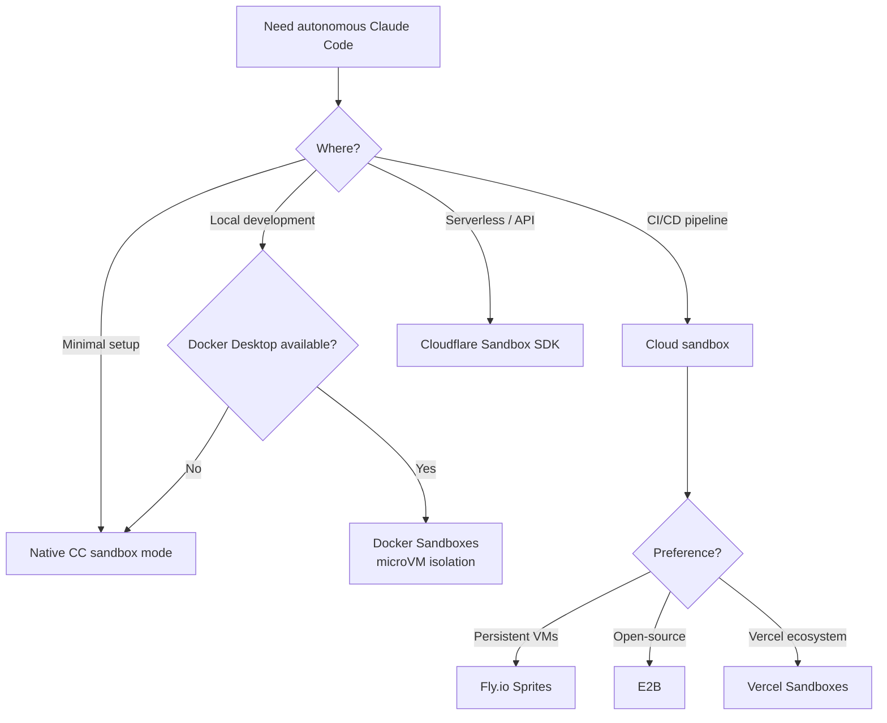

# 面向编码代理的沙箱隔离

> **可信度**：Tier 2 — 官方 Docker 文档 + 经过验证的供应商文档
> **阅读时长**：约 10 分钟
> **范围**：在隔离环境中安全运行 Claude Code

---

## TL;DR

| 方案 | 隔离方式 | 本地/云端 | 最适用于 |
|----------|-----------|-------------|----------|
| **Docker Sandboxes** | microVM（虚拟机监控器） | 本地 | 最高安全性，需要 Docker-in-Docker |
| **原生 CC sandbox** | 进程级（Seatbelt/bubblewrap） | 本地 | 轻量级日常开发，可信代码 |
| **Fly.io Sprites** | Firecracker microVM | 云端 | API 驱动的代理工作流 |
| **E2B** | Firecracker microVM | 云端 | 多框架 AI 应用 |
| **Vercel Sandboxes** | Firecracker microVM | 云端 | Next.js / Vercel 生态系统 |
| **Cloudflare Sandbox SDK** | 容器 | 云端 | 基于 Workers 的无服务器架构 |

快速开始：

```bash
docker sandbox run claude ~/my-project
```

---

## 1. 问题所在：安全的自主性

Claude Code 的权限系统可以保护你免受意外操作的影响。但它也带来了一种矛盾：

- **`--dangerously-skip-permissions`** 移除了所有防护栏 —— Claude 可以在不询问的情况下执行 `rm -rf`、`git push --force` 或 `DROP TABLE`。在裸主机上，这是危险的。
- **权限疲劳** —— 对每一次文件编辑和 shell 命令都进行批准会拖慢自主工作流。对于大规模重构或 CI 流水线，交互式批准并不现实。
- **空白地带**：你如何才能既自主又安全地运行 Claude Code？

**答案**：隔离执行环境。让代理在一个爆炸半径受限的沙箱内自由运行。安全边界是沙箱，而非权限系统。

---

## 2. 隔离方案



---

## 3. Docker Sandboxes

> **来源**：[docs.docker.com/ai/sandboxes/](https://docs.docker.com/ai/sandboxes/)
> **要求**：Docker Desktop 4.58+（macOS 或 Windows）

Docker Sandboxes 在你的本地机器上以基于 microVM 的隔离方式运行 AI 编码代理。每个沙箱都拥有自己私有的 Docker 守护进程和文件系统。沙箱不会出现在 `docker ps` 中 —— 它们是虚拟机，而非容器。

### 快速开始

```bash
# Create and run a sandbox with your project
docker sandbox run claude ~/my-project

# Run with autonomous mode (safe inside sandbox)
docker sandbox run claude ~/my-project -- --dangerously-skip-permissions

# Pass a prompt directly
docker sandbox run claude ~/my-project -- "Refactor auth module to use JWT"

# Continue a previous session
docker sandbox run my-sandbox -- --continue
```

### 架构

```
┌──────────────────────────────────────────────────────────┐
│                     HOST MACHINE                          │
│                                                          │
│  ┌────────────────────────────────────────────────────┐  │
│  │              DOCKER SANDBOX (microVM)               │  │
│  │                                                    │  │
│  │  ┌──────────────┐  ┌───────────────────────────┐  │  │
│  │  │ Claude Code   │  │ Private Docker daemon     │  │  │
│  │  │ (--dsp mode)  │  │ (isolated from host)      │  │  │
│  │  └──────────────┘  └───────────────────────────┘  │  │
│  │                                                    │  │
│  │  ┌──────────────────────────────────────────────┐  │  │
│  │  │ Workspace: ~/my-project (synced with host)   │  │  │
│  │  │ Same absolute path as host                   │  │  │
│  │  └──────────────────────────────────────────────┘  │  │
│  │                                                    │  │
│  │  Base: Ubuntu, Node.js, Python 3, Go, Git,        │  │
│  │        Docker CLI, GitHub CLI, ripgrep, jq         │  │
│  │  User: non-root 'agent' with sudo                 │  │
│  └────────────────────────────────────────────────────┘  │
│                                                          │
│  Host Docker daemon: NOT accessible from sandbox          │
│  Host filesystem: NOT accessible (except workspace)       │
└──────────────────────────────────────────────────────────┘
```

关键特性：
- **工作区同步**：宿主机目录会挂载到沙箱内相同的绝对路径
- **完全隔离**：代理无法访问宿主机 Docker 守护进程、宿主机容器或工作区之外的文件
- **私有 Docker**：每个沙箱都有自己的 Docker 守护进程用于构建/运行容器
- **Claude 以 `--dangerously-skip-permissions` 运行**：这是有意为之 —— 沙箱才是安全边界

### 网络策略

控制沙箱在网络上可以访问的内容。

```bash
# View network activity
docker sandbox network log my-sandbox

# Set up denylist mode (block all, allow specific)
docker sandbox network proxy my-sandbox \
  --policy deny \
  --allow-host api.anthropic.com \
  --allow-host "*.npmjs.org" \
  --allow-host "*.pypi.org" \
  --allow-host github.com

# Set up allowlist mode (allow all, block specific)
docker sandbox network proxy my-sandbox \
  --policy allow \
  --block-host "*.malicious-domain.com" \
  --block-cidr "192.168.0.0/16"
```

| 模式 | 默认行为 | 使用场景 |
|------|-----------------|----------|
| **允许列表**（默认） | 放行大部分流量，阻止特定目标 | 通用开发 |
| **拒绝列表** | 阻止所有流量，仅放行指定目标 | 高安全性环境 |

**默认被阻止的网段**：私有 CIDR（`10.0.0.0/8`、`127.0.0.0/8`、`172.16.0.0/12`、`192.168.0.0/16`、`169.254.0.0/16`）及其 IPv6 对应网段。

**模式匹配**：精确匹配（`example.com`）、指定端口（`example.com:443`）、通配符（`*.example.com` 仅匹配子域名）。最具体的模式优先生效。

**安全警告**：域名过滤不会检查流量内容。宽泛的放行规则（例如 `github.com`）会允许访问用户生成的内容。在 bypass 模式下不会执行 HTTPS 检查。

**配置存储**：按沙箱存储于 `~/.docker/sandboxes/vm/[name]/proxy-config.json`。策略在重启后依然保留。

### 自定义模板

适用于需要可复现、具备特定工具链环境的团队：

```dockerfile
FROM docker/sandbox-templates:claude-code

USER root

# Install project-specific dependencies
RUN apt-get update && apt-get install -y \
    postgresql-client \
    redis-tools

# Install global npm packages
RUN npm install -g pnpm turbo

USER agent
```

构建与使用：

```bash
# Build the template
docker build -t my-team-sandbox:v1 .

# Create sandbox with custom template
docker sandbox create my-sandbox \
  --template my-team-sandbox:v1 \
  --load-local-template ~/my-project
```

在以下情况使用自定义模板：团队环境、特定工具版本、重复性的搭建、复杂配置。对于简单的一次性工作，使用默认配置并让代理自行安装所需内容即可。

### 命令参考

| 命令 | 说明 |
|---------|-------------|
| `docker sandbox run <agent> <path>` | 创建并启动沙箱 |
| `docker sandbox create <name>` | 创建但不启动 |
| `docker sandbox ls` | 列出所有沙箱 |
| `docker sandbox run <name> -- "prompt"` | 传入一个提示词 |
| `docker sandbox run <name> -- --continue` | 继续上一次会话 |
| `docker sandbox run <name> -- --dsp` | --dangerously-skip-permissions 的简写 |
| `docker sandbox network proxy <name>` | 配置网络策略 |
| `docker sandbox network log <name>` | 查看网络活动 |

### 认证

**选项 1：API key（推荐用于无头模式）**

在 `~/.bashrc` 或 `~/.zshrc` 中设置 `ANTHROPIC_API_KEY`。沙箱守护进程从这些文件读取，而非当前 shell 会话。更改后需重启守护进程。该配置在沙箱重新创建后依然保留。

**选项 2：交互式登录（按会话）**

如果未找到凭据，会自动触发。在 Claude Code 内使用 `/login` 可手动触发。当沙箱被销毁时，认证信息不会保留。

### 受支持的代理

| 代理 | 提供方 | 状态 |
|-------|----------|--------|
| Claude Code | Anthropic | 完全支持 |
| Codex CLI | OpenAI | 支持 |
| Gemini CLI | Google | 支持 |
| cagent | Docker | 支持 |
| Kiro | AWS | 支持 |

### 限制

- microVM 模式**仅支持 macOS 和 Windows**。Linux 使用基于容器的旧版沙箱（Docker Desktop 4.57+）。
- **需要 Docker Desktop** —— 独立的 Docker Engine 不支持。社区替代方案如 [dclaude](https://github.com/jedi4ever/dclaude)（Patrick Debois）将 Claude Code 封装在标准 Docker 容器中，以支持仅有 Docker Engine 的环境，但它使用容器隔离（而非 microVM），并挂载宿主机的 Docker socket —— 安全边界更弱。
- 沙箱内**尚不支持 MCP Gateway**。
- **无 GPU 直通** —— 不适用于 ML 训练工作负载。
- **工作区同步是单向的**：沙箱内的更改会传播到宿主机，但宿主机的并发编辑可能产生冲突。

---

## 4. 原生 Claude Code 沙箱

> **来源**：[code.claude.com/docs/en/sandboxing](https://code.claude.com/docs/en/sandboxing)
> **要求**：macOS（内置）或 Linux/WSL2（bubblewrap + socat）
> **功能**：Claude Code v2.1.0+

Claude Code 内置了**原生沙箱**功能，利用操作系统级别的原语实现进程级隔离。无需 Docker。

### 架构

```
┌──────────────────────────────────────────────────────┐
│                    HOST MACHINE                      │
│                                                      │
│  Claude Code (main process)                          │
│       │                                              │
│       ├─ spawn bash command                          │
│       │                                              │
│       ▼                                              │
│  Sandbox wrapper (Seatbelt/bubblewrap)               │
│       │                                              │
│       ├─ Filesystem: read all, write CWD only        │
│       ├─ Network: SOCKS5 proxy, domain filtering     │
│       ├─ Process: isolated environment               │
│       │                                              │
│       ▼                                              │
│  Command executes with restrictions                  │
│       │                                              │
│       └─ Violations blocked at OS level              │
│                                                      │
└──────────────────────────────────────────────────────┘
```

**与 Docker 沙箱的关键区别**：

| 方面 | 原生沙箱 | Docker 沙箱 |
|--------|---------------|------------------|
| **隔离级别** | 进程级（Seatbelt/bubblewrap） | microVM（虚拟机管理程序） |
| **内核** | 与宿主机共享 | 每个沙箱独立内核 |
| **配置** | 0 依赖（macOS），2 个软件包（Linux） | Docker Desktop 4.58+ |
| **开销** | 极小（~1-3% CPU） | 适中（~5-10% CPU，+200MB RAM） |
| **Docker-in-Docker** | ❌ 不支持 | ✅ 私有 Docker daemon |
| **适用场景** | 日常开发、受信任代码 | 不受信任代码、最大化隔离 |

### 操作系统原语

**macOS**：使用 Seatbelt（TrustedBSD 强制访问控制）
- 内置，开箱即用
- 内核级系统调用过滤

**Linux/WSL2**：使用 bubblewrap（Linux namespaces + seccomp）
- 需要安装：`sudo apt-get install bubblewrap socat`
- 为每条命令创建隔离的 namespace

**WSL1**：❌ 不支持（bubblewrap 需要不可用的内核特性）

**Windows 原生**：⏳ 计划中（尚未提供）

### 快速开始

```bash
# Enable sandboxing (interactive menu)
/sandbox

# Linux/WSL2 only: install prerequisites first
sudo apt-get install bubblewrap socat  # Ubuntu/Debian
sudo dnf install bubblewrap socat      # Fedora
```

**两种模式**：

1. **自动允许模式**：若命令在沙箱中运行，则 Bash 命令自动批准（推荐用于日常开发）
2. **常规权限模式**：所有命令都需要批准（用于高安全性场景）

### 配置示例

```json
{
  "sandbox": {
    "autoAllowMode": true,
    "network": {
      "policy": "deny",
      "allowedDomains": [
        "api.anthropic.com",
        "registry.npmjs.com",
        "github.com"
      ]
    }
  },
  "permissions": {
    "deny": [
      "Read(~/.ssh/**)", "Read(~/.aws/**)",
      "Edit(~/.ssh/**)", "Edit(~/.aws/**)"
    ]
  }
}
```

### 何时使用原生沙箱 vs Docker

**在以下情况使用原生沙箱**：
- ✅ 与受信任团队进行日常开发
- ✅ 轻量级配置（无需 Docker Desktop）
- ✅ 优先考虑最小开销
- ✅ 代码大体上是受信任的
- ✅ 不需要 Docker-in-Docker

**在以下情况使用 Docker 沙箱**：
- ✅ 运行不受信任的代码
- ✅ 最大化安全隔离（防护内核漏洞利用）
- ✅ 需要在沙箱内运行私有 Docker daemon
- ✅ 测试 AI 生成的脚本
- ✅ 涉及敏感负载的生产环境 CI/CD

**决策树**：

```
Daily development?
├─ Trusted code + team → Native Sandbox (lightweight)
└─ Untrusted scripts → Docker Sandboxes (max isolation)

Need Docker inside?
├─ Yes → Docker Sandboxes (only option)
└─ No → Either works, prefer Native for simplicity

Maximum security?
├─ Yes (kernel exploit protection) → Docker Sandboxes
└─ Standard (process isolation OK) → Native Sandbox
```

### 安全限制

**⚠️ 原生沙箱的限制**（详见 [guide/sandbox-native.md](./sandbox-native.md)）：

1. **共享内核**：易受内核漏洞利用攻击（Docker microVM 可对此进行防护）
2. **域前置（Domain fronting）**：可能通过 CDN 实现绕过（Cloudflare、Akamai）
3. **Unix sockets**：若配置不当可能授予意外的权限
4. **文件系统**：过于宽泛的写入权限会导致权限提升

**对于不受信任的代码**，Docker 沙箱可提供更强的隔离。

### 开源运行时

该沙箱实现以开源 npm 包的形式提供：

```bash
# Use sandbox runtime directly
npx @anthropic-ai/sandbox-runtime <command-to-sandbox>

# Example: sandbox an MCP server
npx @anthropic-ai/sandbox-runtime node mcp-server.js
```

**代码仓库**：[github.com/anthropic-experimental/sandbox-runtime](https://github.com/anthropic-experimental/sandbox-runtime)

### 深入了解

完整的技术细节、配置示例、故障排查与安全分析请参阅：

→ **[原生沙箱指南](./sandbox-native.md)**

涵盖：操作系统原语、网络代理架构、沙箱模式、逃生舱口、安全限制、最佳实践。

---

## 5. 云沙箱全景

### Fly.io Sprites

> **来源**：[sprites.dev](https://sprites.dev)

由 Fly.io 提供、基于 Firecracker microVM 构建的硬件隔离执行环境。

- **隔离**：具备完整硬件隔离的 Firecracker microVM
- **持久化**：完全可变的 ext4 文件系统，自动分配 100GB 分区
- **检查点/恢复**：约 300ms 完成实时检查点（写时复制），恢复用时不到 1 秒
- **HTTP 访问**：每个 Sprite 独立 URL，请求时自动激活（冷启动不到 1 秒）
- **网络**：三层（Layer 3）出站策略，公有/私有切换
- **资源**：每个 Sprite 最多 8 个 CPU、16GB RAM
- **API**：CLI（`sprite` 命令）、REST API、JavaScript 和 Go 客户端库
- **定价**：按用量付费（$0.07/CPU-小时，$0.04/GB-小时）。提供 $30 试用额度。

### Cloudflare Sandbox SDK

> **来源**：[developers.cloudflare.com/sandbox/](https://developers.cloudflare.com/sandbox/)

构建于 Cloudflare Workers 平台之上、在隔离容器中安全执行代码。

- **隔离**：基于 Cloudflare serverless 运行时的容器（而非 microVM）
- **语言**：Python、JavaScript/TypeScript、shell 命令
- **持久化**：将 R2 bucket 挂载为本地文件系统路径
- **API**：TypeScript SDK（`getSandbox()`、`exec()`、`runCode()`、文件操作、WebSocket）
- **集成**：Claude 生成代码，Sandbox 执行代码，结果以文本/可视化形式返回
- **定价**：需要 Workers Paid 套餐。基于 Containers 平台定价。
- **教程**：[developers.cloudflare.com/sandbox/tutorials/claude-code/](https://developers.cloudflare.com/sandbox/tutorials/claude-code/)

### Vercel Sandboxes

> **来源**：[vercel.com/docs/vercel-sandbox/](https://vercel.com/docs/vercel-sandbox/)

面向 AI agent 与代码生成的临时性 Linux microVM，自 2026-01-30 起正式发布（GA）。

- **隔离**：Firecracker microVM，与环境变量、数据库及云资源隔离
- **性能**：亚秒级初始化，任务完成后自动终止
- **超时**：默认 5 分钟，Hobby 最长 45 分钟，Pro/Enterprise 最长 5 小时
- **SDK**：`Sandbox`、`Command`、`Snapshot` 类。文件系统快照可加速重复运行。
- **认证**：Vercel OIDC token（推荐）或用于外部 CI/CD 的 access token
- **集成**：可与 Claude 的 Agent SDK 配合用于自主 agent 任务

### E2B

> **来源**：[e2b.dev](https://e2b.dev)

面向 AI agent 与 LLM 应用的开源沙箱平台。

- **隔离**：Firecracker microVM（与 AWS Lambda 相同的技术）
- **性能**：约 150ms 冷启动，待机恢复低于 25ms
- **自定义镜像**：最大 10GB，2 秒内启动（Blueprints）
- **快照**：捕获并恢复完整的 VM 状态
- **语言**：Python、JavaScript、Ruby、C++，以及任何可在 Linux 上运行的语言。与 LLM 无关。
- **集成**：LangChain、LangGraph、LlamaIndex、Vercel/Next.js、Ollama
- **部署**：云托管、BYOC（AWS/GCP/Azure）、本地/VPC 自托管
- **定价**：免费层（$100 额度，最长 1 小时），Pro 起价 $150/月（最长 24 小时）

### 原生 Claude Code 沙箱模式

> **来源**：[code.claude.com/docs/en/sandboxing](https://code.claude.com/docs/en/sandboxing)

Claude Code 内置的进程级沙箱（[架构](../core/architecture.md)中的第 4 层）。

- **无外部依赖**：开箱即用
- **进程隔离**：限制 Claude 可执行的命令
- **可配置**：通过设置中的 `allowedTools`
- **限制**：并非完整的 VM 隔离——与宿主机共享内核和文件系统

适用场景：Docker 不可用、轻量级隔离已足够，或你希望在沙箱之外再叠加一层纵深防御。

---

## 6. 对比矩阵

| 标准 | Docker Sandboxes | Native CC | Fly.io Sprites | Cloudflare SDK | E2B | Vercel Sandboxes |
|-----------|-----------------|-----------|----------------|----------------|-----|-----------------|
| **隔离级别** | microVM（hypervisor） | 进程（Seatbelt/bubblewrap） | Firecracker microVM | 容器 | Firecracker microVM | Firecracker microVM |
| **内核隔离** | ✅ 独立内核 | ❌ 共享内核 | ✅ 独立内核 | 部分 | ✅ 独立内核 | ✅ 独立内核 |
| **本地运行** | 是 | 是 | 否（云端） | 否（云端） | 否（云端） | 否（云端） |
| **安装配置** | Docker Desktop 4.58+ | 0 依赖（macOS），2 个包（Linux） | API key | Workers Paid | API key | SDK |
| **Docker-in-Docker** | ✅ 私有守护进程 | ❌ 不支持 | 是 | 否 | 是 | 是 |
| **网络控制** | 允许/拒绝列表 | 允许/拒绝列表（SOCKS5） | L3 出口策略 | 未详述 | 未详述 | 未详述 |
| **平台** | macOS、Windows（WSL2） | macOS、Linux、WSL2 | 任意（API） | 任意（Workers） | 任意（API/SDK） | 任意（SDK） |
| **开销** | 中等（~5-10% CPU） | 极小（~1-3% CPU） | 云端 | 云端 | 云端 | 云端 |
| **免费额度** | Docker Desktop | 免费 | $30 额度 | Workers Paid | $100 额度 | 是（受限） |
| **最适合** | 最高安全性、需要 Docker | 日常开发、可信代码 | API 驱动的智能体 | Serverless | 多框架 | Next.js/Vercel |

---

## 7. 安全自主工作流

### 模式：Docker Sandbox + --dangerously-skip-permissions

推荐的本地自主开发模式：

```bash
# 1. Create a sandbox with your project
docker sandbox create my-feature ~/my-project

# 2. Configure network (optional, recommended for security)
docker sandbox network proxy my-feature \
  --policy deny \
  --allow-host api.anthropic.com \
  --allow-host "*.npmjs.org" \
  --allow-host github.com

# 3. Run Claude autonomously (safe inside sandbox)
docker sandbox run my-feature -- --dangerously-skip-permissions \
  "Refactor the auth module to use JWT. Run all tests before finishing."

# 4. Review changes on host (workspace syncs automatically)
cd ~/my-project && git diff

# 5. If satisfied, commit. If not, discard or re-run.
git add -A && git commit -m "feat: JWT auth (sandbox-generated)"
```

### 模式：带 Sandbox 的 CI/CD 流水线

GitHub Actions 示例：

```yaml
jobs:
  agent-task:
    runs-on: ubuntu-latest
    steps:
      - uses: actions/checkout@v4

      - name: Run Claude in E2B sandbox
        uses: e2b-dev/e2b-github-action@v1
        with:
          api-key: ${{ secrets.E2B_API_KEY }}
          command: |
            claude --dangerously-skip-permissions \
              -p "Run the full test suite and fix any failures"
```

对于 CI/CD，云端沙箱（E2B、Vercel、Sprites）通常比 Docker Sandboxes 更合适，因为它们不需要 Docker Desktop。

---

## 8. 反模式

| 反模式 | 为何危险 | 应该这样做 |
|-------------|-------------------|------------|
| 不使用沙箱的 `--dangerously-skip-permissions` | 智能体可不受限制地访问宿主机文件系统、网络和 Docker | 使用沙箱作为安全边界 |
| 假设容器 = 虚拟机 | 容器共享宿主机内核。一次容器逃逸即可暴露宿主机。 | 使用基于 microVM 的方案（Docker Sandboxes、E2B、Sprites）以获得强隔离 |
| 将整个文件系统挂载进沙箱 | 使隔离失去意义。智能体可访问凭据、SSH 密钥等。 | 仅挂载项目工作区目录 |
| 在网络策略中将 `*` 加入允许列表 | 智能体可将数据外泄到任意端点 | 使用拒绝列表模式并显式列出允许项 |
| 沙箱运行后跳过 `git diff` 审查 | 自主智能体可能做出非预期的更改 | 提交沙箱生成的代码前始终审查 diff |
| 以沙箱为借口跳过代码审查 | 隔离保护的是宿主机，而非代码质量 | 沙箱 + 代码审查相辅相成，而非二选一 |

---

## 另见

- [architecture.md](../core/architecture.md) — Layer 4（Sub-Agent 架构）与权限模型
- [security-hardening.md](./security-hardening.md) — MCP 审查、注入防御、CVE 跟踪
- [code.claude.com/docs/en/sandboxing](https://code.claude.com/docs/en/sandboxing) — 官方 Claude Code 沙箱文档
- [docs.docker.com/ai/sandboxes/](https://docs.docker.com/ai/sandboxes/) — Docker Sandboxes 文档
