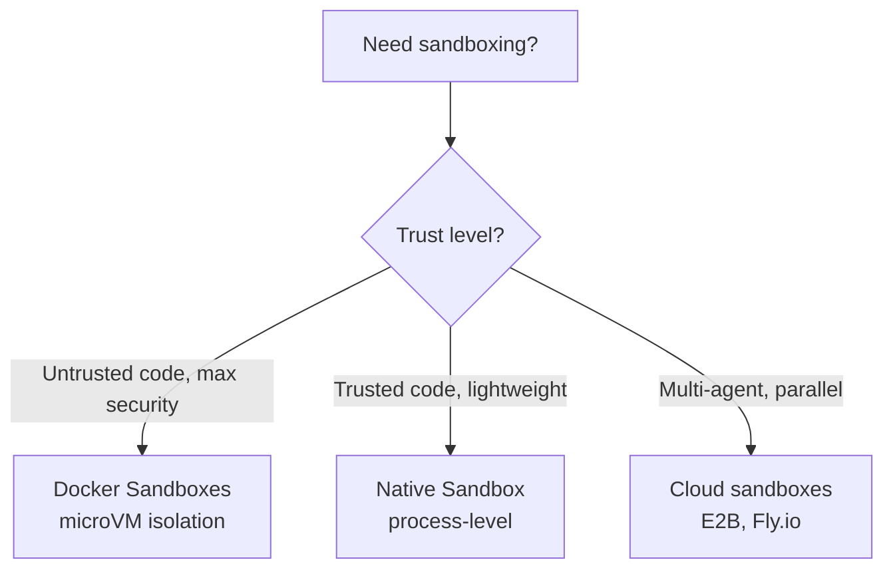
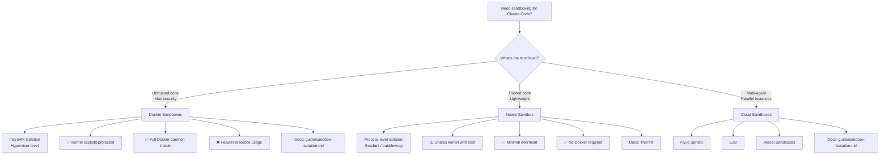

# Claude Code 中的原生沙箱

> **可信度**：Tier 1 — Anthropic 官方文档
> **阅读时间**：约 15 分钟
> **范围**：理解并配置 Claude Code 中的原生进程级沙箱
> **最后更新**：2026-02-02

---

## TL;DR

Claude Code 内置了**原生沙箱**（v2.1.0+），利用操作系统级原语来隔离 bash 命令：

| 方面 | 详情 |
|--------|---------|
| **macOS** | Seatbelt（内置，开箱即用） |
| **Linux/WSL2** | bubblewrap + socat（需要安装） |
| **文件系统** | 全盘可读（可配置），仅可写入工作区 |
| **网络** | SOCKS5 代理，域名允许列表/拒绝列表 |
| **模式** | 自动允许（bash 自动批准）vs 常规权限 |
| **逃生通道** | `dangerouslyDisableSandbox` 用于不兼容的工具 |
| **平台支持** | ✅ macOS、Linux、WSL2 • ❌ WSL1 • ⏳ Windows（计划中） |

**快速开始**：

```bash
# Enable sandboxing
/sandbox

# Linux/WSL2 prerequisites
sudo apt-get install bubblewrap socat  # Ubuntu/Debian
sudo dnf install bubblewrap socat      # Fedora
```

**何时使用原生沙箱 vs Docker 沙箱**：



---

## 1. 为什么需要原生沙箱？

### 自主性与安全性的张力

Claude Code 的权限系统造成了一种根本性的张力：

- **`--dangerously-skip-permissions`** 移除所有护栏 → 快速、自主，但在裸主机上很危险
- **交互式权限** → 安全，但缓慢，对于大规模重构而言不切实际

**原生沙箱解决了这一矛盾**：让 Claude 在操作系统强制的边界内自由运行。安全边界由沙箱来承担，而非权限系统。

### 好处

1. **减少审批疲劳** - 安全命令在沙箱内自动批准
2. **自主工作流** - 大规模重构、CI 流水线，无需持续提示
3. **prompt 注入防护** - 恶意 prompt 无法逃出沙箱边界
4. **依赖安全** - 被攻破的 npm 包被限制在工作区内
5. **透明运行** - 沙箱违规会立即触发通知

---

## 2. 操作系统原语

原生沙箱利用操作系统的安全机制来强制隔离：

### macOS：Seatbelt

**内置，开箱即用** - 无需安装。

- **机制**：macOS Sandbox 框架（TrustedBSD Mandatory Access Control）
- **强制方式**：内核级系统调用过滤
- **范围**：对文件系统、网络、IPC 的逐进程限制
- **性能**：开销极小（典型工作负载下约 1-2% CPU）

**工作原理**：

```
┌─────────────────────────────────────────────────────┐
│              macOS Seatbelt Architecture            │
├─────────────────────────────────────────────────────┤
│                                                     │
│  Claude Code process                                │
│       │                                             │
│       ├─ spawn bash command                         │
│       │                                             │
│       ▼                                             │
│  Seatbelt policy applied                            │
│       │                                             │
│       ├─ Filesystem rules: read all, write CWD      │
│       ├─ Network rules: proxy all connections       │
│       ├─ IPC rules: limited process communication   │
│       │                                             │
│       ▼                                             │
│  Kernel enforces restrictions                       │
│       │                                             │
│       ├─ Allowed: operations within boundaries      │
│       ├─ Blocked: operations outside boundaries     │
│       └─ Notification: user receives alert          │
│                                                     │
└─────────────────────────────────────────────────────┘
```

### Linux/WSL2：bubblewrap

**需要安装** - 必须安装 `bubblewrap` 和 `socat` 包。

- **机制**：Linux namespaces + seccomp-bpf 系统调用过滤
- **强制方式**：内核 namespace 隔离（mount、network、PID、IPC）
- **范围**：为每条命令创建一个隔离的、类容器的环境
- **性能**：开销极小（约 2-3% CPU，每条命令启动 <10ms）

**前置条件**：

```bash
# Ubuntu/Debian
sudo apt-get install bubblewrap socat

# Fedora
sudo dnf install bubblewrap socat

# Arch Linux
sudo pacman -S bubblewrap socat
```

**工作原理**：

```
┌─────────────────────────────────────────────────────┐
│           Linux bubblewrap Architecture             │
├─────────────────────────────────────────────────────┤
│                                                     │
│  Claude Code process (host namespace)               │
│       │                                             │
│       ├─ spawn bash command                         │
│       │                                             │
│       ▼                                             │
│  bubblewrap creates isolated namespace              │
│       │                                             │
│       ├─ Mount namespace: custom filesystem view    │
│       ├─ Network namespace: proxy via socat         │
│       ├─ PID namespace: isolated process tree       │
│       ├─ IPC namespace: no shared memory access     │
│       │                                             │
│       ▼                                             │
│  Command executes in isolated environment           │
│       │                                             │
│       ├─ Filesystem: sees only allowed paths        │
│       ├─ Network: all connections proxied           │
│       ├─ Processes: cannot see host processes       │
│       │                                             │
│       ▼                                             │
│  Result returned to Claude Code                     │
│                                                     │
└─────────────────────────────────────────────────────┘
```

### WSL2 vs WSL1

- **WSL2**：✅ 受支持（使用 bubblewrap，与 Linux 相同）
- **WSL1**：❌ **不受支持** - bubblewrap 需要内核特性（namespaces、cgroups），而 WSL1 的转换层不提供这些特性

**需要迁移**：如果你在使用 WSL1，请[升级到 WSL2](https://learn.microsoft.com/en-us/windows/wsl/install) 以使用原生沙箱。

---

## 3. 文件系统隔离

### 默认行为

- **读取权限**：整台计算机（被显式拒绝的目录除外）
- **写入权限**：仅限当前工作目录（CWD）及其子目录
- **被阻止**：未经显式许可，无法修改 CWD 以外的内容

### 为什么是"全盘可读，仅写 CWD"？

这种非对称策略在易用性和安全性之间取得了平衡：

- **全盘可读**：Claude 需要搜索/分析整个代码库、读取系统配置、检查依赖
- **写 CWD**：大多数开发工作发生在项目目录内；限制写入可防止意外或恶意的系统修改

### 配置文件系统限制

文件系统限制同时使用**权限规则**（用于阻止读取）和 **`sandbox.filesystem` 设置块**（用于扩展写入和细粒度的读取覆盖）。

**阻止对敏感目录的读取**（权限拒绝规则）：

```json
{
  "permissions": {
    "deny": [
      "Read(~/.ssh/**)",
      "Read(~/.aws/**)",
      "Read(~/.kube/**)",
      "Edit(~/.ssh/**)",
      "Edit(~/.aws/**)",
      "Edit(~/.kube/**)"
    ]
  }
}
```

**扩展写入权限或微调读取权限**（`sandbox.filesystem`）：

```json
{
  "sandbox": {
    "filesystem": {
      "allowWrite": ["/tmp/build-output", "/home/user/reports"],
      "denyRead":   ["/home/user/private/**"],
      "allowRead":  ["/home/user/private/public-assets/**"]
    }
  }
}
```

| 设置 | 用途 | 备注 |
|---------|---------|-------|
| `allowWrite` | 将写入权限扩展到 CWD 之外 | 使用绝对路径（v2.1.78+） |
| `denyRead` | 阻止对特定路径的读取权限 | 支持 glob 模式 |
| `allowRead` | 在某个 `denyRead` 区域内重新允许读取（v2.1.77+） | 适用于对子树加入允许列表 |

> **`allowRead` 使用场景**：你阻止了 `/home/user/private/**`，但需要让 Claude 读取 `/home/user/private/public-assets/**`。与其重构目录结构，不如添加 `allowRead` 来开出一个例外，而无需放宽拒绝规则。

写入权限本身就被沙箱限制在 CWD 内。要阻止对敏感目录的读取，请使用权限拒绝规则或 `sandbox.filesystem.denyRead`。

**⚠️ 安全警告**：过于宽泛的写入权限会导致权限提升：

- ❌ **切勿允许写入**：`$PATH` 目录（`/usr/local/bin`）、shell 配置（`~/.bashrc`、`~/.zshrc`）、系统目录（`/etc`）
- ✅ **可安全允许**：项目目录、临时目录（`/tmp`）、构建输出目录

---

## 4. 网络隔离

### 代理架构

来自沙箱命令的所有网络连接都会通过一个运行在沙箱**外部**的 SOCKS5 代理进行路由。该代理限制进程可以连接到哪些域名，但**不会检查通过它的流量内容**（隐私说明：不做深度包检测）。

```
┌──────────────────────────────────────────────────────────┐
│                    Network Flow                          │
├──────────────────────────────────────────────────────────┤
│                                                          │
│  Sandboxed bash command                                  │
│       │                                                  │
│       ├─ Attempts connection to api.anthropic.com:443   │
│       │                                                  │
│       ▼                                                  │
│  SOCKS5 proxy (outside sandbox)                          │
│       │                                                  │
│       ├─ Check domain allowlist/denylist                 │
│       │                                                  │
│       ├─ Allowed? → Forward connection                   │
│       ├─ Blocked? → Reject + notify user                 │
│       │                                                  │
│       ▼                                                  │
│  External network (if allowed)                           │
│                                                          │
└──────────────────────────────────────────────────────────┘
```

### 域名过滤

**两种模式**：

1. **Allowlist（默认）**：允许大多数流量，仅屏蔽特定目标
2. **Denylist**：屏蔽所有流量，仅允许指定的目标

**配置**：

```json
{
  "sandbox": {
    "network": {
      "policy": "deny",
      "allowedDomains": [
        "api.anthropic.com",
        "*.npmjs.org",
        "*.pypi.org",
        "github.com",
        "registry.yarnpkg.com"
      ]
    }
  }
}
```

**模式匹配**：

- **精确**：`example.com`（精确匹配）
- **指定端口**：`example.com:443`（仅 HTTPS）
- **通配符**：`*.example.com`（匹配 `sub.example.com`，但**不**匹配 `example.com` 本身）

**⚠️ 默认屏蔽的地址段**：私有 CIDR（`10.0.0.0/8`、`127.0.0.0/8`、`172.16.0.0/12`、`192.168.0.0/16`、`169.254.0.0/16`）

### 自定义代理

针对高级用例（HTTPS 检测、企业代理）：

```json
{
  "sandbox": {
    "network": {
      "httpProxyPort": 8080,
      "socksProxyPort": 8081
    }
  }
}
```

---

## 5. 沙箱模式

### 自动允许模式（Auto-Allow Mode）

**行为**：

- 如果 bash 命令在沙箱内运行，则**自动批准**
- 与沙箱不兼容的命令（例如需要访问未被允许的域名）→ 回退到常规权限流程
- 显式的 ask/deny 规则**始终被遵守**

**⚠️ 重要**：自动允许模式**独立于**权限模式（default/auto-accept/plan）。即使在 "default" 模式下，沙箱内的 bash 命令也会在无需提示的情况下运行。

**内置屏蔽列表**：即使在自动允许模式下，像 `curl` 和 `wget` 这样的命令也会被默认屏蔽，以防止抓取任意 Web 内容。

**何时使用**：日常开发、自主重构、CI/CD 流水线

### 常规权限模式（Regular Permissions Mode）

**行为**：

- 所有 bash 命令都需要显式批准，即使它们运行在沙箱中
- 沙箱仍然强制执行文件系统/网络限制
- 控制力更强，但工作流更慢

**何时使用**：高安全性环境、不受信任的代码库、学习 Claude Code 行为

### 切换模式

```bash
# Interactive menu
/sandbox

# Or edit settings.json
{
  "sandbox": {
    "autoAllowMode": true  # or false for Regular Permissions
  }
}
```

---

## 6. 逃生舱（Escape Hatch）

### `dangerouslyDisableSandbox` 参数

某些工具与沙箱**不兼容**（例如 `docker`、`watchman`）。Claude Code 提供了一个逃生舱：

**工作原理**：

1. 命令因沙箱限制而失败
2. Claude 分析失败原因
3. Claude 使用 `dangerouslyDisableSandbox` 参数重试
4. 用户收到权限提示（正常的 Claude Code 流程）
5. 如果批准，命令将在**沙箱外部**运行

**不兼容工具示例**：

- `docker`（需要访问 `/var/run/docker.sock`）
- `watchman`（需要文件系统监视 API）
- 搭配 watchman 的 `jest`（改用 `jest --no-watchman`）

### 禁用逃生舱

为获得最高安全性，可完全禁用逃生舱：

```json
{
  "sandbox": {
    "allowUnsandboxedCommands": false
  }
}
```

禁用后：

- `dangerouslyDisableSandbox` 参数**被完全忽略**
- 所有命令必须在沙箱中运行，或在 `excludedCommands` 中显式列出

**推荐用于**：生产环境 CI/CD、不受信任的环境、高安全性场景

### `excludedCommands`

对于**永远**无法在沙箱中工作的工具，可将其永久排除：

```json
{
  "sandbox": {
    "excludedCommands": ["docker", "kubectl", "vagrant"]
  }
}
```

被排除的命令始终在沙箱外部运行（带有正常的权限提示）。

---

## 7. 安全限制

### 域名前置（Domain Fronting）

**风险**：CDN（Cloudflare、Akamai）允许在受信任的域名上托管用户内容。

**攻击场景**：

1. 攻击者将 `cloudflare.com` 加入白名单
2. 攻击者将恶意载荷上传到 Cloudflare Workers（`cloudflare.com` 的子域名）
3. 被入侵的 agent 通过白名单域名下载该载荷
4. 数据外泄成功

**缓解措施**：

- ❌ **避免使用宽泛的 CDN 域名**：`*.cloudflare.com`、`*.akamai.net`、`*.fastly.net`
- ✅ **将特定子域名加入白名单**：`my-app.pages.dev`、`my-workers.workers.dev`
- ✅ 在不受信任的环境中**使用 denylist 模式**

**完美屏蔽的不可能性**：如果不做 HTTPS 检测，域名前置[很难防范](https://en.wikipedia.org/wiki/Domain_fronting)。

### Unix Socket 提权

**风险**：`allowUnixSockets` 配置可能授予对强大系统服务的访问权限。

**攻击场景**：

1. 用户允许 `/tmp/*.sock`（以为它是安全的）
2. 被入侵的 agent 连接到 `/tmp/supervisor.sock`（进程管理器）
3. agent 在沙箱外部派生出特权进程
4. 整个系统被攻陷

**常见的易受攻击 socket**：

- `/var/run/docker.sock`（Docker 守护进程——完整主机访问）
- `/run/containerd/containerd.sock`（containerd——容器控制）
- `/tmp/supervisor.sock`（supervisord——进程管理）
- `~/.config/systemd/user/bus`（systemd 用户总线——服务控制）

**缓解措施**：

- ❌ **绝不允许宽泛的模式**：`/tmp/*.sock`、`/var/run/*.sock`
- ✅ 经审计后**将特定 socket 加入白名单**：`/run/postgresql/.s.PGSQL.5432`（PostgreSQL）
- ✅ **默认**：除非显式允许，否则 Unix socket **被屏蔽**

### 文件系统权限提升

**风险**：过于宽泛的写权限会导致提权。

**攻击场景**：

1. 用户允许写入 `/usr/local/bin`
2. 被入侵的 agent 创建 `/usr/local/bin/sudo`（恶意二进制文件）
3. 用户下次运行 `sudo` 时，恶意二进制文件被执行
4. 系统被攻陷

**易受攻击的目录**：

- `$PATH` 目录（`/usr/local/bin`、`~/bin`）
- Shell 配置文件（`~/.bashrc`、`~/.zshrc`、`~/.profile`）
- 系统目录（`/etc`、`/opt`、`/Library`）
- Cron 目录（`/etc/cron.d`、`/var/spool/cron`）

**缓解措施**：

- ✅ **仅限制写入项目目录**（沙箱默认行为）
- ✅ **使用权限 deny 规则屏蔽敏感读取**
- ✅ **监控沙箱违规日志**

### Linux：嵌套沙箱弱点

**风险**：`enableWeakerNestedSandbox` 模式会削弱隔离性。

**何时使用**：在没有特权命名空间的 Docker 容器内运行 Claude Code。

**安全影响**：将沙箱强度降低到兼容模式（命名空间隔离更少）。

**缓解措施**：

- ✅ **仅在已强制额外隔离的情况下使用**（Docker Sandboxes、云沙箱）
- ✅ **绝不在裸主机上运行不受信任的代码时使用**
- ✅ 尽可能**首选在 Docker 外部运行 Claude Code**

---

## 8. 开源运行时

沙箱运行时以**开源 npm 包**的形式提供：

```bash
# Use sandbox runtime directly
npx @anthropic-ai/sandbox-runtime <command-to-sandbox>

# Example: sandbox an MCP server
npx @anthropic-ai/sandbox-runtime node mcp-server.js
```

**优势**：

- **社区审计**：安全研究人员可以检查其实现
- **自定义用例**：可为任意 AI agent 提供沙箱，而不仅限于 Claude Code
- **贡献**：社区可以增强沙箱的隔离强度

**仓库**：[github.com/anthropic-experimental/sandbox-runtime](https://github.com/anthropic-experimental/sandbox-runtime)

**许可证**：开源（具体许可证请查看仓库）

---

## 9. 平台支持

| 平台 | 支持情况 | 说明 |
|----------|---------|-------|
| **macOS** | ✅ 完整支持 | 内置 Seatbelt，开箱即用 |
| **Linux** | ✅ 完整支持 | 需要安装 `bubblewrap` + `socat` |
| **WSL2** | ✅ 完整支持 | 与 Linux 相同（使用 bubblewrap） |
| **WSL1** | ❌ 不支持 | bubblewrap 需要 WSL1 中不可用的内核特性 |
| **Windows（原生）** | ⏳ 计划中 | 尚不可用，期间请[升级到 WSL2](https://learn.microsoft.com/en-us/windows/wsl/install) |

---

## 10. 决策树：原生沙箱 vs Docker 沙箱



### 对比矩阵

| 方面 | 原生沙箱 | Docker 沙箱 |
|--------|---------------|------------------|
| **隔离级别** | 进程级（Seatbelt/bubblewrap） | microVM（虚拟机管理程序） |
| **内核隔离** | ❌ 共享内核 | ✅ 每个沙箱拥有完整内核 |
| **开销** | 极小（约 1-3% CPU） | 中等（约 5-10% CPU，+200MB 内存） |
| **配置** | 0 依赖（macOS），2 个软件包（Linux） | Docker Desktop 4.58+ |
| **使用场景** | 日常开发、可信代码、轻量级 | 不可信代码、最高安全性、隔离的 Docker |
| **平台支持** | macOS、Linux、WSL2 | macOS、Windows（通过 WSL2） |

**经验法则**：

- **日常开发、可信团队** → 原生沙箱（轻量、安全性足够）
- **运行不可信代码、AI 生成的脚本** → Docker 沙箱（最大隔离）
- **多 agent 编排** → Cloud 沙箱（并行、可扩展）

---

## 11. 配置示例

### 严格安全（黑名单模式）

```json
// settings.json — sandbox settings
{
  "sandbox": {
    "autoAllowMode": true,
    "allowUnsandboxedCommands": false,
    "network": {
      "policy": "deny",
      "allowedDomains": [
        "api.anthropic.com",
        "registry.npmjs.com",
        "registry.yarnpkg.com",
        "files.pythonhosted.org",
        "github.com"
      ]
    },
    "excludedCommands": []
  },
  "permissions": {
    "deny": [
      "Read(~/.ssh/**)", "Read(~/.aws/**)",
      "Read(~/.kube/**)", "Read(~/.gnupg/**)",
      "Edit(~/.ssh/**)", "Edit(~/.aws/**)"
    ]
  }
}
```

### 均衡（白名单模式 + 逃生舱口）

```json
{
  "sandbox": {
    "autoAllowMode": true,
    "allowUnsandboxedCommands": true,
    "network": {
      "policy": "allow",
      "blockedDomains": [
        "*.malicious-domain.com"
      ]
    },
    "excludedCommands": ["docker", "kubectl"]
  },
  "permissions": {
    "deny": [
      "Read(~/.ssh/**)", "Read(~/.aws/**)",
      "Edit(~/.ssh/**)", "Edit(~/.aws/**)"
    ]
  }
}
```

### 开发（宽松）

```json
{
  "sandbox": {
    "autoAllowMode": true,
    "allowUnsandboxedCommands": true,
    "network": {
      "policy": "allow"
    },
    "excludedCommands": ["docker", "podman", "kubectl", "vagrant"]
  }
}
```

---

## 12. 最佳实践

1. **从严格开始，按需放宽** - 先使用黑名单模式，再逐步将域名/路径加入白名单
2. **监控沙箱违规** - 审查日志以了解 Claude 的访问模式
3. **审计权限拒绝规则** - 使用 Read/Edit 拒绝规则来阻止对敏感目录（`~/.ssh`、`~/.aws`、`~/.kube`）的访问
4. **避免宽泛的 CDN 域名** - 将白名单限定到具体的子域名（`my-app.pages.dev`），而非 `*.cloudflare.com`
5. **在生产环境中禁用逃生舱口** - 对 CI/CD、不可信环境设置 `allowUnsandboxedCommands: false`
6. **与 IAM 策略结合** - 将沙箱**与** [权限设置](https://code.claude.com/docs/en/iam) 一起使用，实现纵深防御
7. **测试配置** - 在向团队部署之前，验证沙箱不会阻断合法的工作流
8. **记录允许的域名** - 注明每个域名被加入白名单的原因（`github.com # For git operations`）

---

## 13. 故障排查

### 沙箱未激活

**症状**：`/sandbox` 显示 "Sandboxing not available"

**原因**：

- **Linux/WSL2**：未安装 `bubblewrap` 或 `socat`
- **WSL1**：不支持（需要升级到 WSL2）
- **Windows 原生**：尚不支持（请使用 WSL2）

**解决方案**：

```bash
# Linux/WSL2
sudo apt-get install bubblewrap socat

# Verify
which bubblewrap socat
```

### 命令因 "Network error" 失败

**症状**：`npm install` 因连接超时而失败

**原因**：域名未加入白名单

**解决方案**：

1. 检查沙箱日志（Claude 会显示包含被拒域名的通知）
2. 将域名添加到 `allowedDomains`：

```json
{
  "sandbox": {
    "network": {
      "allowedDomains": [
        "registry.npmjs.com",
        "registry.yarnpkg.com"
      ]
    }
  }
}
```

### Docker 命令始终需要权限

**症状**：`docker ps` 每次都触发权限提示

**原因**：Docker 与沙箱不兼容，回退到常规流程

**解决方案**：添加到 `excludedCommands`：

```json
{
  "sandbox": {
    "excludedCommands": ["docker"]
  }
}
```

### jest 因 watchman 错误失败

**症状**：`jest` 因 "watchman not available" 而失败

**原因**：watchman 与沙箱不兼容

**解决方案**：使用 `jest --no-watchman`

---

## 14. 另请参阅

- [沙箱隔离 (Docker, Cloud)](./sandbox-isolation.md) - 基于 microVM 的沙箱方案，实现最大化隔离
- [架构：权限模型](../core/architecture.md#5-permission--security-model) - 权限与沙箱如何协同工作
- [官方文档：Sandboxing](https://code.claude.com/docs/en/sandboxing) - Anthropic 官方参考
- [官方文档：Security](https://code.claude.com/docs/en/security) - 全面的安全特性
- [官方文档：IAM](https://code.claude.com/docs/en/iam) - 权限配置
- [开源运行时](https://github.com/anthropic-experimental/sandbox-runtime) - 查看或参与贡献沙箱实现

---

**有疑问或问题？** 请在 [github.com/anthropics/claude-code/issues](https://github.com/anthropics/claude-code/issues) 提交反馈
