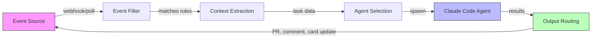
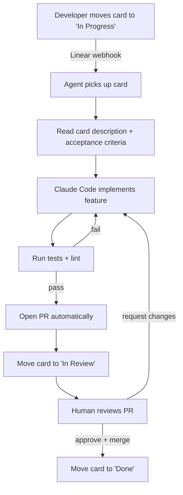

# 事件驱动的智能体自动化

> **可信度**：Tier 3 — 新兴模式，早期采用者反馈结果积极，但配套工具仍在成熟中。

与其为每个任务手动调用 Claude Code，不如让外部事件来驱动工作。一张卡片在 Linear 中被移动到 "In Progress"，Claude 就会自动接手。一个 GitHub issue 被打上 `claude-fix` 标签，几秒钟内就会有一个智能体开始处理它。

这是从拉取式（"嘿 Claude，做这个"）到推送式（"事件触发智能体"）的转变。

---

## 目录

1. [核心概念](#core-concept)
2. [Linear 驱动的智能体循环](#the-linear-driven-agent-loop)
3. [通用的事件到智能体模式](#generic-event-to-agent-pattern)
4. [实现示例](#implementation-example)
5. [事件源兼容性](#event-source-compatibility)
6. [防护栏](#guardrails)
7. [反模式](#anti-patterns)
8. [工具与资源](#tools--resources)
9. [另请参阅](#see-also)

---

## 核心概念

传统的 Claude Code 使用方式是交互式的：你打开终端，输入提示词，反复迭代。事件驱动的自动化把人从触发环节中移除。人仍然审查输出（PR、代码变更），但发起动作通过你现有的项目管理工作流来完成。



这个循环是自我强化的：智能体的输出（一个 PR、一次状态更新）会反馈回事件源，从而触发下一个步骤。

---

## Linear 驱动的智能体循环

记录最详尽的模式来自 Damian Galarza 的工作流（damiangalarza.com，2026 年 2 月）。Linear 作为待办事项的唯一可信来源，而 Claude Code 端到端地负责实现。

### 流程



### 它为什么能奏效

卡片描述充当了提示词。带有清晰验收标准的优质卡片会产出优质代码。模糊的卡片产出模糊的代码，这和人类开发者一样。你工单的质量直接决定了自动化的质量。

Linear 的结构化字段（描述、验收标准、标签、优先级）天然映射到 Claude Code 的需求：构建什么、如何验证、以及适用哪些约束。

### 关键要求

- 卡片必须有清晰的验收标准（不能只有一个标题）
- 仓库需要一套可靠的测试套件用于自动化验证
- 分支命名约定应当是确定性的（例如 `feat/LINEAR-123-card-title`）
- PR 模板有助于标准化智能体的输出

---

## 通用的事件到智能体模式

Linear 的例子是具体的，但这一模式可以推广到任何事件源。整个流水线由五个组件构成：

### 1. 事件源

触发的起源。可以是项目管理工具、CI 系统、监控告警，或自定义 webhook。

### 2. 事件过滤器

并非每个事件都应当触发一个智能体。过滤器决定哪些事件是可处理的：

```bash
# Example: only process cards with the "claude-auto" label
if [[ "$CARD_LABELS" != *"claude-auto"* ]]; then
    echo "Skipping: no claude-auto label"
    exit 0
fi
```

### 3. 上下文提取

从事件载荷中提取相关数据，并将其格式化为 Claude Code 的提示词。在这里，你把工具的 schema 翻译成自然语言指令。

### 4. 智能体选择

不同的事件类型可能需要不同的智能体配置。一个 bug 报告所需的 CLAUDE.md 上下文与一个功能请求不同。你可能会使用不同的允许工具、不同的模型，或不同的安全约束。

### 5. 输出路由

结果去往何处？通常是以下方式的组合：
- Git 分支 + PR（代码变更）
- 对原始 issue/卡片的评论（状态更新）
- 卡片上的状态流转（移动到下一列）
- Slack 通知（让人知晓）

---

## 实现示例

一个轮询 Linear 中 "In Progress" 卡片并触发 Claude Code 智能体的最小化 bash 循环：

```bash
#!/bin/bash
# linear-agent-loop.sh
# Polls Linear for cards in "In Progress" state and spawns Claude agents

LINEAR_API_KEY="${LINEAR_API_KEY:?Missing LINEAR_API_KEY}"
TEAM_ID="${LINEAR_TEAM_ID:?Missing LINEAR_TEAM_ID}"
PROCESSED_FILE="/tmp/linear-agent-processed.txt"
MAX_CONCURRENT=3

touch "$PROCESSED_FILE"

poll_linear() {
    curl -s -X POST https://api.linear.app/graphql \
        -H "Authorization: $LINEAR_API_KEY" \
        -H "Content-Type: application/json" \
        -d '{
            "query": "query { team(id: \"'"$TEAM_ID"'\") { issues(filter: { state: { name: { eq: \"In Progress\" } }, labels: { name: { eq: \"claude-auto\" } } }) { nodes { id title description } } } }"
        }' | jq -r '.data.team.issues.nodes[] | "\(.id)|\(.title)|\(.description)"'
}

spawn_agent() {
    local issue_id="$1"
    local title="$2"
    local description="$3"

    echo "[$(date)] Spawning agent for: $title ($issue_id)"

    claude --print --dangerously-skip-permissions \
        "Implement the following Linear card:
        Title: $title
        Description: $description

        Requirements:
        1. Create a feature branch named feat/$issue_id
        2. Implement the described feature
        3. Run tests and fix any failures
        4. Create a PR with the card title" \
        2>&1 | tee "/tmp/agent-$issue_id.log"

    echo "$issue_id" >> "$PROCESSED_FILE"
}

while true; do
    active_agents=$(jobs -r | wc -l)
    if [ "$active_agents" -ge "$MAX_CONCURRENT" ]; then
        echo "[$(date)] Max concurrent agents reached ($MAX_CONCURRENT), waiting..."
        sleep 30
        continue
    fi

    poll_linear | while IFS='|' read -r id title description; do
        if grep -q "$id" "$PROCESSED_FILE"; then
            continue  # Already processed
        fi
        spawn_agent "$id" "$title" "$description" &
    done

    sleep 60  # Poll interval
done
```

这只是一个起点，并非生产级代码。真正的部署需要妥善的错误处理、一个持久化的状态存储（而非文本文件），以及基于 webhook 的触发方式而非轮询。

---

## 事件源兼容性

| 事件源 | 触发事件 | 智能体应用场景 | 集成方式 |
|-------------|----------------|----------------|-------------------|
| **Linear** | 卡片状态变更、添加标签 | 功能实现、bug 修复 | GraphQL API / MCP server |
| **GitHub Issues** | 创建 issue、打标签 | bug 分诊、调查、修复 PR | GitHub Actions / webhooks |
| **GitHub PR** | 打开 PR、请求审查 | 代码审查、自动修复 | GitHub Actions |
| **Jira** | 状态流转、sprint 分配 | 功能开发、技术债清理 | REST API / webhooks |
| **Slack** | 频道中的消息、emoji 表情回应 | 快速修复、调查 | Slack API / bot |
| **PagerDuty** | 创建事故 | 诊断脚本、初步分诊 | Webhooks |
| **自定义 webhook** | 任意 HTTP POST | 任意场景 | 直连 HTTP 端点 |

---

## 防护栏

事件驱动的 agents 在设计上以更少的人工监督运行，因此防护栏变得至关重要。

### 幂等性

一个 agent 可能会处理同一个事件两次（网络重试、重复的 webhook）。agent 必须在开始之前检查工作是否已经存在：

```bash
# Check if branch already exists for this card
if git ls-remote --heads origin "feat/$ISSUE_ID" | grep -q "feat/$ISSUE_ID"; then
    echo "Branch already exists, skipping"
    exit 0
fi
```

### 速率限制

不要让一阵突发事件同时催生 50 个 agents。设定硬性限制：

- **最大并发 agents 数**：对大多数团队而言为 3-5 个
- **冷却期**：两次 agent 启动之间至少间隔 30 秒
- **每日预算上限**：设定每天最大的 token 消耗量

### 断路器

如果 agents 在某一类特定任务上持续失败，就停止尝试：

```bash
FAILURE_COUNT=$(grep -c "FAILED" "/tmp/agent-failures.log" 2>/dev/null || echo 0)
if [ "$FAILURE_COUNT" -gt 5 ]; then
    echo "Circuit breaker triggered: too many failures"
    # Notify human, pause automation
    exit 1
fi
```

### 人在环路中的检查点

即使在完全自动化的流程中，也要在关键节点保持人的参与：

- PR 审查保持手动（agents 创建 PR，人来批准）
- 数据库迁移永不自动应用
- 部署是一个独立的、由人触发的步骤
- 任何涉及 auth、计费或 PII 的卡片都需要明确的人工批准

---

## 反模式

| 反模式 | 问题 | 解决方案 |
|-------------|---------|----------|
| **激进轮询** | 每 5 秒猛敲一次 API 会浪费资源、让你被限流 | 在可用时使用 webhooks，轮询频率不要快于每 60 秒一次 |
| **没有断路器** | agent 在同一任务上反复失败，无限消耗 token | 按任务跟踪失败次数，尝试 3 次后停止并提醒人 |
| **没有死信队列** | 失败的事件消失了，没人知道有工作被漏掉 | 将失败事件记录到持久化存储中以便人工审查 |
| **无界并发** | 一次移动 20 张卡片，催生 20 个 agents，机器熔毁 | 对并发 agents 数设硬性上限（3-5 个是合理的） |
| **把含糊的卡片当 prompt** | “修一下那个东西”会产出垃圾代码 | 强制执行卡片质量标准，跳过没有验收标准的卡片 |
| **没有状态持久化** | 脚本重启后，从头重新处理一切 | 把已处理的事件 ID 存到数据库里，而非内存中 |
| **跳过 PR 审查** | agent 直接推送到 main | 始终走 PR 流程，由人审查产出 |

---

## 工具与资源

### MCP Servers

- **linear-kanban-mcp**（GitHub 上的 0xikarus）：直接从 Claude Code 暴露 Linear API 以管理看板。无需离开 agent 上下文即可读取卡片、更新状态和管理标签。

### Skills 与平台

- **skillsllm.com**：提供一个 skill，从一张 Linear 卡片出发，编排完整的规划、验证和执行周期。负责将卡片元数据翻译为结构化的 Claude Code prompts。

### Agent 模板

- **Scrum Master Agent**（lobehub.com）：自动检测自己是运行在 Claude Desktop 还是 Claude Code 中，并相应调整行为。作为上下文感知 agent 设计的起点很有用。

---

## 另请参阅

- [agent-teams.md](./agent-teams.md) — 多 agent 并行协调
- [iterative-refinement.md](./iterative-refinement.md) — 核心的 prompt-观察-再 prompt 循环
- [plan-driven.md](./plan-driven.md) — 先规划再执行
- [../../examples/agents/](../../examples/agents/) — 开箱即用的 agent 模板
